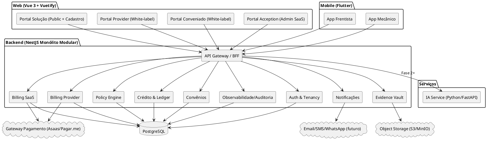
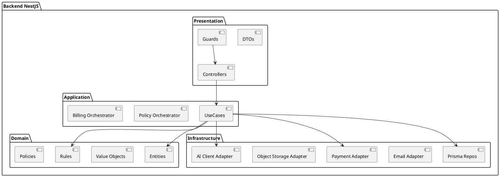
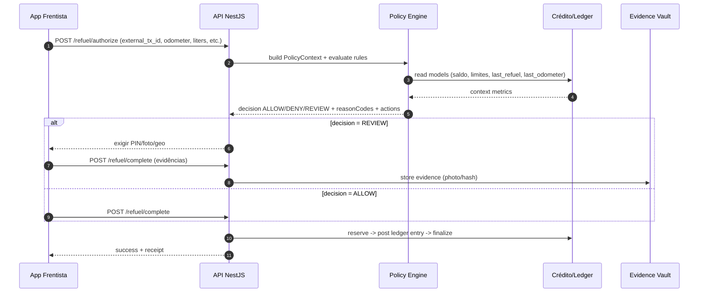
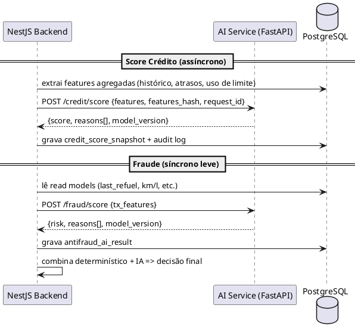

A seguir está um **Documento Descritivo de Arquitetura** consolidado, incluindo:

* **Arquitetura do sistema (visão macro + componentes + integração)**
* **Arquitetura de IA (serviço separado Python/FastAPI + desenho para reduzir contras)**
* **ADRs iniciais (decisões arquiteturais)**
* **Módulos internos do Backend NestJS (monólito modular + Clean Architecture)**
* Diagramas em **PlantUML** e **Mermaid** (conforme solicitado)

---

# Documento de Arquitetura — Plataforma Provider-First (Fiado, Crédito e Antifraude)

## 1. Objetivos arquiteturais

1. **Provider-first**: o posto/oficina é credor e dono do relacionamento, regras e cobrança.
2. **SMB-friendly**: baixa fricção, implantação simples, custo/complexidade controlados.
3. **Segurança e auditabilidade**: decisões de autorização explicáveis, com trilha imutável e evidências.
4. **Evolução por fases**: F1 determinístico; F2 IA; F3 oficinas; F4 parcerias com limite único.
5. **Dev orientado a documentos (SDD)**: documentação como fonte de contexto para IA e humanos.

---

## 2. Visão macro do sistema

### 2.1 Componentes principais

* **Backend**:  NestJS + Prisma + PostgreSQL (monólito modular, Clean Architecture)
	* Server API
* **Frontends (Vue 3 + Vuetify)**:
	- Portal da Solução (público + registro provider + catálogo)
	-  Portal Provider (white-label; operacional + admin no mesmo app por áreas)
	* Portal Conveniado (white-label do provider)
	* Portal Acception (gestão SaaS)
* **Mobile (Flutter)**:
	* App Frentista (online obrigatório; offline só pré-captura)
	* App Mecânico (F3; evidências/fotos/assinatura)
* **Serviços**:
	* **IA Service** (Python/FastAPI) a partir da F2

### 2.2 Diagrama de componentes (PlantUML)

---

## 3. Multitenancy em múltiplos níveis

### 3.1 Decisão adotada

* ✅ **Provider = Tenant real (SaaS)**
* ✅ **Empresa conveniada = escopo dentro do provider**
* ✅ Isolamento sem RLS inicialmente:

  * **DB**: `provider_id` em tudo + `conveniado_id` onde aplicável
  * **App**: RBAC + scoping obrigatório

### 3.2 Implicações arquiteturais

* Todo request resolve `providerId` por:

  * host (white-label domain/subdomain) **ou**
  * claim do token (para portais logados)
* Para usuário conveniado, token inclui `conveniadoId` (escopo fixo)
* Repositórios exigem `providerId` (fail-fast) e exigem `conveniadoId` quando actor for conveniado

---

## 4. Arquitetura do Backend NestJS (Monólito Modular + Clean Architecture)

### 4.1 Padrão de camadas (Clean Architecture)

* **Presentation**: Controllers, DTOs, Guards, Pipes
* **Application**: Use Cases, Orquestração, Services (sem infra)
* **Domain**: Entidades, Value Objects, Regras, Políticas
* **Infrastructure**: Prisma repositories, integrations, storage, queue/email, gateways

#### Diagrama (PlantUML)

### 4.2 Monólito modular (módulos internos NestJS)

Estrutura recomendada (`/backend/server-api/src/modules`):

**Core**

1. `auth` — autenticação, JWT, hashing, sessões
2. `tenancy` — resolução do provider (host/token), tenant context, scoping
3. `rbac` — roles/permissions, policy guards
4. `audit` — audit log, eventos de segurança, trilha de decisões
5. `i18n` — idioma, templates, mensagens

**Domínio Provider-first**
6) `providers` — dados do posto/oficina, configurações, white-label settings
7) `conveniados` — empresas, contratos, status (active/blocked/delinquent)
8) `plans-provider` — planos criados pelo provider (limitados por SaaS), versionamento
9) `fleet` — veículos, motoristas, centros de custo
10) `catalog` — produtos, price list vigente/histórico
11) `credit` — contas de crédito, limites, aging, bloqueios
12) `ledger` — append-only entries + saldos materializados + reconciliação
13) `policy-engine` — regras determinísticas + decisão ALLOW/DENY/REVIEW
14) `refuel` — transações de abastecimento, idempotência, reservas, estornos
15) `billing-provider` — faturas do convênio, cobrança, inadimplência (sem renegociação no início)
16) `notifications` — envio de emails/alertas (provider & conveniado & SaaS)
17) `evidence` — evidências (foto hodômetro, geo), retention, access control

**SaaS Acception**
18) `portal-solution` (API) — registro provider, catálogo público, pages CMS (se necessário)
19) `billing-saas` — planos SaaS, trial configurável, assinatura, suspensão configurável
20) `admin-acception` — gestão de tenants, métricas, suporte/impersonation auditada

**Integrações**
21) `payment-gateway` — adapters Asaas/Pagar.me (SaaS e Provider add-on)
22) `ai-client` — client do IA Service (F2+)
23) `storage` — S3/MinIO
24) `observability` — logs, metrics, tracing, healthchecks

> Observação: `policy-engine`, `credit`, `ledger`, `refuel` formam o núcleo crítico de Fase 1.

---

## 5. Arquitetura de Autorização e Antifraude Determinística (Fase 1)

### 5.1 Contrato de decisão do Policy Engine

Entrada: `AuthorizationRequest` (providerId, conveniadoId, vehicleId, product, liters, totalAmount, odometer, operator, geo, externalTxId)
Saída: `{ decision: ALLOW|DENY|REVIEW, reasonCodes[], requiredActions[], policyVersion, ruleHits[] }`

### 5.2 Sequência (Mermaid)

### 5.3 “Read models” para latência

Para manter P95 ≤ 300ms:

* `last_refuel_by_vehicle`
* `spend_daily/weekly/monthly` por convênio e por veículo
* `current_balance` e `reserved_amount`
* `reversal_rate` por operador/convênio

---

## 6. Arquitetura de IA (Fase 2+)

### 6.1 Decisão adotada

✅ Serviço de IA separado (Python/FastAPI).
✅ Solução híbrida:

* NestJS faz **policy engine, antifraude determinístico, decisão final, auditoria/evidências**
* IA faz **score crédito, anomalia, limite dinâmico, explicações**

### 6.2 Como reduzir contras do serviço separado (desenho)

**Ponto-chave**: **IA stateless** com payload de features (IA não acessa DB).

* NestJS constrói features e envia para IA
* IA retorna score/risk + `model_version` + `reason_codes` + `features_hash`
* NestJS persiste outputs para auditoria e reproduzibilidade

**Timeout + fallback**

* Timeout curto (ex.: 150–300ms) para antifraude transacional
* Se IA falhar: aplicar apenas determinístico e marcar para revisão/monitoramento

**Assíncrono vs síncrono**

* Score de crédito: assíncrono (job diário/horário)
* Fraude transacional: síncrono leve (durante autorização)

### 6.3 Diagrama de interação IA (PlantUML)

### 6.4 Contratos de API (mínimo)

* `POST /credit/score` (assíncrono ou síncrono; preferível assíncrono)
* `POST /fraud/score` (síncrono leve)
* `GET /health`, `GET /model/info`

---

## 7. ADRs iniciais (Architecture Decision Records)

> Formato: **ADR-XXX — Título**
> Status: Proposed/Accepted
> Contexto → Decisão → Consequências

[[ADR-001 — Multitenancy Nível 1 (Provider)]]
[[ADR-002 — Multitenancy - Provider como tenant, Empresa como escopo]]
[[ADR-003 — Multitenancy Nível 2 - Empresa Conveniado]]
[[ADR-004 — Arquitetura monolito modular no backend (NestJS)]]
[[ADR-005 — Ledger append-only com saldos materializados]]
[[ADR-006 — Policy Engine determinístico no backend (Fase 1)]]
[[ADR-007 — IA separada em Python - FastAPI com payload stateless]]
[[ADR-008 — App frentista online obrigatório; offline só pré-capturad]]
[[ADR-009 — White-label a partir do plano Growth]]
[[ADR-010 — Billing SaaS e Billing Provider na mesma estrutura, escopos distintos]]
[[ADR-011 — Trial e suspensão configuráveis por plano-política]]

---

## 8. Mapa de módulos por fase (referência rápida)

### Fase 1 — Postos (determinístico)

* Tenancy/RBAC/Scoping
* Portal Solução (registro provider + catálogo)
* Onboarding provider
* Billing SaaS (planos/trial/suspensão)
* Portal Provider (operacional+admin)
* Portal Conveniado
* Convênios + planos do provider (limitados por SaaS)
* Crédito + Ledger + Reservas
* Policy Engine determinístico + antifraude básico
* App Frentista + evidence
* Billing Provider (faturas/cobrança) sem renegociação parcelada

### Fase 2 — IA (postos)

* IA Service (credit score assíncrono; fraude transacional síncrona leve)
* Feature builder + persistência de outputs
* UI de score e alertas

### Fase 3 — Oficinas

* OS integrada ao crédito
* App Mecânico
* IA para fraude de OS e risco por peças/serviços

### Fase 4 — Parcerias

* Limite único compartilhado posto+oficina
* Liquidação inter-provider
* IA risco agregado

---

## 9. Requisitos arquiteturais críticos

### 9.1 Segurança

* JWT + RBAC + scoping obrigatório
* Audit log imutável
* Evidências protegidas (ACL por provider)
* Idempotência por `(provider_id, external_tx_id)`

### 9.2 Performance

* Autorização P95 ≤ 300ms (F1)
* Read models/materializações para evitar agregações on-demand
* IA fraude com timeout e fallback (F2)

### 9.3 Confiabilidade

* Reserva de crédito com TTL
* Reconciliação ledger ↔ saldos materializados
* Observabilidade (healthchecks, tracing)

