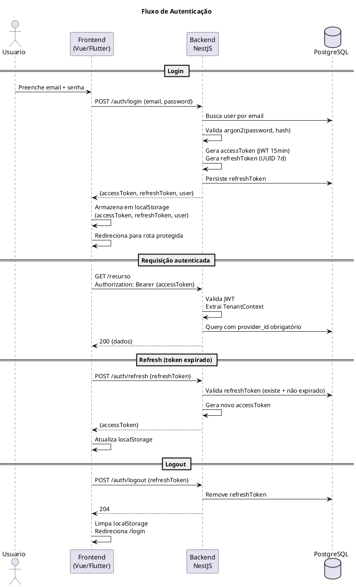
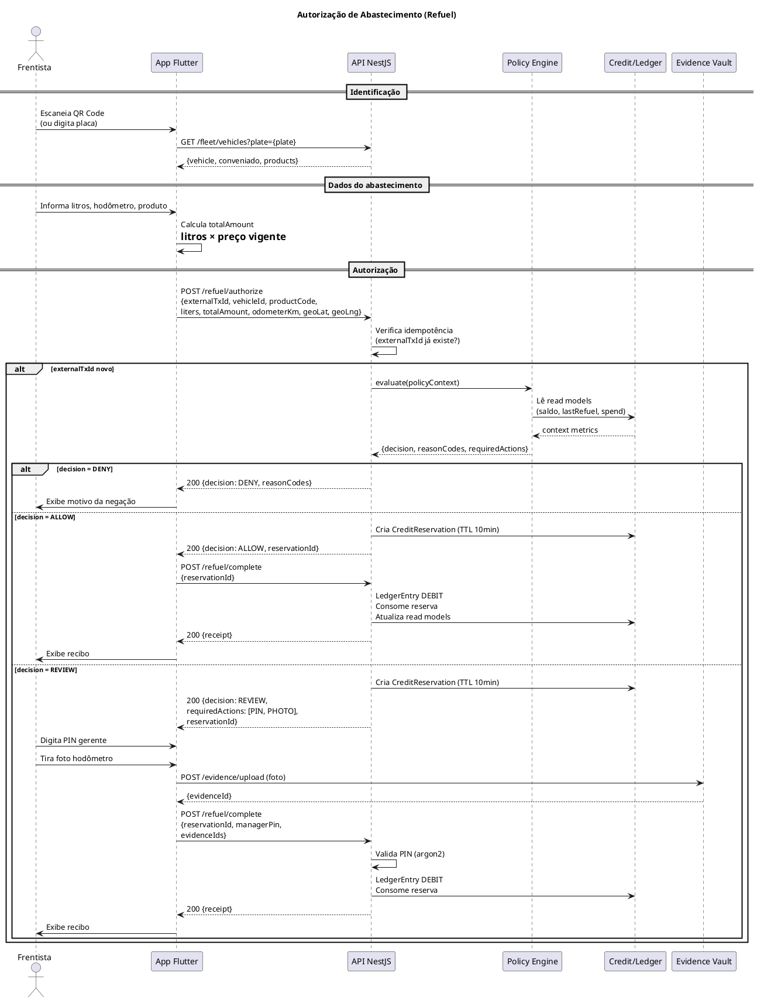
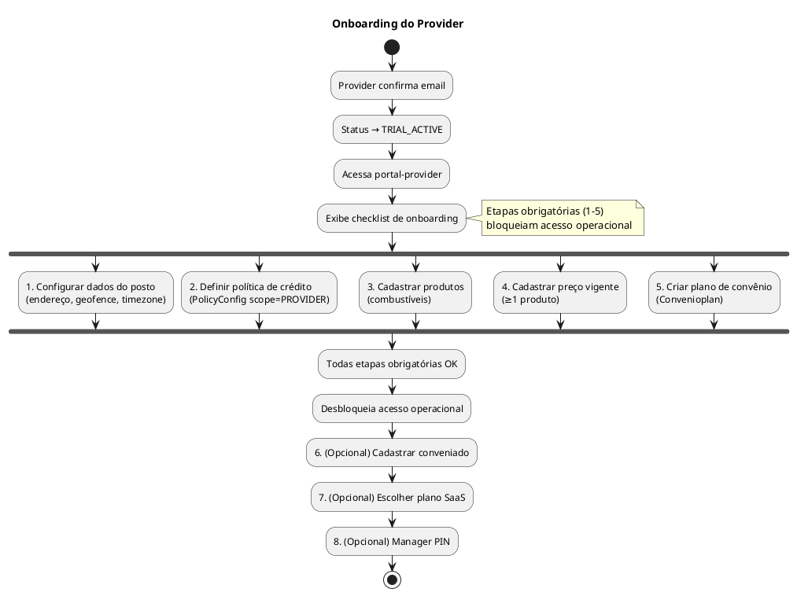
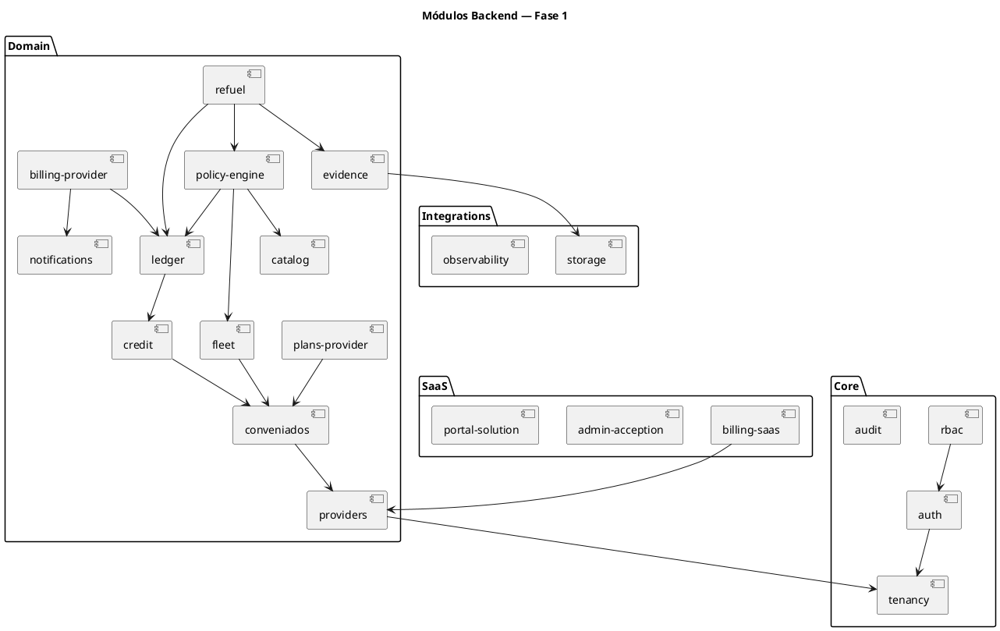

# Fase 1 — Plano de Implementação

> **Referência:** `docs/Features/Phase1-Specification.md`
> **Guideline UI:** `docs/Guidelines/ui-templates.md`
> **Data:** 2026-04-11

---

## Sumário

1. [Visão Geral](#1-visão-geral)
2. [Diagramas](#2-diagramas)
3. [User Stories](#3-user-stories)
4. [Tasks Técnicas de Infraestrutura](#4-tasks-técnicas-de-infraestrutura)
5. [Plano de Sprints](#5-plano-de-sprints)

---

## 1. Visão Geral

### 1.1 Premissas

| Item | Valor |
|---|---|
| Sprints | 11 × 2 semanas = 22 semanas |
| Stack backend | NestJS 11, Prisma 7, PostgreSQL |
| Stack frontend | Vue 3, Vuetify 3, Pinia, Vue Router, vue-i18n, Axios |
| Stack mobile | Flutter |
| Portais | portal-solution (5001), portal-acception (5000), portal-provider (5002), portal-conveniado (5003) |
| Backend | server-api (5100) |
| Padrão UI | Conforme `docs/Guidelines/ui-templates.md` — Public Template + Authenticated Template |

### 1.2 Convenções

- **US-NNN** — User Story
- **T-NNN** — Task técnica
- Prefixos de task: `[BE]` Backend · `[FE-SOL]` portal-solution · `[FE-ACC]` portal-acception · `[FE-PRV]` portal-provider · `[FE-CVD]` portal-conveniado · `[APP]` app-frentista · `[INFRA]` infraestrutura

---

## 2. Diagramas

### 2.1 Fluxo de Autenticação (Login + Refresh)

### 2.2 Fluxo de Autorização de Abastecimento

### 2.3 Onboarding do Provider

### 2.4 Módulos NestJS — Fase 1

---

## 3. User Stories

### 3.1 Autenticação e Identidade (E1)

---

#### US-001 — Login de usuário

**Como** qualquer usuário (provider, conveniado ou acception admin), **quero** fazer login com email e senha **para** acessar meu portal com minhas permissões.

**Critérios de aceite:**
- Login retorna accessToken (JWT 15min) + refreshToken (7 dias)
- JWT contém claims: sub, providerId, actorType, conveniadoId, roles
- Credenciais inválidas retornam 401 com mensagem genérica
- Rate limiting: máx 10 tentativas por IP em 15min

**Tasks:** T-001, T-002, T-050, T-051, T-080, T-081, T-110, T-111, T-140, T-141

---

#### US-002 — Logout

**Como** usuário autenticado, **quero** fazer logout **para** encerrar minha sessão de forma segura.

**Critérios de aceite:**
- Refresh token invalidado no backend
- Frontend limpa localStorage e redireciona para /login
- Access token subsequente não funciona após refresh expirar

**Tasks:** T-003

---

#### US-003 — Refresh de token

**Como** sistema, **quero** renovar o access token automaticamente **para** manter a sessão do usuário sem relogin.

**Critérios de aceite:**
- Interceptor Axios detecta 401 e tenta refresh antes de redirecionar
- Se refresh falhar, limpa estado e redireciona para /login

**Tasks:** T-004, T-052, T-082, T-112, T-142

---

#### US-004 — Esqueci minha senha

**Como** usuário, **quero** solicitar reset de senha por email **para** recuperar meu acesso.

**Critérios de aceite:**
- POST /auth/forgot-password envia email com token (expira 1h)
- Email não cadastrado retorna 200 (sem revelar existência)
- Token single-use

**Tasks:** T-005, T-053, T-083, T-113

---

#### US-005 — Reset de senha

**Como** usuário, **quero** definir nova senha usando o link recebido por email **para** restaurar meu acesso.

**Critérios de aceite:**
- Valida token + define nova senha (argon2)
- Token expirado ou já usado retorna erro amigável
- Redireciona para /login após sucesso

**Tasks:** T-006, T-054, T-084, T-114

---

#### US-006 — Confirmação de email

**Como** novo provider, **quero** confirmar meu email **para** ativar minha conta.

**Critérios de aceite:**
- GET /auth/confirm-email?token=X ativa o usuário e o provider (TRIAL_ACTIVE)
- Token expira em 24h; exibe mensagem e botão de reenvio
- Após confirmação, redireciona para portal-provider

**Tasks:** T-007, T-055

---

### 3.2 Registro e Portal da Solução (E2)

---

#### US-007 — Registro de provider (signup)

**Como** dono de posto, **quero** criar uma conta na plataforma **para** gerenciar crédito para meus clientes.

**Critérios de aceite:**
- Formulário coleta: razão social, nome fantasia, CNPJ (validado), endereço, telefone, email, nome do responsável, senha, aceite de termos
- CNPJ duplicado retorna erro
- Email duplicado retorna erro
- Cria Provider (PENDING_VERIFICATION) + User (PROVIDER_ADMIN, PENDING_EMAIL_CONFIRMATION)
- Cria Subscription com plano Starter em status TRIAL
- Envia email de confirmação

**Tasks:** T-008, T-056, T-057, T-058

---

#### US-008 — Landing page da solução

**Como** visitante, **quero** ver a página institucional da plataforma **para** entender o produto e os planos antes de me registrar.

**Critérios de aceite:**
- Exibe benefícios, features, seção de planos (Starter/Growth/Pro) com preços
- Botão "Criar conta" leva para /signup
- Responsiva mobile

**Tasks:** T-059, T-060

---

#### US-009 — Visualizar planos SaaS (público)

**Como** visitante, **quero** ver os planos disponíveis **para** escolher o mais adequado ao meu posto.

**Critérios de aceite:**
- GET /providers/plans retorna planos ativos com limites e preços
- Exibidos em cards comparativos na landing page

**Tasks:** T-009, T-060

---

### 3.3 Billing SaaS e Portal Acception (E3)

---

#### US-010 — Dashboard da Acception

**Como** admin da Acception, **quero** ver um dashboard com métricas SaaS **para** acompanhar a saúde da plataforma.

**Critérios de aceite:**
- Exibe: nº tenants ativos, em trial, suspensos, MRR, total de invoices abertas
- Dados carregados de GET /admin/metrics

**Tasks:** T-010, T-085, T-086

---

#### US-011 — Listar providers

**Como** admin da Acception, **quero** ver a lista de todos os providers **para** gerenciar a base de clientes.

**Critérios de aceite:**
- Tabela paginada com: nome, CNPJ, status, plano, trial expiry, data criação
- Filtros por status e plano
- Busca por nome/CNPJ

**Tasks:** T-011, T-087

---

#### US-012 — Detalhe do provider (Acception)

**Como** admin da Acception, **quero** ver o detalhe de um provider **para** analisar assinatura e uso.

**Critérios de aceite:**
- Exibe dados cadastrais, assinatura, invoices SaaS, estatísticas de uso (convênios, veículos, transações)
- Botões de ação: ativar assinatura, suspender, reativar

**Tasks:** T-012, T-088

---

#### US-013 — Criar/editar plano SaaS

**Como** admin da Acception, **quero** criar e editar planos SaaS **para** definir a oferta da plataforma.

**Critérios de aceite:**
- Formulário com todos os campos do SaasPlan (nome, preço, limites, white-label, trial, suspensão, grace period)
- Validação de campos obrigatórios
- Edição não altera assinaturas existentes (versionamento futuro)

**Tasks:** T-013, T-089

---

#### US-014 — Ativar assinatura manualmente

**Como** admin da Acception, **quero** ativar a assinatura de um provider **para** permitir que ele opere após o pagamento (confirmado fora da plataforma).

**Critérios de aceite:**
- Muda Subscription.status para ACTIVE
- Define currentPeriodStart/End
- Provider status muda de TRIAL_ACTIVE para ACTIVE
- Gera audit log

**Tasks:** T-014, T-090

---

#### US-015 — Suspender provider manualmente

**Como** admin da Acception, **quero** suspender um provider **para** bloquear seu acesso em caso de inadimplência.

**Critérios de aceite:**
- Muda Provider.status para SUSPENDED_SAAS_FULL ou SUSPENDED_SAAS_AUTH_ONLY (conforme plano)
- Provider suspenso FULL_BLOCK recebe 403 em toda rota de negócio
- Provider suspenso BLOCK_AUTH_ONLY acessa dados mas não autoriza abastecimentos
- Gera audit log

**Tasks:** T-015, T-091

---

#### US-016 — Reativar provider manualmente

**Como** admin da Acception, **quero** reativar um provider suspenso **para** restaurar seu acesso após regularização.

**Critérios de aceite:**
- Muda Provider.status para ACTIVE
- Subscription.status volta para ACTIVE
- Gera audit log

**Tasks:** T-016, T-092

---

#### US-017 — Expiração automática de trial

**Como** sistema, **quero** suspender automaticamente providers com trial expirado **para** forçar a escolha de plano.

**Critérios de aceite:**
- Job diário verifica Subscriptions com status=TRIAL e trialEndsAt < now
- Muda Provider.status para SUSPENDED conforme suspensionMode do plano
- Envia notificação de suspensão

**Tasks:** T-017

---

#### US-018 — Gerar invoice SaaS mensal

**Como** sistema, **quero** gerar invoices mensais para providers ativos **para** controle financeiro da Acception.

**Critérios de aceite:**
- Job mensal gera SaasInvoice com baseAmount + usageAmount (transações excedentes)
- Invoice fica com status OPEN
- Apuração de uso: conta transações do período vs. limite do plano

**Tasks:** T-018

---

#### US-019 — Marcar invoice SaaS como paga

**Como** admin da Acception, **quero** registrar pagamento de uma invoice SaaS **para** manter o controle financeiro.

**Critérios de aceite:**
- Muda SaasInvoice.status para PAID
- Registra paidAt

**Tasks:** T-019, T-093

---

#### US-020 — Visualizar audit log (Acception)

**Como** admin da Acception, **quero** ver o log de auditoria cross-tenant **para** monitorar ações críticas na plataforma.

**Critérios de aceite:**
- Tabela paginada com filtros: provider, action, período, ator
- Exibe detalhes em JSON formatado

**Tasks:** T-020, T-094

---

### 3.4 Onboarding e Gestão do Provider (E4)

---

#### US-021 — Checklist de onboarding

**Como** provider recém-registrado, **quero** ver um checklist das etapas que preciso completar **para** saber o que falta para começar a operar.

**Critérios de aceite:**
- GET /providers/me/onboarding retorna lista de etapas com status (DONE/PENDING)
- Portal exibe checklist com links diretos para cada etapa
- Acesso a rotas operacionais bloqueado enquanto etapas 1–5 não completadas
- Ao completar cada etapa, backend atualiza status automaticamente

**Tasks:** T-021, T-115, T-116

---

#### US-022 — Configurar dados do posto

**Como** provider admin, **quero** configurar os dados do meu posto **para** que o sistema conheça minha operação.

**Critérios de aceite:**
- PATCH /providers/me aceita: tradeName, legalName, addressJson, phone, timezone, geofenceLat, geofenceLng, geofenceRadiusM
- Valida campos obrigatórios
- Marca etapa 1 do onboarding como DONE

**Tasks:** T-022, T-117

---

#### US-023 — Configurar domínio white-label

**Como** provider com plano Growth+, **quero** registrar meu subdomínio/domínio **para** personalizar o acesso dos meus conveniados.

**Critérios de aceite:**
- POST /providers/me/domains valida que o plano SaaS permite white-label
- Starter → retorna 403
- Growth → aceita subdomínio (ex: meuposto.fiadoauto.com.br)
- Pro → aceita domínio próprio (ex: credito.meuposto.com.br)
- Registra em provider_domains com status PENDING_VERIFICATION

**Tasks:** T-023, T-118

---

#### US-024 — Configurar Manager PIN

**Como** provider admin, **quero** definir um PIN numérico para autorização de step-up **para** que frentistas possam validar operações que exigem aprovação do gerente.

**Critérios de aceite:**
- PUT /providers/me/manager-pin aceita pin (6 dígitos)
- Armazena como hash argon2
- Requer senha atual do admin como confirmação
- Marca etapa do onboarding como DONE (se parte do checklist)

**Tasks:** T-024, T-119

---

#### US-025 — Convidar operador/gerente

**Como** provider admin, **quero** convidar operadores e gerentes **para** que possam acessar o portal e/ou o app frentista.

**Critérios de aceite:**
- POST /users/invite envia email com link de convite (token 72h)
- Define role: PROVIDER_OPERATOR ou PROVIDER_MANAGER
- Convite expira em 72h

**Tasks:** T-025, T-120

---

#### US-026 — Aceitar convite de operador

**Como** operador convidado, **quero** aceitar o convite e criar minha senha **para** acessar o sistema.

**Critérios de aceite:**
- GET /auth/invite/accept?token=X exibe formulário (nome, senha)
- POST cria senha e ativa usuário
- Redireciona para portal-provider ou app

**Tasks:** T-026, T-121

---

#### US-027 — Gerenciar usuários do provider

**Como** provider admin, **quero** ver, desativar e alterar roles dos meus operadores **para** controlar quem acessa o sistema.

**Critérios de aceite:**
- GET /users lista usuários do provider (paginado)
- PATCH /users/:id permite alterar role e status (ACTIVE/INACTIVE)
- Não é possível desativar o próprio usuário

**Tasks:** T-027, T-122

---

### 3.5 Catálogo de Produtos (E4)

---

#### US-028 — Cadastrar produto

**Como** provider admin, **quero** cadastrar os combustíveis que vendo **para** que apareçam nas opções de abastecimento.

**Critérios de aceite:**
- POST /catalog/products cria produto (code, name, unitType)
- Seed automático com produtos padrão ao criar provider (DIESEL_S10, DIESEL_COMUM, GASOLINA_COMUM, GASOLINA_ADITIVADA, ETANOL)
- Code único por provider
- Marca etapa 3 do onboarding como DONE

**Tasks:** T-028, T-123

---

#### US-029 — Configurar preço vigente

**Como** provider admin, **quero** definir o preço por litro de cada produto **para** que o sistema calcule valores corretamente.

**Critérios de aceite:**
- POST /catalog/prices define preço vigente (validFrom = now, desativa preço anterior)
- Apenas 1 preço ativo por produto por vez
- Histórico preservado
- GET /catalog/prices/current retorna preços vigentes
- Marca etapa 4 do onboarding como DONE

**Tasks:** T-029, T-124

---

#### US-030 — Visualizar histórico de preços

**Como** provider admin, **quero** ver o histórico de preços **para** auditoria.

**Critérios de aceite:**
- GET /catalog/prices?productId=X retorna histórico paginado (preço, validFrom, validTo)

**Tasks:** T-030, T-125

---

### 3.6 Planos do Provider e Convênios (E5)

---

#### US-031 — Criar plano de convênio

**Como** provider admin, **quero** criar um plano parametrizável **para** oferecer condições de crédito aos meus clientes.

**Critérios de aceite:**
- POST /plans-provider cria plano com todos os parâmetros (crédito, governança, antifraude, comercial)
- Valida que provider não excedeu limite de planos do SaaS
- Versão inicial = 1
- Marca etapa 5 do onboarding como DONE

**Tasks:** T-031, T-126

---

#### US-032 — Editar plano (nova versão)

**Como** provider admin, **quero** alterar parâmetros de um plano **para** ajustar condições mantendo o histórico.

**Critérios de aceite:**
- PATCH /plans-provider/:id cria nova versão do plano
- Convênios existentes continuam na versão anterior
- Novos convênios usam a versão mais recente

**Tasks:** T-032, T-127

---

#### US-033 — Cadastrar empresa conveniada

**Como** provider admin, **quero** cadastrar uma empresa **para** iniciar um convênio de crédito.

**Critérios de aceite:**
- POST /conveniados cria conveniado (legalName, cnpj, email, responsibleName, planId, billingCycleDay)
- Valida CNPJ (único por provider)
- Valida limite de convênios do plano SaaS
- Status inicial: PENDING_APPROVAL
- Cria CreditAccount com limite do plano
- Envia email de convite ao conveniado (token 72h)

**Tasks:** T-033, T-128

---

#### US-034 — Ativação de conta do conveniado

**Como** conveniado, **quero** ativar minha conta pelo link recebido **para** acessar o portal e ter meu crédito liberado.

**Critérios de aceite:**
- Link leva para tela pública do portal-conveniado
- Conveniado define nome e senha do usuário admin
- Cria User (CONVENIADO_ADMIN)
- Conveniado.status → ACTIVE

**Tasks:** T-034, T-143, T-144

---

#### US-035 — Listar convênios

**Como** provider admin, **quero** ver todos os meus convênios **para** acompanhar minha carteira.

**Critérios de aceite:**
- GET /conveniados retorna lista paginada (nome, cnpj, status, plano, saldo, próxima fatura)
- Filtros: status, plano
- Busca por nome/cnpj

**Tasks:** T-035, T-129

---

#### US-036 — Detalhe do convênio

**Como** provider admin, **quero** ver os detalhes de um convênio **para** analisar situação financeira e operacional.

**Critérios de aceite:**
- GET /conveniados/:id retorna dados completos + crédito + histórico de status
- Exibe: dados cadastrais, plano vigente, saldo, veículos, últimas transações

**Tasks:** T-036, T-130

---

#### US-037 — Bloquear/desbloquear convênio manualmente

**Como** provider admin, **quero** bloquear ou desbloquear um convênio **para** controlar a operação de crédito.

**Critérios de aceite:**
- PATCH /conveniados/:id/status aceita {status: BLOCKED | ACTIVE}
- Gera audit log
- Convênio bloqueado → regra AF-001 impede autorizações

**Tasks:** T-037, T-131

---

#### US-038 — Alterar plano de um convênio

**Como** provider admin, **quero** mudar o plano de um convênio **para** ajustar condições de crédito.

**Critérios de aceite:**
- PATCH /conveniados/:id aceita {planId}
- Atualiza referência para nova versão do plano
- Ajusta creditLimit na CreditAccount se o novo plano tiver limite diferente
- Gera audit log

**Tasks:** T-038, T-132

---

### 3.7 Frota (E6)

---

#### US-039 — Cadastrar veículo

**Como** provider admin, **quero** cadastrar veículos de um conveniado **para** permitir autorização de abastecimento.

**Critérios de aceite:**
- POST /fleet/vehicles cria veículo (plate, type, tankCapacityLiters, vehicleCreditLimit, allowedProducts)
- Placa única por provider
- Valida limite de veículos do plano SaaS

**Tasks:** T-039, T-133

---

#### US-040 — Editar veículo

**Como** provider admin, **quero** editar dados de um veículo **para** manter informações atualizadas.

**Critérios de aceite:**
- PATCH /fleet/vehicles/:id atualiza dados editáveis (tipo, tanque, limite, produtos permitidos)
- Placa não editável após criação

**Tasks:** T-040, T-134

---

#### US-041 — Ativar/desativar veículo

**Como** provider admin, **quero** ativar ou desativar um veículo **para** controlar quais veículos podem abastecer.

**Critérios de aceite:**
- PATCH /fleet/vehicles/:id/status aceita {status: ACTIVE | INACTIVE | STOLEN}
- Veículo INACTIVE/STOLEN → regra AF-002 impede autorizações

**Tasks:** T-041, T-135

---

#### US-042 — Gerar QR Code do veículo

**Como** provider admin, **quero** gerar e imprimir o QR Code de um veículo **para** que o frentista possa identificá-lo.

**Critérios de aceite:**
- GET /fleet/vehicles/:id/qr retorna QR Code (base64 PNG) com payload assinado {vehicleId, providerId, checksum}
- Portal exibe QR e botão para download/impressão (PDF A4 com 4 QR por página ou individual)
- Gerar novo QR invalida o anterior

**Tasks:** T-042, T-136

---

#### US-043 — Gerenciar centros de custo

**Como** provider admin, **quero** criar e editar centros de custo de um conveniado **para** que as transações sejam categorizadas.

**Critérios de aceite:**
- POST /fleet/cost-centers cria CC (code, name, conveniadoId)
- Code único por provider+conveniado
- PATCH para editar, ativar/desativar

**Tasks:** T-043, T-137

---

### 3.8 Crédito e Ledger (E7)

---

#### US-044 — Visualizar saldo e limites

**Como** provider admin, **quero** ver o saldo e limites de um conveniado **para** acompanhar a exposição de crédito.

**Critérios de aceite:**
- GET /credit/accounts/:conveniadoId retorna: creditLimit, currentBalance, reservedAmount, availableBalance
- Dados lidos do read model (materializado)

**Tasks:** T-044, T-138

---

#### US-045 — Visualizar extrato

**Como** provider admin, **quero** ver o extrato de um conveniado **para** auditar movimentações.

**Critérios de aceite:**
- GET /ledger/:conveniadoId retorna entries paginadas (data, tipo, valor, veículo, descrição)
- Filtros: período, tipo (DEBIT/CREDIT/REVERSAL), veículo
- Ordenação: mais recente primeiro

**Tasks:** T-045, T-139

---

#### US-046 — Ajuste manual de saldo

**Como** provider admin, **quero** registrar um ajuste manual no saldo **para** corrigir discrepâncias.

**Critérios de aceite:**
- POST /ledger/adjustment exige justificativa obrigatória
- Cria LedgerEntry tipo ADJUSTMENT
- Atualiza currentBalance
- Gera audit log
- Requer confirmação com senha do admin

**Tasks:** T-046, T-140a

---

#### US-047 — Exportar extrato em CSV

**Como** provider admin, **quero** exportar o extrato **para** importar em planilhas.

**Critérios de aceite:**
- GET /ledger/:conveniadoId/export?format=csv retorna arquivo CSV
- Mesmo filtros do extrato online

**Tasks:** T-047, T-140b

---

#### US-048 — Visualizar aging da dívida

**Como** provider admin, **quero** ver o aging dos créditos concedidos **para** avaliar risco da carteira.

**Critérios de aceite:**
- GET /credit/accounts/:conveniadoId/aging retorna breakdown: 0–30, 31–60, 61–90, 90+ dias
- Dashboard financeiro exibe aging agregado de toda carteira

**Tasks:** T-048, T-140c

---

#### US-049 — Dashboard financeiro do provider

**Como** provider admin, **quero** ver um dashboard com visão geral da carteira de crédito **para** acompanhar a saúde financeira.

**Critérios de aceite:**
- Exibe: total concedido, saldo devedor total, % inadimplência, aging consolidado, top 5 devedores
- Dados agregados por GET /credit/dashboard

**Tasks:** T-049a, T-140d

---

### 3.9 Policy Engine e Antifraude (E8)

---

#### US-050 — Configurar política do provider

**Como** provider admin, **quero** configurar as regras antifraude e governança do meu posto **para** personalizar o nível de controle.

**Critérios de aceite:**
- POST/PUT /policy-config (scope=PROVIDER) salva configuração com todos os parâmetros
- Formulário com seções: governança, crédito, antifraude, step-up
- Marca etapa 2 do onboarding como DONE

**Tasks:** T-049b, T-140e

---

#### US-051 — Override de política por convênio

**Como** provider admin, **quero** customizar parâmetros de política para um convênio específico **para** aplicar regras diferenciadas.

**Critérios de aceite:**
- POST/PUT /policy-config (scope=CONVENIADO, scopeId=X) salva override
- Campos não preenchidos herdam do provider
- Exibe visualmente quais campos estão herdados vs. customizados

**Tasks:** T-049c, T-140f

---

#### US-052 — Visualizar regras ativas

**Como** provider admin, **quero** ver o catálogo de regras e seus parâmetros **para** entender como funciona o antifraude.

**Critérios de aceite:**
- Exibe tabela com: ID, nome, severidade, parâmetros vigentes, status (ativo/desativado)
- Não editável individualmente (edição via PolicyConfig)

**Tasks:** T-140g

---

### 3.10 Autorização de Abastecimento (E9)

---

#### US-053 — Solicitar autorização de abastecimento

**Como** operador do app frentista, **quero** solicitar autorização de abastecimento **para** verificar se o crédito é suficiente e as regras antifraude permitem.

**Critérios de aceite:**
- POST /refuel/authorize recebe AuthorizationRequest e retorna AuthorizationDecision
- Idempotência: mesmo externalTxId retorna mesma decisão
- Latência P95 ≤ 300ms

**Tasks:** T-049d

---

#### US-054 — Completar abastecimento

**Como** operador, **quero** confirmar o abastecimento **para** efetivar o débito no crédito do conveniado.

**Critérios de aceite:**
- POST /refuel/complete consome reserva, cria LedgerEntry DEBIT, atualiza read models
- Se step-up exigido, valida PIN e/ou evidências

**Tasks:** T-049e

---

#### US-055 — Cancelar autorização

**Como** operador, **quero** cancelar uma autorização não completada **para** liberar o crédito reservado.

**Critérios de aceite:**
- POST /refuel/cancel libera reserva e atualiza reservedAmount
- Só cancela reservas ACTIVE

**Tasks:** T-049f

---

#### US-056 — Estornar abastecimento

**Como** provider manager, **quero** estornar um abastecimento já efetivado **para** corrigir erros operacionais.

**Critérios de aceite:**
- POST /refuel/transactions/:id/reverse cria LedgerEntry REVERSAL
- Atualiza currentBalance e read models (operator_stats)
- Gera audit log
- Apenas PROVIDER_MANAGER ou PROVIDER_ADMIN

**Tasks:** T-049g

---

#### US-057 — Visualizar transações

**Como** provider admin/manager, **quero** ver o histórico de transações **para** monitorar a operação.

**Critérios de aceite:**
- GET /refuel/transactions retorna lista paginada com filtros (data, conveniado, veículo, decisão, status)
- Badges visuais: ALLOW (verde), DENY (vermelho), REVIEW (amarelo)

**Tasks:** T-049h, T-140h

---

#### US-058 — Detalhe de transação

**Como** provider admin, **quero** ver o detalhe de uma transação **para** entender a decisão tomada.

**Critérios de aceite:**
- GET /refuel/transactions/:id retorna dados completos + ruleHits + evidências
- Exibe reason codes legíveis, parâmetros que dispararam cada regra
- Preview de evidências (foto com presigned URL)

**Tasks:** T-049i, T-140i

---

### 3.11 App Frentista (E10)

---

#### US-059 — Login no app

**Como** frentista, **quero** fazer login no app **para** iniciar meu turno de abastecimentos.

**Critérios de aceite:**
- Tela de login com email + senha
- JWT armazenado em flutter_secure_storage
- Sessão persistida entre reinicializações do app
- Auto-refresh do token

**Tasks:** T-150, T-151

---

#### US-060 — Identificar veículo por QR Code

**Como** frentista, **quero** escanear o QR Code do veículo **para** iniciar o abastecimento rapidamente.

**Critérios de aceite:**
- Câmera abre automaticamente na tela "Novo Abastecimento"
- Lê QR com payload {vehicleId, providerId, checksum}
- Valida checksum; se inválido, exibe erro e opção de placa manual
- Busca dados do veículo e exibe na tela

**Tasks:** T-152, T-153

---

#### US-061 — Identificar veículo por placa (fallback)

**Como** frentista, **quero** digitar a placa do veículo **para** identificá-lo quando o QR não funcionar.

**Critérios de aceite:**
- Campo de placa com máscara (ABC-1D23)
- GET /fleet/vehicles?plate=X busca veículo no backend
- Se encontrado, exibe dados; se não, exibe erro

**Tasks:** T-154

---

#### US-062 — Preencher dados do abastecimento

**Como** frentista, **quero** informar litros, hodômetro e produto **para** que o sistema calcule o valor e autorize.

**Critérios de aceite:**
- Dropdown de produtos (do conveniado ou provider)
- Campos numéricos: litros, hodômetro
- Calcula totalAmount = litros × preço vigente (exibido)
- Validações: litros > 0, hodômetro > 0

**Tasks:** T-155

---

#### US-063 — Receber decisão ALLOW e confirmar

**Como** frentista, **quero** ver que o abastecimento foi autorizado **para** realizar o abastecimento e confirmar.

**Critérios de aceite:**
- Tela de confirmação: "Autorizado — R$ X,XX — Confirma?"
- Ao confirmar, chama POST /refuel/complete
- Exibe recibo com dados completos

**Tasks:** T-156

---

#### US-064 — Receber DENY e ver motivo

**Como** frentista, **quero** entender por que o abastecimento foi negado **para** informar o motorista.

**Critérios de aceite:**
- Tela vermelha com ícone de negação
- Lista de reason codes traduzidos para pt-BR (ex: "Limite de crédito excedido")
- Botão "Voltar" para iniciar novo abastecimento

**Tasks:** T-157

---

#### US-065 — Executar step-up (PIN + foto)

**Como** frentista, **quero** executar as ações de step-up solicitadas **para** completar um abastecimento sob revisão.

**Critérios de aceite:**
- Exibe lista de ações requeridas (PIN, foto, geo)
- Campo de PIN: 6 dígitos, obscurecido, máx 5 tentativas
- Foto: abre câmera, preview antes de enviar
- Geo: captura posição atual, exibe no mapa
- Ao completar todas, chama POST /refuel/complete com evidências

**Tasks:** T-158, T-159, T-160

---

#### US-066 — Pré-captura offline

**Como** frentista, **quero** registrar um abastecimento quando estou sem internet **para** que não se perca a informação.

**Critérios de aceite:**
- Detecta ausência de conectividade
- Armazena em SQLite local: externalTxId (gerado), vehicleId, liters, odometerKm, timestamp
- Exibe badge de "pendentes" na tela home
- Não efetiva débito

**Tasks:** T-161

---

#### US-067 — Sincronizar pré-capturas

**Como** frentista, **quero** sincronizar pré-capturas quando a internet voltar **para** que sejam autorizadas.

**Critérios de aceite:**
- Tela lista pré-capturas pendentes
- Botão "Sincronizar" envia cada uma para POST /refuel/authorize → complete
- Se negado, marca a pré-captura como rejeitada com motivo
- Se autorizado, remove da lista e exibe recibo

**Tasks:** T-162

---

#### US-068 — Visualizar recibo

**Como** frentista, **quero** ver o recibo do abastecimento **para** comprovar a operação.

**Critérios de aceite:**
- Exibe: data, veículo, placa, produto, litros, valor, operador, nº da transação
- Botão "Novo Abastecimento" para reiniciar fluxo

**Tasks:** T-163

---

### 3.12 Billing Provider (E11)

---

#### US-069 — Geração automática de fatura

**Como** sistema, **quero** gerar faturas mensais para cada conveniado **para** que o provider possa cobrar.

**Critérios de aceite:**
- Job diário verifica conveniados com billingCycleDay = hoje
- Cria ProviderInvoice com items (todos DEBITs do período)
- Aplica: desconto do plano, taxa administrativa, juros/multas de atraso
- Calcula totalAmount
- Status: OPEN, dueDate = periodEnd + paymentDueDays

**Tasks:** T-049j

---

#### US-070 — Listar faturas do provider

**Como** provider admin, **quero** ver todas as faturas geradas **para** acompanhar contas a receber.

**Critérios de aceite:**
- GET /billing/invoices retorna lista paginada (conveniado, período, valor, status, vencimento)
- Filtros: conveniado, status, período

**Tasks:** T-049k, T-140j

---

#### US-071 — Detalhe de fatura

**Como** provider admin, **quero** ver o detalhe de uma fatura **para** conferir os itens.

**Critérios de aceite:**
- GET /billing/invoices/:id retorna header + items (data, veículo, litros, valor)
- Exibe totais: base, desconto, taxa, multa, total

**Tasks:** T-049l, T-140k

---

#### US-072 — Registrar pagamento manual

**Como** provider admin, **quero** registrar que um conveniado pagou **para** atualizar o saldo e desbloquear.

**Critérios de aceite:**
- POST /billing/invoices/:id/pay registra valor e data do pagamento
- Cria LedgerEntry CREDIT
- Se conveniado era DELINQUENT e não há mais faturas vencidas → status ACTIVE
- Gera audit log

**Tasks:** T-049m, T-140l

---

#### US-073 — Exportar fatura em PDF

**Como** provider admin, **quero** exportar uma fatura em PDF **para** enviar ao conveniado.

**Critérios de aceite:**
- Botão "Exportar PDF" gera PDF no frontend (html2pdf/jsPDF) com dados da fatura
- Formato: header do provider + dados do conveniado + tabela de items + totais

**Tasks:** T-140m

---

#### US-074 — Inadimplência automática

**Como** sistema, **quero** bloquear automaticamente conveniados com faturas vencidas **para** proteger o provider.

**Critérios de aceite:**
- Job diário verifica faturas com status OPEN e dueDate < now
- Muda status fatura para PAST_DUE
- Se vencido > lockAfterDays → conveniado.status → DELINQUENT
- Envia notificação de bloqueio

**Tasks:** T-049n

---

#### US-075 — Dashboard de inadimplência

**Como** provider admin, **quero** ver um dashboard de inadimplência **para** agir sobre conveniados em atraso.

**Critérios de aceite:**
- Exibe: conveniados em atraso, aging por faixa, total em aberto
- Ações diretas: bloquear, registrar pagamento

**Tasks:** T-140n

---

### 3.13 Portal Conveniado (E12)

---

#### US-076 — Login do conveniado

**Como** usuário de empresa conveniada, **quero** fazer login no portal **para** consultar minha situação financeira.

**Critérios de aceite:**
- Login no portal-conveniado (porta 5003) ou via subdomínio white-label
- Resolução de tenant por host header ou JWT
- Apenas dados do conveniado acessíveis

**Tasks:** T-141, T-142

---

#### US-077 — Dashboard do conveniado

**Como** conveniado admin, **quero** ver meu dashboard **para** ter visão rápida da situação.

**Critérios de aceite:**
- Exibe: saldo disponível, crédito utilizado, próxima fatura (valor, vencimento), último abastecimento

**Tasks:** T-145

---

#### US-078 — Extrato do conveniado

**Como** conveniado, **quero** ver meu extrato de abastecimentos **para** conferir os consumos.

**Critérios de aceite:**
- Tabela paginada com filtros: período, veículo, centro de custo
- Botão exportar CSV

**Tasks:** T-146

---

#### US-079 — Faturas recebidas

**Como** conveniado, **quero** ver minhas faturas **para** conferir valores e prazos.

**Critérios de aceite:**
- Lista de faturas (período, valor, status, vencimento)
- Detalhe da fatura com items

**Tasks:** T-147

---

#### US-080 — Lista de veículos (view-only)

**Como** conveniado, **quero** ver meus veículos cadastrados **para** conferir a frota.

**Critérios de aceite:**
- Tabela com: placa, tipo, status, último abastecimento
- Apenas visualização (sem ações)

**Tasks:** T-148

---

### 3.14 Notificações e Evidence (E13)

---

#### US-081 — Enviar email de confirmação de conta

**Como** sistema, **quero** enviar email de confirmação **para** validar o email do provider.

**Critérios de aceite:**
- Email com link contendo token (expira 24h)
- Template em pt-BR com nome do provider

**Tasks:** T-049o

---

#### US-082 — Enviar email de convite ao conveniado

**Como** sistema, **quero** enviar email de convite **para** que o conveniado ative sua conta.

**Critérios de aceite:**
- Email com link de ativação (expira 72h)
- Template em pt-BR com nome do provider e dados do convênio

**Tasks:** T-049p

---

#### US-083 — Enviar email de boas-vindas

**Como** sistema, **quero** enviar email de boas-vindas ao provider após confirmação **para** orientar sobre os próximos passos.

**Critérios de aceite:**
- Enviado automaticamente após confirmação de email
- Contém link para o portal e resumo do onboarding

**Tasks:** T-049q

---

#### US-084 — Alertar trial expirando

**Como** sistema, **quero** enviar alerta 7 dias antes do trial expirar **para** que o provider tenha tempo de escolher um plano.

**Critérios de aceite:**
- Job diário verifica trials com 7 dias restantes
- Envia email com link para escolha de plano

**Tasks:** T-049r

---

#### US-085 — Notificar vencimento de fatura (provider)

**Como** sistema, **quero** enviar notificação 3 dias antes e no dia do vencimento da fatura **para** que o conveniado providencie pagamento.

**Critérios de aceite:**
- Email enviado ao CONVENIADO_ADMIN e ao PROVIDER_ADMIN
- Template com dados da fatura e valor

**Tasks:** T-049s

---

#### US-086 — Notificar bloqueio por inadimplência

**Como** sistema, **quero** notificar quando um convênio é bloqueado por inadimplência **para** que ambas as partes tomem ação.

**Critérios de aceite:**
- Email enviado a CONVENIADO_ADMIN e PROVIDER_ADMIN
- Template com dados do convênio e fatura(s) em atraso

**Tasks:** T-049t

---

#### US-087 — Armazenar evidência (foto + geo)

**Como** sistema, **quero** armazenar fotos e geolocalização de abastecimentos **para** auditoria e prova de operação.

**Critérios de aceite:**
- POST /evidence/upload recebe arquivo (max 5MB JPEG), armazena no S3/MinIO
- Registra hash SHA-256 para integridade
- GET /evidence/:id/url retorna presigned URL (TTL 15min)
- ACL: evidência acessível apenas pelo provider dono

**Tasks:** T-049u

---

## 4. Tasks Técnicas de Infraestrutura

Estas tasks são pré-requisitos que não derivam diretamente de uma US, mas sustentam toda a implementação.

### 4.1 Backend

| ID | Task | Módulo |
|---|---|---|
| T-001 | `[BE]` Módulo auth: endpoints login, logout, refresh, confirm-email, forgot-password, reset-password, invite/accept. Hash argon2 para senhas | auth |
| T-002 | `[BE]` JWT service: gerar access token (15min) com claims {sub, providerId, actorType, conveniadoId, roles}. Gerar refresh token UUID (7d) | auth |
| T-003 | `[BE]` Logout: invalidar refresh token no DB | auth |
| T-004 | `[BE]` Refresh endpoint: validar refresh token existente + não expirado, retornar novo access token | auth |
| T-005 | `[BE]` Forgot password: gerar token single-use (1h), enviar email com link de reset | auth |
| T-006 | `[BE]` Reset password: validar token, atualizar hash da senha, invalidar token | auth |
| T-007 | `[BE]` Confirm email: validar token (24h), ativar User + Provider (→ TRIAL_ACTIVE), criar Subscription com plano Starter | auth |
| T-008 | `[BE]` Register provider: criar Provider (PENDING_VERIFICATION) + User (PROVIDER_ADMIN), validar CNPJ (algoritmo), validar email único, enviar email confirmação | portal-solution |
| T-009 | `[BE]` GET /providers/plans: listar planos SaaS ativos (público, sem auth) | portal-solution |
| T-010 | `[BE]` GET /admin/metrics: nº tenants por status, MRR, invoices abertas. Restrito a ACCEPTION_ADMIN | admin-acception |
| T-011 | `[BE]` GET /admin/providers: lista paginada com filtros (status, plano), busca por nome/CNPJ. Restrito a ACCEPTION_ADMIN | admin-acception |
| T-012 | `[BE]` GET /admin/providers/:id: detalhe com subscription + invoices + uso. Restrito a ACCEPTION_ADMIN | admin-acception |
| T-013 | `[BE]` CRUD SaasPlan: POST + PUT + GET para planos SaaS. Restrito a ACCEPTION_ADMIN | billing-saas |
| T-014 | `[BE]` Ativar subscription: mudar Subscription.status → ACTIVE, definir currentPeriodStart/End, mudar Provider.status → ACTIVE. Audit log | billing-saas |
| T-015 | `[BE]` Suspender provider: mudar Provider.status → SUSPENDED_SAAS_*, Subscription.status → SUSPENDED. Audit log | billing-saas |
| T-016 | `[BE]` Reativar provider: mudar Provider.status → ACTIVE, Subscription.status → ACTIVE. Audit log | billing-saas |
| T-017 | `[BE]` Job cron diário: verificar trials expirados → suspender conforme suspensionMode do plano | billing-saas |
| T-018 | `[BE]` Job cron mensal: gerar SaasInvoice com baseAmount + usageAmount (transações excedentes). Apurar uso: contar refuel_transactions no período vs maxTransactionsMonth | billing-saas |
| T-019 | `[BE]` Marcar SaasInvoice como PAID: atualizar status + paidAt | billing-saas |
| T-020 | `[BE]` GET /admin/audit-log: paginado, filtros (provider, action, período, ator). Restrito a ACCEPTION_ADMIN | audit |
| T-021 | `[BE]` GET /providers/me/onboarding: retorna checklist de etapas com status. Computado a partir de existência de dados (provider_address preenchido? products > 0? etc.) | providers |
| T-022 | `[BE]` PATCH /providers/me: atualizar dados cadastrais + geofence. Validação. Marca etapa 1 | providers |
| T-023 | `[BE]` POST /providers/me/domains: registrar subdomínio/domínio. Validar plano permite white-label. Registrar em provider_domains | providers |
| T-024 | `[BE]` PUT /providers/me/manager-pin: receber PIN 6 dígitos + senha atual do admin. Armazenar hash argon2 | providers |
| T-025 | `[BE]` POST /users/invite: gerar token de convite (72h), definir role, enviar email com link | auth |
| T-026 | `[BE]` POST /auth/invite/accept: validar token, criar senha, ativar User | auth |
| T-027 | `[BE]` GET /users: listar usuários do provider (paginado). PATCH /users/:id: alterar role, status | rbac |
| T-028 | `[BE]` CRUD products: POST + PATCH + GET /catalog/products. Seed com produtos padrão ao criar provider. Marca etapa 3 | catalog |
| T-029 | `[BE]` CRUD price list: POST /catalog/prices (validFrom=now, desativa anterior). GET /catalog/prices/current. Marca etapa 4 | catalog |
| T-030 | `[BE]` GET /catalog/prices?productId=X: histórico paginado | catalog |
| T-031 | `[BE]` POST /plans-provider: criar plano com todos parâmetros. Validar limite de planos do SaaS. Marca etapa 5 | plans-provider |
| T-032 | `[BE]` PATCH /plans-provider/:id: incrementar versão, manter versão anterior | plans-provider |
| T-033 | `[BE]` POST /conveniados: criar conveniado + CreditAccount. Validar CNPJ único por provider, limite SaaS. Enviar email convite | conveniados |
| T-034 | `[BE]` POST /conveniados/activate: aceitar convite (token), criar User CONVENIADO_ADMIN, status → ACTIVE | conveniados |
| T-035 | `[BE]` GET /conveniados: lista paginada com filtros, busca | conveniados |
| T-036 | `[BE]` GET /conveniados/:id: detalhe com credit account, veículos, histórico status | conveniados |
| T-037 | `[BE]` PATCH /conveniados/:id/status: bloquear/desbloquear. Audit log | conveniados |
| T-038 | `[BE]` PATCH /conveniados/:id: alterar planId, atualizar creditLimit na CreditAccount | conveniados |
| T-039 | `[BE]` POST /fleet/vehicles: criar veículo. Validar placa única, limite SaaS | fleet |
| T-040 | `[BE]` PATCH /fleet/vehicles/:id: atualizar dados (exceto placa) | fleet |
| T-041 | `[BE]` PATCH /fleet/vehicles/:id/status: ACTIVE/INACTIVE/STOLEN | fleet |
| T-042 | `[BE]` GET /fleet/vehicles/:id/qr: gerar QR Code PNG com payload assinado {vehicleId, providerId, checksum} | fleet |
| T-043 | `[BE]` CRUD cost-centers: POST + PATCH + GET /fleet/cost-centers | fleet |
| T-044 | `[BE]` GET /credit/accounts/:conveniadoId: saldo materializado | credit |
| T-045 | `[BE]` GET /ledger/:conveniadoId: extrato paginado com filtros | ledger |
| T-046 | `[BE]` POST /ledger/adjustment: criar entry ADJUSTMENT, justificativa obrigatória. Audit log | ledger |
| T-047 | `[BE]` GET /ledger/:conveniadoId/export?format=csv: gerar arquivo CSV | ledger |
| T-048 | `[BE]` GET /credit/accounts/:conveniadoId/aging: breakdown por faixa | credit |
| T-049a | `[BE]` GET /credit/dashboard: agregado da carteira (total concedido, devedor, inadimplência, top devedores) | credit |
| T-049b | `[BE]` POST+PUT /policy-config (scope=PROVIDER): salvar config de política do provider | policy-engine |
| T-049c | `[BE]` POST+PUT /policy-config (scope=CONVENIADO): salvar override de política por conveniado. Herança de campos | policy-engine |
| T-049d | `[BE]` POST /refuel/authorize: validar JWT + tenant + idempotência + Policy Engine. Retornar decision + reason codes + required actions. Criar reserva se ALLOW/REVIEW | refuel |
| T-049e | `[BE]` POST /refuel/complete: validar step-up (PIN hash, evidências), consumir reserva, criar LedgerEntry DEBIT, atualizar read models (balance, odometer, lastRefuel, spend snapshots) | refuel |
| T-049f | `[BE]` POST /refuel/cancel: cancelar reserva ACTIVE, atualizar reservedAmount | refuel |
| T-049g | `[BE]` POST /refuel/transactions/:id/reverse: criar LedgerEntry REVERSAL, atualizar saldo, atualizar operator_stats. Restrito PROVIDER_MANAGER+ | refuel |
| T-049h | `[BE]` GET /refuel/transactions: lista paginada com filtros (data, conveniado, veículo, decisão, status) | refuel |
| T-049i | `[BE]` GET /refuel/transactions/:id: detalhe com ruleHits, evidências | refuel |
| T-049j | `[BE]` Job cron diário: gerar ProviderInvoice para conveniados com billingCycleDay = hoje. Compor items a partir de DEBITs do período. Calcular fees, descontos, penalties | billing-provider |
| T-049k | `[BE]` GET /billing/invoices: lista paginada com filtros (conveniado, status, período) | billing-provider |
| T-049l | `[BE]` GET /billing/invoices/:id: detalhe com items | billing-provider |
| T-049m | `[BE]` POST /billing/invoices/:id/pay: registrar pagamento, criar LedgerEntry CREDIT, desbloquear conveniado se necessário | billing-provider |
| T-049n | `[BE]` Job cron diário: verificar faturas vencidas, atualizar status PAST_DUE, bloquear conveniado após lockAfterDays. Enviar notificações | billing-provider |
| T-049o | `[BE]` Notifications: adapter email (SES/SMTP). Template confirmação de conta | notifications |
| T-049p | `[BE]` Notifications: template convite de conveniado | notifications |
| T-049q | `[BE]` Notifications: template boas-vindas ao provider | notifications |
| T-049r | `[BE]` Notifications: template trial expirando (7 dias). Job verifica trials | notifications |
| T-049s | `[BE]` Notifications: template vencimento fatura (3 dias antes + dia). Job diário | notifications |
| T-049t | `[BE]` Notifications: template bloqueio por inadimplência | notifications |
| T-049u | `[BE]` Evidence: POST /evidence/upload (multipart, max 5MB), armazenar S3/MinIO, registrar hash SHA-256. GET /evidence/:id/url (presigned URL 15min). ACL por provider | evidence |

### 4.2 Frontend — Setup por portal (conforme guidelines)

Cada portal requer as tasks de setup abaixo. Os IDs são sequenciais por portal.

#### portal-solution (T-050..T-060)

| ID | Task |
|---|---|
| T-050 | `[FE-SOL]` Setup projeto: Vue 3 + Vite + Vuetify 3 + Pinia + Vue Router + vue-i18n + Axios. Porta 5001 |
| T-051 | `[FE-SOL]` plugins/vuetify.ts: tema FiadoAuto (cores primary, secondary). @mdi/font |
| T-052 | `[FE-SOL]` infrastructure/http/apiClient.ts: Axios com interceptors (Bearer token + redirect 401 + auto-refresh) |
| T-053 | `[FE-SOL]` Criar presentation/views/ForgotPasswordView.vue: formulário email → POST /auth/forgot-password. Public template (v-container fill-height + card centralizado) |
| T-054 | `[FE-SOL]` Criar presentation/views/ResetPasswordView.vue: formulário nova senha → POST /auth/reset-password. Public template |
| T-055 | `[FE-SOL]` Criar presentation/views/ConfirmEmailView.vue: chama confirm-email, exibe resultado + botão reenvio. Public template |
| T-056 | `[FE-SOL]` Criar presentation/views/SignupView.vue: formulário de registro de provider (todos campos: razão social, CNPJ, nome fantasia, endereço, telefone, email, nome admin, senha, aceite termos). Validação CNPJ no frontend. Public template |
| T-057 | `[FE-SOL]` application/stores/registerStore.ts (Pinia): state + actions para signup + loading + error |
| T-058 | `[FE-SOL]` infrastructure/http/ProviderApi.ts: endpoints de registro + listagem de planos |
| T-059 | `[FE-SOL]` Criar presentation/views/LandingView.vue: hero section, features, seção de planos (v-card comparativo), CTA "Criar conta" |
| T-060 | `[FE-SOL]` router/index.ts: rotas públicas (/, /signup, /confirm-email/:token, /forgot-password, /reset-password/:token). Sem layout autenticado neste portal |

#### portal-acception (T-080..T-094)

| ID | Task |
|---|---|
| T-080 | `[FE-ACC]` Setup projeto: Vue 3 + Vite + Vuetify 3 + Pinia + Vue Router + vue-i18n + Axios. Porta 5000 |
| T-081 | `[FE-ACC]` plugins/vuetify.ts: tema Acception (cores distintas do provider) |
| T-082 | `[FE-ACC]` infrastructure/http/apiClient.ts: Axios com interceptors |
| T-083 | `[FE-ACC]` LoginView.vue: conforme guideline — v-container fill-height, card centralizado, email + senha, alerta de erro. Public template |
| T-084 | `[FE-ACC]` ForgotPasswordView.vue + ResetPasswordView.vue: public template |
| T-085 | `[FE-ACC]` application/stores/auth.ts (Pinia): state {user, accessToken, refreshToken, loading, error}, getters {isAuthenticated, isAdmin}, actions {login, logout, loadStoredAuth, refreshAccessToken} |
| T-086 | `[FE-ACC]` presentation/layouts/AuthenticatedLayout.vue: v-app + v-app-bar (título "FiadoAuto Admin") + v-navigation-drawer (menu filtrado por roles) + v-main. Menu items: Dashboard, Providers, Planos SaaS, Audit Log |
| T-087 | `[FE-ACC]` Criar views: ProvidersListView.vue (v-data-table paginado, filtros status/plano, busca) |
| T-088 | `[FE-ACC]` Criar views: ProviderDetailView.vue (tabs: dados, assinatura, invoices, uso). Ações: ativar, suspender, reativar (v-btn com confirmação via useGlobalDialog) |
| T-089 | `[FE-ACC]` Criar views: PlansListView.vue + PlanFormView.vue (v-form com todos campos de SaasPlan) |
| T-090 | `[FE-ACC]` Action: ativar subscription. POST + feedback snackbar |
| T-091 | `[FE-ACC]` Action: suspender provider. PATCH + confirmação dialog + feedback snackbar |
| T-092 | `[FE-ACC]` Action: reativar provider. PATCH + feedback snackbar |
| T-093 | `[FE-ACC]` Criar views: InvoiceDetailView.vue (dentro do detalhe do provider). Botão marcar como pago |
| T-094 | `[FE-ACC]` Criar views: AuditLogView.vue (v-data-table, filtros, detalhe JSON em v-dialog) |

#### portal-provider (T-110..T-140)

| ID | Task |
|---|---|
| T-110 | `[FE-PRV]` Setup projeto: Vue 3 + Vite + Vuetify 3 + Pinia + Vue Router + vue-i18n + Axios. Porta 5002 |
| T-111 | `[FE-PRV]` plugins/vuetify.ts: tema provider (customizável por white-label no futuro) |
| T-112 | `[FE-PRV]` infrastructure/http/apiClient.ts: Axios com interceptors + resolução de tenant por host |
| T-113 | `[FE-PRV]` LoginView.vue + ForgotPasswordView.vue + ResetPasswordView.vue: public template |
| T-114 | `[FE-PRV]` presentation/views/TenantBlockedView.vue: tela informativa para provider suspenso. Exibe motivo + link para contato |
| T-115 | `[FE-PRV]` application/stores/auth.ts (Pinia): state, getters {isAuthenticated, isProviderAdmin, isProviderManager, isProviderOperator, isTenantBlocked}, actions |
| T-116 | `[FE-PRV]` presentation/layouts/AuthenticatedLayout.vue: v-app + v-app-bar (título do provider) + v-navigation-drawer. Menu: Dashboard, Convênios, Frota, Financeiro (sub: Extrato, Faturas, Aging), Configurações (sub: Dados do Posto, Produtos, Preços, Política, Usuários, PIN, White-label). Filtragem por roles: ADMIN vê tudo, MANAGER vê operacional, OPERATOR vê mínimo |
| T-117 | `[FE-PRV]` Criar views: ProviderSettingsView.vue — v-form com dados do posto + mapa interativo para geofence (v-card com iframe ou componente de mapa) |
| T-118 | `[FE-PRV]` Criar views: WhitelabelSettingsView.vue — formulário de domínio/subdomínio, exibe status de verificação |
| T-119 | `[FE-PRV]` Criar views: ManagerPinView.vue — campo PIN 6 dígitos + confirmação de senha. Feedback snackbar |
| T-120 | `[FE-PRV]` Criar views: UsersListView.vue — v-data-table com operadores/gerentes. Botão convidar (v-dialog com form email + role). Ações: alterar role, ativar/desativar |
| T-121 | `[FE-PRV]` Criar views: AcceptInviteView.vue — public template. Formulário nome + senha. Rota /invite/:token |
| T-122 | `[FE-PRV]` Stores: usersStore.ts (list, invite, update) |
| T-123 | `[FE-PRV]` Criar views: ProductsListView.vue — v-data-table com produtos. Botão adicionar (v-dialog com form code + name). Ações: ativar/desativar |
| T-124 | `[FE-PRV]` Criar views: PricesView.vue — tabela de preços vigentes por produto + formulário para definir novo preço (v-dialog). Histórico em v-expansion-panel |
| T-125 | `[FE-PRV]` Stores: catalogStore.ts (products, prices, priceHistory) |
| T-126 | `[FE-PRV]` Criar views: ConvenioPlansListView.vue + PlanFormView.vue — formulário completo com seções (v-tabs ou v-expansion-panels): Crédito, Governança, Antifraude, Comercial |
| T-127 | `[FE-PRV]` Stores: plansStore.ts (list, create, update version) |
| T-128 | `[FE-PRV]` Criar views: ConveniadosListView.vue — v-data-table (nome, CNPJ, status chip colorido, plano, saldo). Filtros + busca. Botão "Novo Convênio" |
| T-129 | `[FE-PRV]` Criar views: ConveniadoFormView.vue — v-form com dados da empresa + seleção de plano (v-select) + billingCycleDay |
| T-130 | `[FE-PRV]` Criar views: ConveniadoDetailView.vue — v-tabs (Dados, Crédito, Frota, Transações, Faturas). Ações: bloquear, desbloquear, alterar plano |
| T-131 | `[FE-PRV]` Stores: conveniadosStore.ts (list, create, detail, updateStatus, updatePlan) |
| T-132 | `[FE-PRV]` Actions conveniado: bloquear/desbloquear com confirmação (useGlobalDialog), alterar plano (v-dialog com v-select) |
| T-133 | `[FE-PRV]` Criar views: VehiclesListView.vue — v-data-table por conveniado (placa, tipo, status, último abastecimento). Botão "Novo Veículo" |
| T-134 | `[FE-PRV]` Criar views: VehicleFormView.vue — v-form (placa com máscara, tipo v-select, tanque, limite, produtos v-select multiple). Dentro de v-dialog |
| T-135 | `[FE-PRV]` Actions veículo: ativar/desativar/marcar como roubado (v-menu ou v-btn-toggle) |
| T-136 | `[FE-PRV]` Criar views: VehicleQRView.vue — exibe QR Code gerado (v-img), botões: download PNG, imprimir (PDF via jsPDF) |
| T-137 | `[FE-PRV]` Criar views: CostCentersView.vue — v-data-table por conveniado. CRUD inline (v-dialog com form code + name) |
| T-138 | `[FE-PRV]` Criar views: CreditDetailView.vue — cards (limite, saldo, disponível, reservado). Barra de progresso visual |
| T-139 | `[FE-PRV]` Criar views: LedgerView.vue — v-data-table paginado com filtros (período v-date-picker, tipo v-select, veículo v-autocomplete). Badges por tipo de entry. Botão exportar CSV |
| T-140a | `[FE-PRV]` Form: ajuste manual de saldo — v-dialog com campo valor + justificativa + confirmação de senha |
| T-140b | `[FE-PRV]` Botão exportar CSV no extrato — gera arquivo via blob download |
| T-140c | `[FE-PRV]` Criar views: AgingView.vue — v-card com barras de aging por faixa (0-30, 31-60, 61-90, 90+). Usa Vuetify v-progress-linear ou chart simples |
| T-140d | `[FE-PRV]` Criar views: FinancialDashboardView.vue — cards KPI (total concedido, devedor, inadimplência %), aging consolidado, top 5 devedores (v-list) |
| T-140e | `[FE-PRV]` Criar views: PolicyConfigView.vue — v-form com seções (v-expansion-panels): Governança, Crédito, Antifraude. Toggle para cada parâmetro. Salva via PUT /policy-config |
| T-140f | `[FE-PRV]` Criar views: PolicyOverrideView.vue — mesmo form da política, mas exibe quais campos são herdados vs customizados (v-chip "herdado" / "customizado") |
| T-140g | `[FE-PRV]` Criar views: RulesCatalogView.vue — v-data-table readonly com ID, nome, severidade (chips coloridos), parâmetros vigentes |
| T-140h | `[FE-PRV]` Criar views: TransactionsListView.vue — v-data-table com filtros (data, conveniado, veículo, decisão). Badge ALLOW/DENY/REVIEW colorido |
| T-140i | `[FE-PRV]` Criar views: TransactionDetailView.vue — dados completos + ruleHits (v-list com severity chips) + evidências (v-img com presigned URL). Botão estorno (PROVIDER_MANAGER+) com confirmação |
| T-140j | `[FE-PRV]` Criar views: InvoicesListView.vue — v-data-table (conveniado, período, valor, status chip, vencimento). Filtros |
| T-140k | `[FE-PRV]` Criar views: InvoiceDetailView.vue — header + v-data-table items + totais. Botão "Registrar Pagamento" |
| T-140l | `[FE-PRV]` Form: registrar pagamento — v-dialog (valor, data, observação). POST + feedback snackbar. Auto-desbloqueio |
| T-140m | `[FE-PRV]` Botão exportar fatura em PDF — jsPDF/html2pdf com layout: header provider, dados conveniado, tabela items, totais |
| T-140n | `[FE-PRV]` Criar views: DelinquencyDashboardView.vue — cards de resumo + v-data-table conveniados em atraso com ações diretas (bloquear, registrar pagamento) |

#### portal-conveniado (T-141..T-148)

| ID | Task |
|---|---|
| T-141 | `[FE-CVD]` Setup projeto: Vue 3 + Vite + Vuetify 3 + Pinia + Vue Router + vue-i18n + Axios. Porta 5003 |
| T-142 | `[FE-CVD]` plugins/vuetify.ts: tema white-label (cores do provider carregadas via API ou default). Resolução de tenant por host header |
| T-143 | `[FE-CVD]` LoginView.vue: public template. Branding do provider (logo + nome) via tenant context |
| T-144 | `[FE-CVD]` ActivateAccountView.vue: public template. Rota /activate/:token. Form: nome + senha. POST /conveniados/activate |
| T-145 | `[FE-CVD]` Criar views: DashboardView.vue — cards (saldo disponível, crédito utilizado v-progress-linear, próxima fatura com badge de status, último abastecimento) |
| T-146 | `[FE-CVD]` Criar views: ExtratoView.vue — v-data-table paginado, filtros (período, veículo, CC). Botão exportar CSV |
| T-147 | `[FE-CVD]` Criar views: InvoicesView.vue — lista de faturas + detalhe (v-dialog com items) |
| T-148 | `[FE-CVD]` Criar views: VehiclesView.vue — v-data-table readonly (placa, tipo, status, último abastecimento) |

### 4.3 App Frentista (T-150..T-163)

| ID | Task |
|---|---|
| T-150 | `[APP]` Setup Flutter: estrutura de projeto, dependências (dio, flutter_secure_storage, mobile_scanner, sqflite, image_picker, geolocator) |
| T-151 | `[APP]` Auth: tela de login (email + senha). Armazenamento JWT em flutter_secure_storage. Auto-refresh via dio interceptor |
| T-152 | `[APP]` Tela home: nome do operador, provider, botão "Novo Abastecimento". Badge "X pendentes" se houver pré-capturas |
| T-153 | `[APP]` Scanner QR Code: tela com câmera (mobile_scanner). Parse do payload {vehicleId, providerId, checksum}. Validação do checksum |
| T-154 | `[APP]` Fallback placa: campo de texto com máscara ABC-1D23. Busca GET /fleet/vehicles?plate=X. Exibe resultado ou erro |
| T-155 | `[APP]` Tela de dados: dropdown produto, campo litros, campo hodômetro. Cálculo em tempo real (total = litros × preço). Validações |
| T-156 | `[APP]` Fluxo ALLOW: tela de confirmação → POST /refuel/complete → tela de recibo |
| T-157 | `[APP]` Fluxo DENY: tela vermelha com ícone + lista de reason codes traduzidos. Botão "Voltar" |
| T-158 | `[APP]` Step-up PIN: campo 6 dígitos com obscureText. Contador de tentativas (máx 5). Se excedido, DENY |
| T-159 | `[APP]` Step-up foto: abre câmera (image_picker), preview, upload para POST /evidence/upload |
| T-160 | `[APP]` Step-up geo: captura posição (geolocator), exibe em mini-mapa |
| T-161 | `[APP]` Pré-captura offline: detectar conectividade. Armazenar em sqflite {externalTxId UUID, vehicleId, liters, odometerKm, timestamp} |
| T-162 | `[APP]` Sync: tela de pré-capturas pendentes. Botão "Sincronizar". Processar fila sequencialmente. Marcar como rejeitada ou autorizada |
| T-163 | `[APP]` Tela de recibo: dados completos (data, veículo, placa, produto, litros, valor, operador, nº tx). Botão "Novo Abastecimento" |

### 4.4 Infraestrutura (T-170..T-180)

| ID | Task |
|---|---|
| T-170 | `[INFRA]` Prisma schema completo da Fase 1: todos os modelos definidos em Phase1-Specification.md. npx prisma db push |
| T-171 | `[INFRA]` Seed: planos SaaS padrão (Starter, Growth, Pro), usuário ACCEPTION_ADMIN |
| T-172 | `[INFRA]` Docker Compose: PostgreSQL + MinIO + Mailhog (dev local) |
| T-173 | `[INFRA]` NestJS: setup global — validation pipe, exception filter, request-id interceptor, logging structured JSON |
| T-174 | `[INFRA]` TenantGuard: middleware que resolve providerId por host ou JWT. Injeta TenantContext no request scope |
| T-175 | `[INFRA]` RolesGuard: decorator @Roles(), verifica roles do JWT contra meta da rota |
| T-176 | `[INFRA]` SuspensionGuard: verifica se tenant suspenso. FULL_BLOCK → 403 em toda rota. BLOCK_AUTH_ONLY → 403 apenas em rotas de refuel |
| T-177 | `[INFRA]` AuditService: serviço transversal para registrar audit_log entries |
| T-178 | `[INFRA]` Health check: GET /health (DB ping + MinIO ping + SMTP ping) |
| T-179 | `[INFRA]` Rate limiting: @nestjs/throttler em endpoints públicos (login, register, forgot-password) |
| T-180 | `[INFRA]` Storage adapter: interface + implementação MinIO/S3 configurável via env |
| T-181 | `[INFRA]` @nestjs/swagger: setup para geração automática de API docs em /api/docs |
| T-182 | `[INFRA]` .env.example documentado com todas variáveis (DB_URL, JWT_SECRET, MINIO_*, SMTP_*, etc.) |

---

## 5. Plano de Sprints

### Sprint 01 — Foundation Backend

**Semanas:** 1–2
**Épicos:** E1
**Objetivo:** Base técnica completa — auth, multitenancy, RBAC, audit, schema Prisma.

#### User Stories

| ID | Título |
|---|---|
| US-001 | Login de usuário |
| US-002 | Logout |
| US-003 | Refresh de token |
| US-004 | Esqueci minha senha |
| US-005 | Reset de senha |
| US-006 | Confirmação de email |

#### Tasks

| ID | Prefixo | Título |
|---|---|---|
| T-170 | [INFRA] | Prisma schema completo + db push |
| T-171 | [INFRA] | Seed: planos SaaS + admin Acception |
| T-172 | [INFRA] | Docker Compose (PostgreSQL, MinIO, Mailhog) |
| T-173 | [INFRA] | NestJS: validation pipe, exception filter, request-id, logging |
| T-174 | [INFRA] | TenantGuard: resolve providerId por host ou JWT |
| T-175 | [INFRA] | RolesGuard: decorator @Roles() |
| T-176 | [INFRA] | SuspensionGuard: verifica tenant suspenso |
| T-177 | [INFRA] | AuditService: registrar audit_log |
| T-178 | [INFRA] | Health check |
| T-179 | [INFRA] | Rate limiting (throttler) |
| T-001 | [BE] | Módulo auth: todos endpoints |
| T-002 | [BE] | JWT service: access + refresh |
| T-003 | [BE] | Logout: invalidar refresh token |
| T-004 | [BE] | Refresh endpoint |
| T-005 | [BE] | Forgot password |
| T-006 | [BE] | Reset password |
| T-007 | [BE] | Confirm email: ativa user + provider |

#### DoD

- Login retorna JWT com claims corretos
- TenantGuard rejeita requests sem providerId
- RolesGuard rejeita roles insuficientes
- Audit log registrado em eventos de auth
- Testes unitários: auth service, guards

#### Entregável

API rodando localmente com login, registro parcial, e health check. Verificável via Postman.

---

### Sprint 02 — Plataforma SaaS

**Semanas:** 3–4
**Épicos:** E2, E3 (parcial)
**Objetivo:** Provider se registra, entra em trial, Acception gerencia.

#### User Stories

| ID | Título | Portal |
|---|---|---|
| US-007 | Registro de provider | portal-solution |
| US-008 | Landing page | portal-solution |
| US-009 | Visualizar planos SaaS | portal-solution |
| US-010 | Dashboard Acception | portal-acception |
| US-011 | Listar providers | portal-acception |
| US-012 | Detalhe do provider | portal-acception |
| US-013 | Criar/editar plano SaaS | portal-acception |
| US-014 | Ativar assinatura | portal-acception |
| US-015 | Suspender provider | portal-acception |
| US-016 | Reativar provider | portal-acception |
| US-017 | Expiração automática trial | backend |
| US-018 | Gerar invoice SaaS | backend |
| US-019 | Marcar invoice como paga | portal-acception |
| US-020 | Visualizar audit log | portal-acception |

#### Tasks

| ID | Prefixo | Título |
|---|---|---|
| T-008 | [BE] | Register provider |
| T-009 | [BE] | GET /providers/plans |
| T-010 | [BE] | GET /admin/metrics |
| T-011 | [BE] | GET /admin/providers |
| T-012 | [BE] | GET /admin/providers/:id |
| T-013 | [BE] | CRUD SaasPlan |
| T-014 | [BE] | Ativar subscription |
| T-015 | [BE] | Suspender provider |
| T-016 | [BE] | Reativar provider |
| T-017 | [BE] | Job trial expirado |
| T-018 | [BE] | Job invoice SaaS mensal |
| T-019 | [BE] | Marcar SaasInvoice paga |
| T-020 | [BE] | GET /admin/audit-log |
| T-050 | [FE-SOL] | Setup portal-solution |
| T-051 | [FE-SOL] | plugins/vuetify.ts |
| T-052 | [FE-SOL] | apiClient.ts |
| T-053 | [FE-SOL] | ForgotPasswordView |
| T-054 | [FE-SOL] | ResetPasswordView |
| T-055 | [FE-SOL] | ConfirmEmailView |
| T-056 | [FE-SOL] | SignupView |
| T-057 | [FE-SOL] | registerStore.ts |
| T-058 | [FE-SOL] | ProviderApi.ts |
| T-059 | [FE-SOL] | LandingView |
| T-060 | [FE-SOL] | Router (rotas públicas) |
| T-080 | [FE-ACC] | Setup portal-acception |
| T-081 | [FE-ACC] | plugins/vuetify.ts |
| T-082 | [FE-ACC] | apiClient.ts |
| T-083 | [FE-ACC] | LoginView |
| T-084 | [FE-ACC] | Forgot/ResetPasswordView |
| T-085 | [FE-ACC] | auth.ts store |
| T-086 | [FE-ACC] | AuthenticatedLayout + menu |
| T-087 | [FE-ACC] | ProvidersListView |
| T-088 | [FE-ACC] | ProviderDetailView |
| T-089 | [FE-ACC] | PlansListView + PlanFormView |
| T-090 | [FE-ACC] | Action: ativar subscription |
| T-091 | [FE-ACC] | Action: suspender provider |
| T-092 | [FE-ACC] | Action: reativar provider |
| T-093 | [FE-ACC] | InvoiceDetailView (marcar pago) |
| T-094 | [FE-ACC] | AuditLogView |

#### DoD

- Provider se registra, confirma email, entra em trial
- Acception lista, suspende, reativa providers
- Trial expira automaticamente
- Invoice SaaS gerada
- Portais solution e acception funcionando

#### Entregável

Demo: registrar provider → confirmar email → logar no portal-acception → ver provider na lista → ativar assinatura.

---

### Sprint 03 — Provider Admin + Catálogo

**Semanas:** 5–6
**Épicos:** E4
**Objetivo:** Provider completa onboarding, configura catálogo e PIN.

#### User Stories

| ID | Título | Portal |
|---|---|---|
| US-021 | Checklist de onboarding | portal-provider |
| US-022 | Configurar dados do posto | portal-provider |
| US-023 | Configurar white-label | portal-provider |
| US-024 | Configurar Manager PIN | portal-provider |
| US-025 | Convidar operador | portal-provider |
| US-026 | Aceitar convite | portal-provider |
| US-027 | Gerenciar usuários | portal-provider |
| US-028 | Cadastrar produto | portal-provider |
| US-029 | Configurar preço vigente | portal-provider |
| US-030 | Histórico de preços | portal-provider |

#### Tasks

| ID | Prefixo | Título |
|---|---|---|
| T-021 | [BE] | GET /providers/me/onboarding |
| T-022 | [BE] | PATCH /providers/me |
| T-023 | [BE] | POST /providers/me/domains |
| T-024 | [BE] | PUT /providers/me/manager-pin |
| T-025 | [BE] | POST /users/invite |
| T-026 | [BE] | POST /auth/invite/accept |
| T-027 | [BE] | GET/PATCH /users |
| T-028 | [BE] | CRUD products + seed |
| T-029 | [BE] | CRUD prices |
| T-030 | [BE] | GET price history |
| T-110 | [FE-PRV] | Setup portal-provider |
| T-111 | [FE-PRV] | plugins/vuetify.ts |
| T-112 | [FE-PRV] | apiClient.ts |
| T-113 | [FE-PRV] | LoginView + Forgot/Reset |
| T-114 | [FE-PRV] | TenantBlockedView |
| T-115 | [FE-PRV] | auth.ts store |
| T-116 | [FE-PRV] | AuthenticatedLayout + menu |
| T-117 | [FE-PRV] | ProviderSettingsView |
| T-118 | [FE-PRV] | WhitelabelSettingsView |
| T-119 | [FE-PRV] | ManagerPinView |
| T-120 | [FE-PRV] | UsersListView + invite dialog |
| T-121 | [FE-PRV] | AcceptInviteView |
| T-122 | [FE-PRV] | usersStore.ts |
| T-123 | [FE-PRV] | ProductsListView |
| T-124 | [FE-PRV] | PricesView |
| T-125 | [FE-PRV] | catalogStore.ts |

#### DoD

- Provider completa onboarding (etapas 1–5)
- Catálogo de produtos + preços configurado
- Manager PIN definido
- Operadores convidados e ativos
- Portal-provider funcional com login e layout autenticado

#### Entregável

Demo: provider loga → completa checklist → configura produtos/preços → convida operador → operador aceita convite.

---

### Sprint 04 — Convênios + Frota

**Semanas:** 7–8
**Épicos:** E5, E6
**Objetivo:** Provider cria convênios, cadastra frota, gera QR Codes.

#### User Stories

| ID | Título | Portal |
|---|---|---|
| US-031 | Criar plano de convênio | portal-provider |
| US-032 | Editar plano | portal-provider |
| US-033 | Cadastrar conveniado | portal-provider |
| US-034 | Ativação do conveniado | portal-conveniado |
| US-035 | Listar convênios | portal-provider |
| US-036 | Detalhe do convênio | portal-provider |
| US-037 | Bloquear/desbloquear | portal-provider |
| US-038 | Alterar plano | portal-provider |
| US-039 | Cadastrar veículo | portal-provider |
| US-040 | Editar veículo | portal-provider |
| US-041 | Ativar/desativar veículo | portal-provider |
| US-042 | Gerar QR Code | portal-provider |
| US-043 | Centros de custo | portal-provider |
| US-081 | Email confirmação | backend |
| US-082 | Email convite conveniado | backend |
| US-083 | Email boas-vindas | backend |

#### Tasks

| ID | Prefixo | Título |
|---|---|---|
| T-031 | [BE] | POST /plans-provider |
| T-032 | [BE] | PATCH /plans-provider/:id |
| T-033 | [BE] | POST /conveniados |
| T-034 | [BE] | POST /conveniados/activate |
| T-035 | [BE] | GET /conveniados |
| T-036 | [BE] | GET /conveniados/:id |
| T-037 | [BE] | PATCH /conveniados/:id/status |
| T-038 | [BE] | PATCH /conveniados/:id (plano) |
| T-039 | [BE] | POST /fleet/vehicles |
| T-040 | [BE] | PATCH /fleet/vehicles/:id |
| T-041 | [BE] | PATCH /fleet/vehicles/:id/status |
| T-042 | [BE] | GET /fleet/vehicles/:id/qr |
| T-043 | [BE] | CRUD cost-centers |
| T-049o | [BE] | Notifications: template confirmação |
| T-049p | [BE] | Notifications: template convite conveniado |
| T-049q | [BE] | Notifications: template boas-vindas |
| T-126 | [FE-PRV] | ConvenioPlansListView + PlanFormView |
| T-127 | [FE-PRV] | plansStore.ts |
| T-128 | [FE-PRV] | ConveniadosListView |
| T-129 | [FE-PRV] | ConveniadoFormView |
| T-130 | [FE-PRV] | ConveniadoDetailView |
| T-131 | [FE-PRV] | conveniadosStore.ts |
| T-132 | [FE-PRV] | Actions conveniado |
| T-133 | [FE-PRV] | VehiclesListView |
| T-134 | [FE-PRV] | VehicleFormView |
| T-135 | [FE-PRV] | Actions veículo |
| T-136 | [FE-PRV] | VehicleQRView |
| T-137 | [FE-PRV] | CostCentersView |

#### DoD

- Plano de convênio criado com todos parâmetros
- Conveniado cadastrado, convidado, ativado
- Veículos com QR Code gerado e imprimível
- Centros de custo funcionando
- Emails de convite e boas-vindas enviados

#### Entregável

Demo: criar plano → criar conveniado → conveniado ativa conta → cadastrar veículo → imprimir QR.

---

### Sprint 05 — Crédito + Ledger

**Semanas:** 9–10
**Épicos:** E7
**Objetivo:** Núcleo financeiro com saldos materializados e ledger imutável.

#### User Stories

| ID | Título | Portal |
|---|---|---|
| US-044 | Visualizar saldo e limites | portal-provider |
| US-045 | Visualizar extrato | portal-provider |
| US-046 | Ajuste manual de saldo | portal-provider |
| US-047 | Exportar extrato CSV | portal-provider |
| US-048 | Aging da dívida | portal-provider |
| US-049 | Dashboard financeiro | portal-provider |

#### Tasks

| ID | Prefixo | Título |
|---|---|---|
| T-044 | [BE] | GET /credit/accounts/:conveniadoId |
| T-045 | [BE] | GET /ledger/:conveniadoId |
| T-046 | [BE] | POST /ledger/adjustment |
| T-047 | [BE] | GET /ledger/export CSV |
| T-048 | [BE] | GET /credit/aging |
| T-049a | [BE] | GET /credit/dashboard |
| T-138 | [FE-PRV] | CreditDetailView |
| T-139 | [FE-PRV] | LedgerView |
| T-140a | [FE-PRV] | Form ajuste manual |
| T-140b | [FE-PRV] | Exportar CSV |
| T-140c | [FE-PRV] | AgingView |
| T-140d | [FE-PRV] | FinancialDashboardView |

#### DoD

- Saldo e aging calculados corretamente
- Extrato paginado com filtros
- Ajuste manual gera audit log
- Exportação CSV funcional
- Job de expiração de reservas ativo

#### Entregável

Demo: ver saldo do conveniado → ver extrato → ajustar saldo com justificativa → exportar CSV.

---

### Sprint 06 — Policy Engine

**Semanas:** 11–12
**Épicos:** E8
**Objetivo:** Motor de decisão completo com todas as regras AF-001..042.

#### User Stories

| ID | Título | Portal |
|---|---|---|
| US-050 | Configurar política do provider | portal-provider |
| US-051 | Override de política por convênio | portal-provider |
| US-052 | Visualizar regras ativas | portal-provider |

#### Tasks

| ID | Prefixo | Título |
|---|---|---|
| T-049b | [BE] | POST/PUT /policy-config (PROVIDER) |
| T-049c | [BE] | POST/PUT /policy-config (CONVENIADO) |
| T-140e | [FE-PRV] | PolicyConfigView |
| T-140f | [FE-PRV] | PolicyOverrideView |
| T-140g | [FE-PRV] | RulesCatalogView |

**Tasks BE adicionais para implementação das regras (não listadas individualmente):**
- Implementar interface PolicyRule + chain of responsibility
- Implementar cada regra: AF-001..005 (hard blocks), AF-010..013 (governança), AF-020..025 (crédito), AF-030..037 (antifraude), AF-040..042 (step-up)
- Leitura de read models no contexto de avaliação
- Testes unitários: 1 teste por regra (cenário DENY/REVIEW/ALLOW)

#### DoD

- Todas as 21 regras implementadas e testadas individualmente
- PolicyConfig salva e aplicada na avaliação
- Override por conveniado funciona com herança
- Catálogo de regras exibido no portal

#### Entregável

Demo: configurar política → testar avaliação via Postman (cenários ALLOW, DENY, REVIEW).

---

### Sprint 07 — Autorização + Evidence

**Semanas:** 13–14
**Épicos:** E9, E13 (backend evidence)
**Objetivo:** Fluxo completo de autorização end-to-end.

#### User Stories

| ID | Título | Portal |
|---|---|---|
| US-053 | Solicitar autorização | backend |
| US-054 | Completar abastecimento | backend |
| US-055 | Cancelar autorização | backend |
| US-056 | Estornar abastecimento | portal-provider |
| US-057 | Visualizar transações | portal-provider |
| US-058 | Detalhe de transação | portal-provider |
| US-087 | Armazenar evidência | backend |

#### Tasks

| ID | Prefixo | Título |
|---|---|---|
| T-049d | [BE] | POST /refuel/authorize |
| T-049e | [BE] | POST /refuel/complete |
| T-049f | [BE] | POST /refuel/cancel |
| T-049g | [BE] | POST /refuel/transactions/:id/reverse |
| T-049h | [BE] | GET /refuel/transactions |
| T-049i | [BE] | GET /refuel/transactions/:id |
| T-049u | [BE] | Evidence: upload + presigned URL |
| T-180 | [INFRA] | Storage adapter (MinIO/S3) |
| T-140h | [FE-PRV] | TransactionsListView |
| T-140i | [FE-PRV] | TransactionDetailView |

#### DoD

- POST /refuel/authorize retorna decision em P95 ≤ 300ms
- POST /refuel/complete efetiva débito e atualiza saldo
- Estorno cria REVERSAL e corrige saldo
- Evidências armazenadas e acessíveis via presigned URL
- Idempotência validada

#### Entregável

Demo: via Postman, autorizar abastecimento → completar → verificar saldo → estornar → verificar saldo restaurado. Visualizar transação no portal.

---

### Sprint 08 — App Frentista

**Semanas:** 15–16
**Épicos:** E10
**Objetivo:** App Flutter funcional com fluxo completo online e offline.

#### User Stories

| ID | Título |
|---|---|
| US-059 | Login no app |
| US-060 | Identificar veículo QR |
| US-061 | Identificar veículo placa |
| US-062 | Preencher dados |
| US-063 | Receber ALLOW + confirmar |
| US-064 | Receber DENY + ver motivo |
| US-065 | Step-up (PIN + foto) |
| US-066 | Pré-captura offline |
| US-067 | Sincronizar pré-capturas |
| US-068 | Visualizar recibo |

#### Tasks

| ID | Prefixo | Título |
|---|---|---|
| T-150 | [APP] | Setup Flutter + dependências |
| T-151 | [APP] | Auth: login + secure storage + auto-refresh |
| T-152 | [APP] | Tela home + badge pendentes |
| T-153 | [APP] | Scanner QR Code |
| T-154 | [APP] | Fallback placa manual |
| T-155 | [APP] | Tela dados do abastecimento |
| T-156 | [APP] | Fluxo ALLOW + recibo |
| T-157 | [APP] | Fluxo DENY |
| T-158 | [APP] | Step-up PIN |
| T-159 | [APP] | Step-up foto |
| T-160 | [APP] | Step-up geo |
| T-161 | [APP] | Pré-captura offline (sqflite) |
| T-162 | [APP] | Sync pré-capturas |
| T-163 | [APP] | Tela recibo |

#### DoD

- Frentista escaneia QR e autoriza em menos de 1min
- PIN validado no fluxo REVIEW
- Foto capturada e associada à transação
- Pré-captura armazenada offline e sincronizada

#### Entregável

Demo em device: QR scan → autorizar → confirmar → recibo. Desligar wifi → pré-captura → religar → sync.

---

### Sprint 09 — Billing Provider + Notificações

**Semanas:** 17–18
**Épicos:** E11, E13 (notifications)
**Objetivo:** Faturas geradas, pagamentos registrados, notificações por email.

#### User Stories

| ID | Título | Portal |
|---|---|---|
| US-069 | Geração automática fatura | backend |
| US-070 | Listar faturas | portal-provider |
| US-071 | Detalhe fatura | portal-provider |
| US-072 | Registrar pagamento | portal-provider |
| US-073 | Exportar fatura PDF | portal-provider |
| US-074 | Inadimplência automática | backend |
| US-075 | Dashboard inadimplência | portal-provider |
| US-084 | Alertar trial expirando | backend |
| US-085 | Notificar vencimento fatura | backend |
| US-086 | Notificar bloqueio | backend |

#### Tasks

| ID | Prefixo | Título |
|---|---|---|
| T-049j | [BE] | Job geração de fatura |
| T-049k | [BE] | GET /billing/invoices |
| T-049l | [BE] | GET /billing/invoices/:id |
| T-049m | [BE] | POST /billing/invoices/:id/pay |
| T-049n | [BE] | Job inadimplência |
| T-049r | [BE] | Notifications: trial expirando |
| T-049s | [BE] | Notifications: vencimento fatura |
| T-049t | [BE] | Notifications: bloqueio |
| T-140j | [FE-PRV] | InvoicesListView |
| T-140k | [FE-PRV] | InvoiceDetailView |
| T-140l | [FE-PRV] | Form registrar pagamento |
| T-140m | [FE-PRV] | Exportar fatura PDF |
| T-140n | [FE-PRV] | DelinquencyDashboardView |

#### DoD

- Fatura gerada automaticamente no dia correto
- Pagamento manual atualiza saldo e desbloqueia conveniado
- Inadimplência bloqueia após lockAfterDays
- Emails de vencimento e bloqueio enviados
- PDF da fatura gerado

#### Entregável

Demo: ver fatura gerada → registrar pagamento → conveniado desbloqueado. Ver email no Mailhog.

---

### Sprint 10 — Portal Conveniado + Acception Completo

**Semanas:** 19–20
**Épicos:** E12, E3 (finalização)
**Objetivo:** Portais conveniado e acception completos.

#### User Stories

| ID | Título | Portal |
|---|---|---|
| US-076 | Login conveniado | portal-conveniado |
| US-077 | Dashboard conveniado | portal-conveniado |
| US-078 | Extrato conveniado | portal-conveniado |
| US-079 | Faturas recebidas | portal-conveniado |
| US-080 | Lista veículos (view-only) | portal-conveniado |

#### Tasks

| ID | Prefixo | Título |
|---|---|---|
| T-141 | [FE-CVD] | Setup portal-conveniado |
| T-142 | [FE-CVD] | plugins/vuetify.ts (white-label) |
| T-143 | [FE-CVD] | LoginView (branding provider) |
| T-144 | [FE-CVD] | ActivateAccountView |
| T-145 | [FE-CVD] | DashboardView |
| T-146 | [FE-CVD] | ExtratoView |
| T-147 | [FE-CVD] | InvoicesView |
| T-148 | [FE-CVD] | VehiclesView (readonly) |

#### DoD

- Conveniado loga no portal white-label
- Dashboard exibe saldo e próxima fatura
- Extrato com filtros e exportação CSV
- Faturas com detalhe
- Veículos em lista view-only

#### Entregável

Demo: conveniado loga → vê dashboard → consulta extrato → vê fatura → vê veículos.

---

### Sprint 11 — Integração, Performance e Hardening

**Semanas:** 21–22
**Objetivo:** Validação end-to-end, performance, segurança.

#### Tasks

| ID | Prefixo | Título |
|---|---|---|
| — | [QA] | Teste E2E: registro → onboarding → convênio → abastecimento ALLOW → fatura → pagamento |
| — | [QA] | Teste E2E: DENY (convênio bloqueado, limite, produto) |
| — | [QA] | Teste E2E: REVIEW + step-up (PIN inválido, válido, foto) |
| — | [QA] | Teste E2E: offline → pré-captura → sync → autorização |
| — | [PERF] | Load test POST /refuel/authorize: 100 req concorrentes, P95 ≤ 300ms |
| — | [PERF] | Load test GET /ledger: 200 req/s, P95 ≤ 100ms |
| — | [PERF] | EXPLAIN ANALYZE em queries críticas |
| — | [SEC] | Cross-tenant: tentar acessar dados de outro provider → 403/404 |
| — | [SEC] | RBAC: tentar ações proibidas por role → 403 |
| — | [SEC] | Validação inputs: SQL injection, XSS |
| T-181 | [INFRA] | @nestjs/swagger em /api/docs |
| T-182 | [INFRA] | .env.example documentado |
| — | [FIX] | Bug fixes identificados durante QA |

#### DoD

- Todos fluxos críticos cobertos por E2E
- P95 autorização ≤ 300ms validado
- Zero brechas cross-tenant
- Swagger publicado
- docker compose up funciona do zero

#### Entregável

Sistema validado e pronto para deploy de homologação.

---

## Marcos

| Marco | Sprint | Critério |
|---|---|---|
| **M1 — Core funcional** | S03 | Provider registrado, onboarding completo, catálogo configurado |
| **M2 — Crédito operacional** | S05 | Convênio ativo, ledger materializado, extrato funcional |
| **M3 — Primeiro abastecimento** | S07 | Fluxo authorize → complete → ledger no backend |
| **M4 — Produto completo** | S10 | Todos portais + app frentista integrados |
| **M5 — Prontidão produção** | S11 | Performance + segurança + docs validados |
