# Plano de Implementacao — Fase 1: Postos (Abastecimento + Credito)

> Documento de referencia para implementacao completa da Fase 1 do FiadoAuto.
> Organizado em User Stories, Tasks e Sprints logicamente encadeados.
> Baseado em: `Phase1-Specification.md`, `ui-templates.md`, ADRs e Backlog.

---

## Indice

1. [Visao Geral](#1-visao-geral)
2. [Epicos e User Stories](#2-epicos-e-user-stories)
3. [Tasks Detalhadas por Epico](#3-tasks-detalhadas-por-epico)
4. [Sprints](#4-sprints)
5. [Diagramas de Arquitetura](#5-diagramas-de-arquitetura)
6. [Dependencias entre Sprints](#6-dependencias-entre-sprints)

---

## 1. Visao Geral

### 1.1 Escopo da Fase 1

| Aspecto | Descricao |
|---------|-----------|
| **Foco** | Postos de combustivel — credito (fiado) + antifraude deterministico |
| **Backend** | NestJS 11 + Prisma 7 + PostgreSQL |
| **Frontends** | portal-acception, portal-solution, portal-provider, portal-conveniado |
| **Mobile** | app-frentista (Flutter) |
| **IA** | Nenhuma — apenas regras deterministicas |

### 1.2 Epicos

| ID | Epico | User Stories | Sprint |
|----|-------|-------------|--------|
| E1 | Infraestrutura + Core | 8 | S1 |
| E2 | SaaS Billing + Portal Solution | 10 | S2 |
| E3 | Portal Acception (Admin SaaS) | 8 | S3 |
| E4 | Portal Provider — Onboarding + Convenios | 12 | S4 |
| E5 | Credito + Ledger | 8 | S5 |
| E6 | Policy Engine + Antifraude Deterministico | 10 | S6 |
| E7 | Portal Provider — Operacoes + Billing | 9 | S7 |
| E8 | Portal Conveniado | 8 | S8 |
| E9 | App Frentista (Flutter) | 7 | S9 |
| E10 | White-label + Polimento | 5 | S10 |

**Total: 85 User Stories**

### 1.3 Roles do Sistema

| Role | Portal | Escopo |
|------|--------|--------|
| `ACCEPTION_ADMIN` | portal-acception | Gestao global SaaS |
| `ACCEPTION_SUPPORT` | portal-acception | Suporte read-only |
| `PROVIDER_ADMIN` | portal-provider | Gestao completa do provider |
| `PROVIDER_MANAGER` | portal-provider | Aprovacoes e limites |
| `PROVIDER_OPERATOR` | portal-provider | Operacoes diarias |
| `CONVENIADO_USER` | portal-conveniado | Visualizacao propria empresa |

---

## 2. Epicos e User Stories

### E1 — Infraestrutura + Core

| ID | User Story | Criterios de Aceite |
|----|-----------|-------------------|
| US-001 | Como desenvolvedor, preciso do projeto backend NestJS configurado com Clean Architecture e modulos base | Projeto roda com `npm run start:dev`; estrutura de pastas segue `core/domain/saas/integrations`; Prisma conecta no PostgreSQL |
| US-002 | Como desenvolvedor, preciso do schema Prisma com as entidades core (User, Provider, Role, AuditLog) | `npx prisma db push` aplica schema; tabelas criadas com `provider_id` obrigatorio |
| US-003 | Como desenvolvedor, preciso do modulo de autenticacao (JWT + refresh token) | Login retorna `accessToken` + `refreshToken`; refresh renova token; logout invalida tokens |
| US-004 | Como desenvolvedor, preciso do sistema RBAC com guards e decorators | `@Roles('PROVIDER_ADMIN')` protege endpoints; `@TenantScoped()` injeta `provider_id` no contexto |
| US-005 | Como desenvolvedor, preciso do modulo de auditoria (audit log imutavel) | Toda acao critica gera registro em `audit_log`; registros nao podem ser alterados ou deletados |
| US-006 | Como desenvolvedor, preciso do HTTP client (Axios) configurado nos frontends com interceptors | Todos os 4 portais possuem `apiClient.ts` com Bearer token injection e redirect 401 |
| US-007 | Como desenvolvedor, preciso da infraestrutura UI base nos 4 portais (Vue 3 + Vuetify + Pinia + i18n) | Cada portal roda com `npm run dev`; Vuetify configurado; i18n com pt-BR; Pinia disponivel |
| US-008 | Como desenvolvedor, preciso do sistema de notificacoes globais (Snackbar + Dialog) em todos os portais | `useSnackbar().show()` funciona; `useGlobalDialog().open()` funciona; componentes renderizam |

### E2 — SaaS Billing + Portal Solution

| ID | User Story | Criterios de Aceite |
|----|-----------|-------------------|
| US-009 | Como admin Acception, preciso gerenciar planos SaaS (Starter, Growth, Pro) | CRUD de planos com nome, preco, features, trial_days; planos persistem no DB |
| US-010 | Como admin Acception, preciso configurar trial por plano (duracao + limites) | Cada plano tem `trial_duration_days`, `trial_max_transactions`; configuravel via API |
| US-011 | Como admin Acception, preciso configurar politica de suspensao por plano | Cada plano tem `suspension_mode`: FULL_BLOCK ou BLOCK_AUTH_ONLY |
| US-012 | Como visitante, preciso ver a pagina publica da solucao com catalogo de planos | portal-solution exibe landing page com planos, precos e CTA de registro |
| US-013 | Como visitante, preciso me registrar como novo provider (signup) | Formulario: nome empresa, CNPJ, nome responsavel, email, senha, plano selecionado |
| US-014 | Como novo provider, preciso ativar minha conta via token enviado por email | Email enviado com link `/activate/:token`; ao clicar, tenant status muda para ACTIVE |
| US-015 | Como provider recem-ativado, preciso ser redirecionado ao portal-provider com trial ativo | Apos ativacao, login automatico; trial inicia; contagem de dias visivel |
| US-016 | Como admin Acception, preciso visualizar providers em trial e proximo do vencimento | Lista com filtros: status (TRIAL, ACTIVE, SUSPENDED, BLOCKED); dias restantes de trial |
| US-017 | Como sistema, preciso processar expiracoes de trial automaticamente | Job diario verifica trials expirados; aplica politica de suspensao do plano |
| US-018 | Como admin Acception, preciso registrar pagamentos de assinatura SaaS | Endpoint para registrar pagamento; atualiza status do provider; gera recibo |

### E3 — Portal Acception (Admin SaaS)

| ID | User Story | Criterios de Aceite |
|----|-----------|-------------------|
| US-019 | Como admin Acception, preciso fazer login no portal-acception | Tela de login seguindo padrao ui-templates; auth guard protege rotas; redirect apos login |
| US-020 | Como admin Acception, preciso ver o dashboard com metricas SaaS | Dashboard: total providers, providers ativos/trial/suspensos, MRR, churn |
| US-021 | Como admin Acception, preciso listar todos os providers (tenants) com filtros | Tabela paginada: nome, CNPJ, plano, status, data criacao; filtros por status/plano |
| US-022 | Como admin Acception, preciso ver detalhes de um provider | Tela detalhe: info do provider, plano atual, historico de pagamentos, usuarios, metricas |
| US-023 | Como admin Acception, preciso ativar/desativar/bloquear um provider manualmente | Botoes de acao com confirmacao; status muda; audit log registra acao |
| US-024 | Como admin Acception, preciso gerenciar usuarios do portal-acception | CRUD de usuarios Acception (ACCEPTION_ADMIN, ACCEPTION_SUPPORT) |
| US-025 | Como admin Acception, preciso ver logs de auditoria globais | Tabela paginada de audit_log com filtros: acao, usuario, provider, data |
| US-026 | Como admin Acception, preciso gerenciar planos SaaS via interface | Tela CRUD de planos com campos: nome, preco, features, trial config, suspensao mode |

### E4 — Portal Provider — Onboarding + Convenios

| ID | User Story | Criterios de Aceite |
|----|-----------|-------------------|
| US-027 | Como provider admin, preciso fazer login no portal-provider | Tela de login com redirect para dashboard; verificacao de tenant status (blocked → tela informativa) |
| US-028 | Como provider admin, preciso completar meu onboarding (dados complementares) | Wizard: dados fiscais, endereco, logo, configuracoes iniciais; progresso persistido |
| US-029 | Como provider admin, preciso gerenciar usuarios do meu provider | CRUD usuarios: nome, email, role (ADMIN/MANAGER/OPERATOR); convite por email; ativacao via token |
| US-030 | Como provider admin, preciso criar planos de convenio | CRUD planos: nome, limite global, limite por veiculo, limite por periodo, produtos permitidos, taxa |
| US-031 | Como provider admin, preciso cadastrar um novo conveniado | Formulario: razao social, CNPJ, nome contato, email, telefone, plano de convenio |
| US-032 | Como provider admin, preciso ativar/desativar um conveniado | Toggle de status; desativacao bloqueia novas transacoes; audit log |
| US-033 | Como provider admin, preciso visualizar lista de conveniados | Tabela paginada: razao social, CNPJ, plano, status, saldo, limite; filtros e busca |
| US-034 | Como provider admin, preciso ver detalhes de um conveniado | Tela detalhe: info, plano ativo, saldo, limite, veiculos, motoristas, historico transacoes |
| US-035 | Como provider admin, preciso cadastrar veiculos de um conveniado | CRUD veiculos: placa, modelo, ano, combustivel, capacidade tanque, centro de custo, odometro |
| US-036 | Como provider admin, preciso cadastrar motoristas de um conveniado | CRUD motoristas: nome, CPF, CNH, vinculo com veiculo(s); ativacao/desativacao |
| US-037 | Como provider admin, preciso configurar centros de custo de um conveniado | CRUD centros de custo: nome, codigo, limite mensal opcional; associacao com veiculos |
| US-038 | Como provider admin, preciso gerenciar o catalogo de produtos/combustiveis | CRUD produtos: nome, tipo, preco atual; historico de precos; ativacao/desativacao |

### E5 — Credito + Ledger

| ID | User Story | Criterios de Aceite |
|----|-----------|-------------------|
| US-039 | Como sistema, preciso criar conta de credito automaticamente ao ativar conveniado | Ao ativar conveniado, `credit_account` criado com limite do plano; saldo zerado |
| US-040 | Como provider admin, preciso ajustar o limite de credito de um conveniado | Formulario para alterar limite; validacao (>= saldo utilizado); audit log |
| US-041 | Como sistema, preciso registrar transacoes no ledger append-only | Toda transacao gera `ledger_entry` (DEBIT/CREDIT/REVERSAL/ADJUSTMENT); entries imutaveis |
| US-042 | Como sistema, preciso materializar saldos a partir do ledger | `credit_account.current_balance` atualizado apos cada lancamento; reconciliacao diaria |
| US-043 | Como sistema, preciso gerenciar reservas de credito (pre-autorizacao) | Reserva criada na autorizacao; TTL configuravel; expiradas sao liberadas automaticamente |
| US-044 | Como provider admin, preciso visualizar extrato do ledger de um conveniado | Tela com lista de lancamentos: data, tipo, valor, saldo resultante, referencia; filtros por periodo |
| US-045 | Como sistema, preciso aplicar aging e bloqueio automatico por inadimplencia | Job diario verifica faturas vencidas; aplica regras: PAST_DUE → avisos → LOCKED → bloqueio credito |
| US-046 | Como provider admin, preciso ver resumo de credito (dashboard) | Cards: total concedido, total utilizado, total disponivel, inadimplentes, reservas ativas |

### E6 — Policy Engine + Antifraude Deterministico

| ID | User Story | Criterios de Aceite |
|----|-----------|-------------------|
| US-047 | Como sistema, preciso do Policy Engine com pipeline de regras | Pipeline: Hard Blocks → Governance → Credit → Anti-Fraud → Step-up; output ALLOW/DENY/REVIEW |
| US-048 | Como sistema, preciso aplicar hard blocks (convenio bloqueado, veiculo inativo, produto nao permitido) | Regras AF-001 a AF-005 implementadas; DENY imediato com reason_codes |
| US-049 | Como sistema, preciso aplicar regras de governance (horario, geofence, centro de custo) | Regras AF-010 a AF-013; REVIEW se fora do horario ou geofence |
| US-050 | Como sistema, preciso aplicar regras de credito (limites global, veiculo, periodo, aging) | Regras AF-020 a AF-026; DENY se sem limite; REVIEW se proximo do limite |
| US-051 | Como sistema, preciso aplicar regras antifraude deterministicas | Regras AF-030 a AF-037: duplicidade, frequencia, tanque, odometro, km/l, preco, operador, estorno |
| US-052 | Como sistema, preciso emitir acoes de step-up (PIN, foto, geo) | Regras AF-040 a AF-042; decisao REVIEW com `required_actions` |
| US-053 | Como provider admin, preciso configurar parametros das regras antifraude | Tela de configuracao: thresholds por regra (ex: frequencia max = 3 em 2h, km/l range por veiculo) |
| US-054 | Como sistema, preciso registrar cada decisao de autorizacao com rastreabilidade | `authorization_decisions` com: decision, reason_codes, rule_hits, policy_version, required_actions |
| US-055 | Como sistema, preciso do endpoint de autorizacao de abastecimento | `POST /api/refuel/authorize` com idempotencia por `(provider_id, external_tx_id)` |
| US-056 | Como sistema, preciso do endpoint de confirmacao/cancelamento de abastecimento | `POST /api/refuel/confirm` e `POST /api/refuel/cancel` para finalizar ou reverter reserva |

### E7 — Portal Provider — Operacoes + Billing

| ID | User Story | Criterios de Aceite |
|----|-----------|-------------------|
| US-057 | Como provider admin, preciso ver dashboard operacional | Cards: transacoes hoje, volume litros, valor total, alertas antifraude, inadimplentes |
| US-058 | Como provider operator, preciso ver lista de transacoes de abastecimento | Tabela: data, conveniado, veiculo, motorista, litros, valor, status, decisao; filtros |
| US-059 | Como provider operator, preciso ver detalhes de uma transacao | Detalhe: todos dados + decisao + reason_codes + evidencias (fotos) + mapa (geo) |
| US-060 | Como provider admin, preciso ver alertas de antifraude pendentes (REVIEW) | Lista de transacoes com decisao REVIEW; acao: aprovar ou rejeitar manualmente |
| US-061 | Como provider admin, preciso gerar faturas mensais para conveniados | Geracao manual ou automatica (job mensal); fatura baseada em transacoes do periodo |
| US-062 | Como provider admin, preciso visualizar faturas emitidas | Lista faturas: conveniado, periodo, valor, status (OPEN/PAID/PAST_DUE/LOCKED); filtros |
| US-063 | Como provider admin, preciso registrar pagamento de fatura de conveniado | Formulario: fatura, data pagamento, valor, forma; atualiza status e saldo do conveniado |
| US-064 | Como provider admin, preciso ver relatorio de inadimplencia | Lista de conveniados inadimplentes: valor em aberto, dias de atraso, status de bloqueio |
| US-065 | Como provider admin, preciso enviar avisos de cobranca | Botao para enviar email de cobranca; template configuravel; registro de envio |

### E8 — Portal Conveniado

| ID | User Story | Criterios de Aceite |
|----|-----------|-------------------|
| US-066 | Como usuario conveniado, preciso fazer login no portal-conveniado | Tela login; auth guard com verificacao de conveniado_id; layout autenticado |
| US-067 | Como usuario conveniado, preciso ver meu dashboard | Cards: saldo disponivel, limite total, faturas pendentes, ultimos abastecimentos |
| US-068 | Como usuario conveniado, preciso ver extrato de transacoes | Tabela: data, veiculo, motorista, litros, valor, posto, status; filtros por periodo |
| US-069 | Como usuario conveniado, preciso ver minhas faturas | Lista faturas: periodo, valor, vencimento, status; download PDF |
| US-070 | Como usuario conveniado, preciso gerenciar meus veiculos | Lista veiculos: placa, modelo, status; CRUD limitado (adicionar/editar, nao excluir se tem transacoes) |
| US-071 | Como usuario conveniado, preciso gerenciar meus motoristas | Lista motoristas: nome, CPF, status; associar/desassociar veiculos |
| US-072 | Como usuario conveniado, preciso ver meus centros de custo e gastos | Lista centros de custo: nome, gasto mensal, limite; detalhamento por veiculo |
| US-073 | Como usuario conveniado, preciso ativar minha conta via convite do provider | Email com link `/activate-user/:token`; formulario de senha; ativacao |

### E9 — App Frentista (Flutter)

| ID | User Story | Criterios de Aceite |
|----|-----------|-------------------|
| US-074 | Como frentista, preciso fazer login no app | Tela login com email/senha; token JWT armazenado; auto-login |
| US-075 | Como frentista, preciso identificar veiculo (placa ou QR/NFC) | Input de placa com autocomplete; scan QR/NFC opcional; retorna dados do veiculo |
| US-076 | Como frentista, preciso solicitar autorizacao de abastecimento | Formulario: veiculo, produto, litros, odometro; envia para `POST /api/refuel/authorize` |
| US-077 | Como frentista, preciso executar step-up quando solicitado | Se REVIEW: exibir campos extras (PIN gerente, captura foto hodometro, geolocalizacao) |
| US-078 | Como frentista, preciso confirmar ou cancelar abastecimento | Apos ALLOW: botao confirmar (litros finais) ou cancelar; chama confirm/cancel |
| US-079 | Como frentista, preciso ver historico de abastecimentos do dia | Lista: veiculo, hora, litros, valor, status; pull-to-refresh |
| US-080 | Como frentista, preciso capturar e enviar evidencias (foto hodometro) | Camera integrada; upload de imagem; vinculacao com transacao |

### E10 — White-label + Polimento

| ID | User Story | Criterios de Aceite |
|----|-----------|-------------------|
| US-081 | Como provider admin (Growth+), preciso configurar subdominio personalizado | Input de subdominio desejado; validacao de disponibilidade; ativacao |
| US-082 | Como provider admin (Pro+), preciso configurar dominio proprio | Input de dominio; instrucoes DNS; verificacao automatica; ativacao |
| US-083 | Como provider admin, preciso personalizar logo e cores do portal | Upload de logo; seletor de cor primaria/secundaria; preview; persistencia |
| US-084 | Como sistema, preciso resolver dominio/subdominio para provider_id | Middleware que resolve dominio → provider_id; fallback para provider padrao |
| US-085 | Como desenvolvedor, preciso garantir que todos os portais passam por testes E2E basicos | Testes E2E: login, navegacao, CRUD principal de cada portal |

---

## 3. Tasks Detalhadas por Epico

### E1 — Infraestrutura + Core

#### T-001: Configurar projeto NestJS com Clean Architecture
**US**: US-001
**Componente**: backend/server-api

```
ALGORITMO:
1. Criar estrutura de pastas:
   src/
     modules/
       core/ (auth, tenancy, rbac, audit, i18n)
       domain/ (providers, conveniados, ...)
       saas/ (billing-saas, admin-acception, portal-solution)
       integrations/ (payment-gateway, storage, ...)
     common/ (pipes, interceptors, decorators, filters, guards)
2. Configurar NestJS com modulos: ConfigModule, PrismaModule
3. Configurar .env com DATABASE_URL, JWT_SECRET, PORT=5100
4. Criar PrismaService como provider global
5. Criar HealthCheckController
```

#### T-002: Schema Prisma — Entidades Core
**US**: US-002
**Componente**: backend/server-api/prisma/schema.prisma

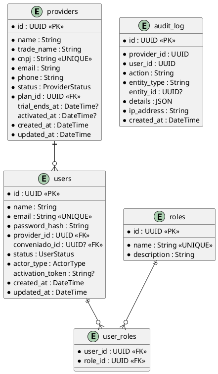

**Enums**:
- `ProviderStatus`: PENDING, TRIAL, ACTIVE, SUSPENDED, BLOCKED
- `UserStatus`: PENDING, ACTIVE, INACTIVE
- `ActorType`: ACCEPTION_USER, PROVIDER_USER, CONVENIADO_USER

#### T-003: Modulo Auth (JWT + Refresh Token)
**US**: US-003
**Componente**: backend — `modules/core/auth/`

```
ALGORITMO LoginUseCase:
1. Receber { email, password }
2. Buscar usuario por email
3. Verificar password com bcrypt
4. Verificar usuario.status == ACTIVE
5. Verificar provider.status nao bloqueado
6. Gerar accessToken (JWT, 15min) com claims:
   { sub: userId, providerId, actorType, roles[] }
7. Gerar refreshToken (UUID, 7 dias) e persistir
8. Registrar audit_log: AUTH_LOGIN
9. Retornar { accessToken, refreshToken, user }

ALGORITMO RefreshUseCase:
1. Receber { refreshToken }
2. Buscar token valido no DB
3. Verificar nao expirado
4. Gerar novo accessToken
5. Rotacionar refreshToken (revogar antigo, criar novo)
6. Retornar { accessToken, refreshToken }
```

**Endpoints**:
| Metodo | Rota | Descricao |
|--------|------|-----------|
| POST | /api/auth/login | Login |
| POST | /api/auth/refresh | Refresh token |
| POST | /api/auth/logout | Logout (revoga tokens) |
| GET | /api/auth/me | Retorna usuario autenticado |

#### T-004: Modulo RBAC (Guards + Decorators)
**US**: US-004
**Componente**: backend — `modules/core/rbac/` + `common/`

```
IMPLEMENTAR:
1. @Roles(...roles) — decorator de metadados
2. RolesGuard — guard que verifica roles do JWT
3. @TenantScoped() — decorator que injeta providerId
4. TenantGuard — valida que providerId do JWT == recurso acessado
5. ConveniadoGuard — para CONVENIADO_USER, valida conveniado_id
6. TenantContext service — fornece { providerId, conveniadoId, roles }
```

#### T-005: Modulo Audit Log
**US**: US-005
**Componente**: backend — `modules/core/audit/`

```
IMPLEMENTAR:
1. AuditService.log({ providerId, userId, action, entityType, entityId, details, ip })
2. AuditInterceptor — interceptor global que loga acoes em controllers marcados
3. @Audited(action) — decorator para marcar metodos
4. AuditLog repository (append-only, sem UPDATE/DELETE)
```

#### T-006: Configurar 4 portais frontend (Vue 3 + Vuetify + Pinia + i18n)
**US**: US-006, US-007
**Componente**: frontend/*

Para cada portal (acception, solution, provider, conveniado):

```
IMPLEMENTAR (conforme ui-templates.md):
1. Instalar dependencias: vuetify, @mdi/font, vite-plugin-vuetify, pinia, vue-router, vue-i18n, axios
2. Criar plugins/vuetify.ts (tema light/dark, cores, icones MDI)
3. Criar i18n/index.ts + i18n/locales/pt-BR.ts
4. Criar main.ts registrando todos os plugins
5. Criar App.vue com <router-view /> + <GlobalSnackbar />
6. Criar infrastructure/http/apiClient.ts com interceptors (Bearer, 401 redirect)
7. Criar application/stores/auth.ts (Pinia) com state, getters, actions
8. Criar router/index.ts com rotas publicas e protegidas
9. Criar router/guards/authGuard.ts
```

#### T-007: UI Template — Layout Autenticado (todos os portais)
**US**: US-007
**Componente**: frontend/* — `presentation/layouts/AuthenticatedLayout.vue`

```
IMPLEMENTAR (conforme ui-templates.md secao 5):
1. <v-app> container raiz
2. <v-app-bar> com hamburger, titulo, avatar menu, logout
3. <v-navigation-drawer> com info usuario, role chip, menu filtrado por roles
4. <v-main> com <router-view />
5. MenuItem[] tipado com title, icon, to, roles, children
6. filteredMenuItems computed com filterByRole()
7. userInitials computed
8. handleLogout action
```

#### T-008: Componentes Globais (Snackbar + Dialog)
**US**: US-008
**Componente**: frontend/*

```
IMPLEMENTAR:
1. composables/useSnackbar.ts — estado global com show(message, type)
2. composables/useGlobalDialog.ts — estado global com open(title, message, type)
3. components/common/GlobalSnackbar.vue — v-snackbar top-right
4. components/GlobalMessageDialog.vue — v-dialog modal
```

---

### E2 — SaaS Billing + Portal Solution

#### T-009: Schema Prisma — Entidades SaaS Billing
**US**: US-009, US-010, US-011

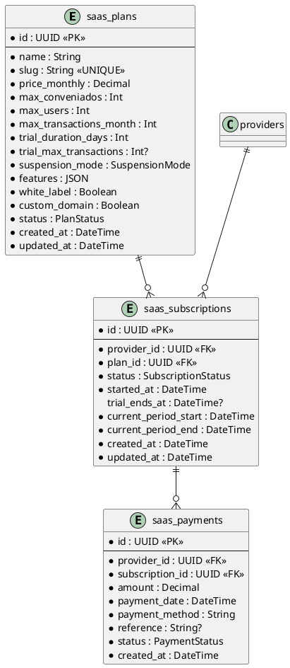

**Enums**:
- `SuspensionMode`: FULL_BLOCK, BLOCK_AUTH_ONLY
- `SubscriptionStatus`: TRIAL, ACTIVE, PAST_DUE, SUSPENDED, CANCELLED
- `PaymentStatus`: PENDING, CONFIRMED, FAILED, REFUNDED

#### T-010: Modulo SaaS Billing — Use Cases
**US**: US-009–US-011, US-017, US-018

```
USE CASES:
1. CreatePlan(dto) → valida unicidade slug, persiste
2. UpdatePlan(id, dto) → nao permite alterar se tem subscriptions ativas
3. CreateSubscription(providerId, planId) → cria com status TRIAL
4. CheckTrialExpiration() → job cron diario
   PARA CADA subscription com status TRIAL:
     SE trial_ends_at < agora:
       subscription.status = plan.suspension_mode == FULL_BLOCK ? SUSPENDED : ACTIVE
       provider.status = SUSPENDED (se FULL_BLOCK)
5. RegisterPayment(subscriptionId, paymentDto) → cria saas_payment, reativa se necessario
```

#### T-011: Modulo Portal Solution — Endpoints publicos
**US**: US-012, US-013, US-014, US-015

```
ENDPOINTS PUBLICOS (sem auth):
POST /api/solution/register
  Body: { companyName, cnpj, contactName, email, password, planSlug }
  1. Validar CNPJ unico
  2. Criar provider (status=PENDING)
  3. Criar user (status=PENDING, role=PROVIDER_ADMIN)
  4. Criar subscription (status=TRIAL, trial_ends_at calculado)
  5. Gerar activation_token
  6. Enviar email com link de ativacao
  7. Retornar { message: "Verifique seu email" }

GET /api/solution/plans
  Retorna lista de planos ativos com precos e features

POST /api/solution/activate/:token
  1. Buscar provider pelo token
  2. Validar token nao expirado
  3. Atualizar provider.status = TRIAL
  4. Atualizar user.status = ACTIVE
  5. Retornar { accessToken, refreshToken, user }
```

#### T-012: Frontend portal-solution — Landing Page + Registro
**US**: US-012, US-013, US-014

```
PAGINAS (todas publicas, sem layout autenticado):

1. LandingView.vue (/)
   - Hero section com valor proposta
   - Grid de planos (v-card por plano)
   - CTA "Comecar Agora" → /signup

2. SignupView.vue (/signup)
   - Seguir padrao ui-templates (v-container + v-card centralizado)
   - Formulario multi-step:
     Step 1: Dados empresa (nome, CNPJ)
     Step 2: Dados responsavel (nome, email, senha)
     Step 3: Selecao de plano (cards com radio)
     Step 4: Resumo + confirmar
   - Submit → POST /api/solution/register
   - Sucesso → tela "Verifique seu email"

3. ActivateTenantView.vue (/activate/:token)
   - Auto-submit ao carregar (POST /activate/:token)
   - Sucesso → redirect portal-provider
   - Erro → mensagem + link reenviar
```

---

### E3 — Portal Acception (Admin SaaS)

#### T-013: Frontend portal-acception — Login + Layout
**US**: US-019
**Conforme**: ui-templates.md

```
IMPLEMENTAR:
1. LoginView.vue seguindo padrao (secao 4.2 ui-templates)
2. AuthenticatedLayout.vue com:
   - App bar: titulo "FiadoAuto Admin", avatar menu
   - Drawer: menu fixo ACCEPTION_ADMIN
   - Menu items: Dashboard, Providers, Planos, Usuarios, Auditoria
3. Auth store com roles ACCEPTION_ADMIN/ACCEPTION_SUPPORT
4. Router com guard: apenas ACCEPTION roles
```

#### T-014: Frontend portal-acception — Dashboard
**US**: US-020

```
PAGINA DashboardView.vue:
- 4 cards KPI: total providers, ativos, trial, suspensos
- Card MRR (receita recorrente mensal)
- Grafico de novos providers por mes (ultimos 6 meses)
- Lista "Trials expirando em 7 dias"

ENDPOINT BACKEND:
GET /api/admin/dashboard
  Retorna: { totalProviders, activeProviders, trialProviders,
             suspendedProviders, mrr, recentSignups[], expiringTrials[] }
```

#### T-015: Frontend portal-acception — CRUD Providers
**US**: US-021, US-022, US-023

```
PAGINAS:
1. ProviderListView.vue (/providers)
   - v-data-table com paginacao server-side
   - Colunas: nome, CNPJ, plano, status, criado em
   - Filtros: status (chips), plano (select), busca texto
   - Acoes: ver detalhes, ativar, suspender, bloquear

2. ProviderDetailView.vue (/providers/:id)
   - Tabs: Info, Plano, Pagamentos, Usuarios, Metricas
   - Tab Info: dados cadastrais (read-only)
   - Tab Plano: plano atual, historico de mudancas
   - Tab Pagamentos: lista de saas_payments
   - Tab Usuarios: lista de usuarios do provider
   - Tab Metricas: transacoes, conveniados, volume
   - Barra de acoes: Ativar/Suspender/Bloquear com dialog confirmacao
```

#### T-016: Frontend portal-acception — CRUD Planos SaaS
**US**: US-026

```
PAGINAS:
1. PlanListView.vue (/plans)
   - v-data-table: nome, preco, trial_days, suspension_mode, status
   - Botao "Novo Plano"

2. PlanFormView.vue (/plans/new, /plans/:id/edit)
   - v-form com campos:
     nome, slug (auto-gerado), preco mensal
     max_conveniados, max_users, max_transactions
     trial_duration_days, trial_max_transactions
     suspension_mode (radio: FULL_BLOCK / BLOCK_AUTH_ONLY)
     features (checklist: white_label, custom_domain, ...)
```

#### T-017: Frontend portal-acception — Usuarios + Auditoria
**US**: US-024, US-025

```
PAGINAS:
1. UserListView.vue (/users)
   - v-data-table: nome, email, role, status
   - Botao "Novo Usuario"
   - Dialog para criar/editar usuario

2. AuditLogView.vue (/audit)
   - v-data-table server-side com paginacao
   - Colunas: data, usuario, acao, entidade, provider
   - Filtros: acao, usuario, provider, periodo
```

---

### E4 — Portal Provider — Onboarding + Convenios

#### T-018: Schema Prisma — Entidades Provider Domain
**US**: US-030–US-038

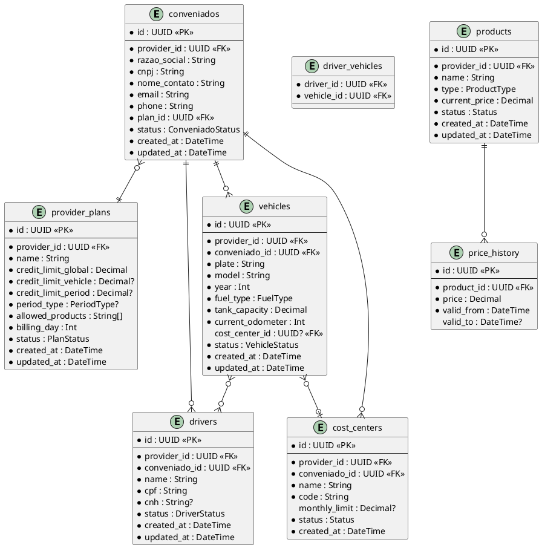

**Enums**:
- `ConveniadoStatus`: PENDING, ACTIVE, SUSPENDED, BLOCKED
- `FuelType`: GASOLINE, ETHANOL, DIESEL, GNV
- `ProductType`: FUEL, SERVICE, PRODUCT
- `PeriodType`: DAILY, WEEKLY, BIWEEKLY, MONTHLY

#### T-019: Backend — Modulo Conveniados
**US**: US-031–US-034

```
USE CASES:
1. CreateConveniado(providerId, dto)
   - Validar CNPJ unico no provider
   - Criar conveniado com status PENDING
   - Criar credit_account com limites do plano

2. ActivateConveniado(providerId, conveniadoId)
   - Atualizar status para ACTIVE
   - Enviar convite ao email do contato

3. DeactivateConveniado(providerId, conveniadoId)
   - Atualizar status para SUSPENDED
   - Nao permite novas transacoes

4. ListConveniados(providerId, filters, pagination)
   - Paginacao server-side com filtros

5. GetConveniadoDetail(providerId, conveniadoId)
   - Retorna conveniado + plano + credit_account + counts

ENDPOINTS:
POST   /api/providers/:providerId/conveniados
GET    /api/providers/:providerId/conveniados
GET    /api/providers/:providerId/conveniados/:id
PATCH  /api/providers/:providerId/conveniados/:id
POST   /api/providers/:providerId/conveniados/:id/activate
POST   /api/providers/:providerId/conveniados/:id/deactivate
```

#### T-020: Backend — Modulo Veiculos, Motoristas, Centros de Custo
**US**: US-035, US-036, US-037

```
ENDPOINTS (todos scoped por providerId + conveniadoId):

Veiculos:
POST   /api/providers/:pid/conveniados/:cid/vehicles
GET    /api/providers/:pid/conveniados/:cid/vehicles
GET    /api/providers/:pid/conveniados/:cid/vehicles/:id
PATCH  /api/providers/:pid/conveniados/:cid/vehicles/:id
DELETE /api/providers/:pid/conveniados/:cid/vehicles/:id (soft delete)

Motoristas:
POST   /api/providers/:pid/conveniados/:cid/drivers
GET    /api/providers/:pid/conveniados/:cid/drivers
PATCH  /api/providers/:pid/conveniados/:cid/drivers/:id
POST   /api/providers/:pid/conveniados/:cid/drivers/:id/link-vehicle/:vid
DELETE /api/providers/:pid/conveniados/:cid/drivers/:id/unlink-vehicle/:vid

Centros de Custo:
POST   /api/providers/:pid/conveniados/:cid/cost-centers
GET    /api/providers/:pid/conveniados/:cid/cost-centers
PATCH  /api/providers/:pid/conveniados/:cid/cost-centers/:id
```

#### T-021: Backend — Modulo Produtos/Catalogo
**US**: US-038

```
ENDPOINTS (scoped por providerId):
POST   /api/providers/:pid/products
GET    /api/providers/:pid/products
PATCH  /api/providers/:pid/products/:id
POST   /api/providers/:pid/products/:id/update-price  (cria price_history)
```

#### T-022: Backend — Modulo Provider Plans (Planos de Convenio)
**US**: US-030

```
ENDPOINTS:
POST   /api/providers/:pid/plans
GET    /api/providers/:pid/plans
GET    /api/providers/:pid/plans/:id
PATCH  /api/providers/:pid/plans/:id
```

#### T-023: Backend — Gestao de Usuarios do Provider
**US**: US-029

```
USE CASES:
1. InviteUser(providerId, { name, email, role })
   - Criar user com status PENDING
   - Gerar activation_token
   - Enviar email convite com link /activate-user/:token

2. ActivateUser(token, { password })
   - Buscar user pelo token
   - Definir password
   - Status → ACTIVE

3. ListUsers(providerId, filters)
4. UpdateUserRole(providerId, userId, newRole)
5. DeactivateUser(providerId, userId)

ENDPOINTS:
POST   /api/providers/:pid/users/invite
GET    /api/providers/:pid/users
PATCH  /api/providers/:pid/users/:id
POST   /api/providers/:pid/users/:id/deactivate
POST   /api/auth/activate-user/:token (publico)
```

#### T-024: Frontend portal-provider — Login + Layout + Onboarding
**US**: US-027, US-028

```
PAGINAS:

1. LoginView.vue — padrao ui-templates
   - Verificacao de provider.status no login
   - Se BLOCKED/SUSPENDED → redirect /tenant-blocked

2. TenantBlockedView.vue — pagina informativa

3. AuthenticatedLayout.vue — conforme ui-templates secao 5
   - App bar: nome do provider (dinamico), avatar, logout
   - Drawer: menu filtrado por role (ADMIN/MANAGER/OPERATOR)
   - Menu items:
     Dashboard, Conveniados, Veiculos, Motoristas,
     Produtos, Transacoes, Faturas, Antifraude,
     Configuracoes (grupo: Usuarios, Planos, Regras)

4. OnboardingWizardView.vue (/onboarding)
   - Step 1: Dados fiscais (razao social, CNPJ, IE, endereco)
   - Step 2: Upload logo
   - Step 3: Cadastro primeiro produto
   - Step 4: Resumo
   - Marca onboarding como completo
```

#### T-025: Frontend portal-provider — CRUD Conveniados
**US**: US-031–US-034

```
PAGINAS:

1. ConveniadoListView.vue (/conveniados)
   - v-data-table: razao social, CNPJ, plano, status, saldo, limite
   - Filtros: status, busca texto
   - Botao "Novo Conveniado"

2. ConveniadoFormView.vue (/conveniados/new)
   - v-form: razao social, CNPJ, contato, email, telefone
   - Select plano de convenio
   - Submit → cria conveniado

3. ConveniadoDetailView.vue (/conveniados/:id)
   - Tabs: Info, Credito, Veiculos, Motoristas, Centros Custo, Transacoes, Faturas
   - Barra acoes: Ativar/Suspender/Editar
   - Tab Credito: saldo, limite, extrato ledger
   - Tab Veiculos: v-data-table + botao adicionar
   - Tab Motoristas: v-data-table + botao adicionar
   - Tab Centros Custo: v-data-table + botao adicionar
```

#### T-026: Frontend portal-provider — CRUD Veiculos, Motoristas, Centros Custo
**US**: US-035, US-036, US-037

```
COMPONENTES (dentro de ConveniadoDetailView tabs):

1. VehicleFormDialog.vue
   - v-dialog com v-form: placa, modelo, ano, combustivel, capacidade tanque, odometro
   - Select centro de custo

2. DriverFormDialog.vue
   - v-dialog com v-form: nome, CPF, CNH
   - Multi-select veiculos vinculados

3. CostCenterFormDialog.vue
   - v-dialog com v-form: nome, codigo, limite mensal
```

#### T-027: Frontend portal-provider — Catalogo Produtos
**US**: US-038

```
PAGINA ProductListView.vue (/products):
- v-data-table: nome, tipo, preco atual, status
- Botao "Novo Produto"
- Dialog para criar/editar
- Acao "Atualizar Preco" com input de novo preco
```

---

### E5 — Credito + Ledger

#### T-028: Schema Prisma — Entidades Credito + Ledger
**US**: US-039–US-045

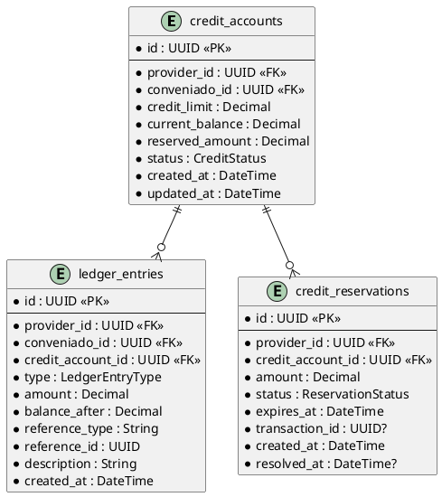

**Enums**:
- `CreditStatus`: ACTIVE, LOCKED, SUSPENDED
- `LedgerEntryType`: DEBIT, CREDIT, REVERSAL, ADJUSTMENT
- `ReservationStatus`: PENDING, CONFIRMED, CANCELLED, EXPIRED

#### T-029: Backend — Modulo Credit
**US**: US-039–US-043

```
USE CASES:

1. CreateCreditAccount(providerId, conveniadoId, limit)
   - Cria conta com saldo 0, limite conforme plano
   - Chamado automaticamente ao ativar conveniado

2. AdjustCreditLimit(providerId, conveniadoId, newLimit)
   - Valida newLimit >= saldo utilizado
   - Registra ledger_entry ADJUSTMENT
   - Audit log

3. CreateReservation(providerId, creditAccountId, amount)
   - Verifica saldo disponivel (limit - balance - reserved)
   - Cria reserva com TTL (ex: 30 min)
   - Atualiza reserved_amount

4. ConfirmReservation(reservationId, finalAmount)
   - Confirma reserva → cria ledger_entry DEBIT
   - Atualiza current_balance
   - Libera diferenca se finalAmount < reservedAmount

5. CancelReservation(reservationId)
   - Cancela reserva → libera reserved_amount
   - Sem lancamento no ledger

6. ExpireReservations() — Job cron (cada 5 min)
   - Busca reservas PENDING com expires_at < agora
   - Cancela cada uma

7. ReconcileBalances() — Job cron (diario)
   - Para cada credit_account:
     soma = SUM(ledger_entries.amount WHERE type=DEBIT) - SUM(WHERE type=CREDIT/REVERSAL)
     SE soma != current_balance → alerta + correcao
```

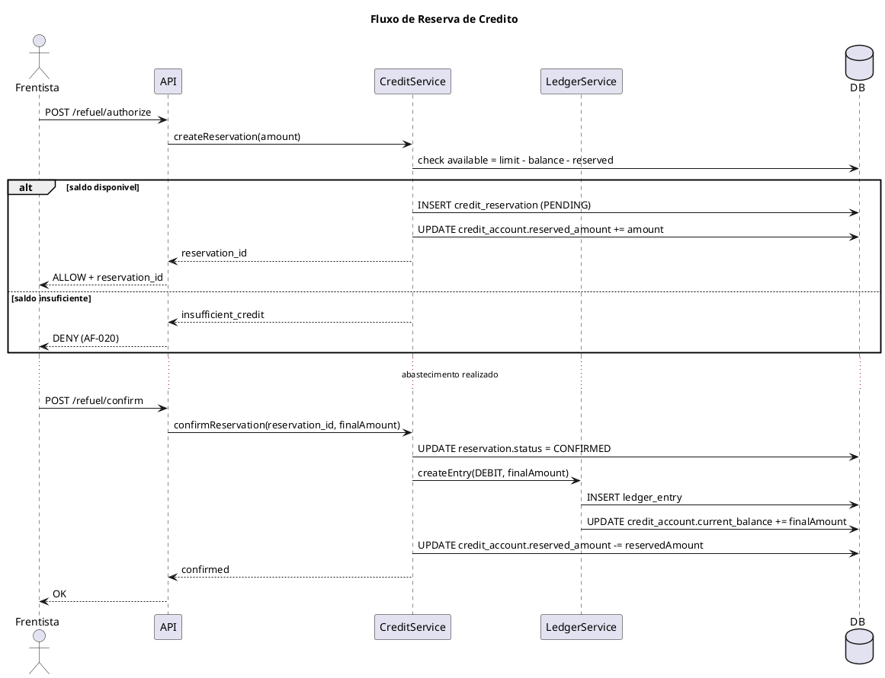

#### T-030: Backend — Modulo Ledger
**US**: US-041, US-042, US-044

```
USE CASES:

1. CreateLedgerEntry(providerId, conveniadoId, { type, amount, referenceType, referenceId, description })
   - Calcula balance_after = current_balance + (CREDIT/REVERSAL ? -amount : +amount)
   - INSERT ledger_entry (imutavel)
   - UPDATE credit_account.current_balance

2. GetLedgerExtract(providerId, conveniadoId, { dateFrom, dateTo, page, pageSize })
   - Lista ledger_entries com paginacao
   - Ordenado por created_at DESC

3. ApplyAging() — Job cron diario
   - Busca faturas vencidas por provider
   - Para cada fatura vencida:
     dias_atraso = hoje - vencimento
     SE dias_atraso > N (config provider) E credit_account.status != LOCKED:
       credit_account.status = LOCKED
       Notifica provider
```

#### T-031: Frontend portal-provider — Dashboard Credito + Extrato
**US**: US-044, US-046

```
COMPONENTES:

1. CreditDashboardView.vue (/credit)
   - Cards KPI: total concedido, utilizado, disponivel, inadimplentes
   - Grafico pizza: utilizacao por conveniado (top 10)
   - Lista reservas ativas

2. LedgerExtractComponent.vue (dentro de ConveniadoDetailView)
   - v-data-table: data, tipo, valor, saldo, descricao
   - Filtros: periodo, tipo
   - Export CSV
```

---

### E6 — Policy Engine + Antifraude Deterministico

#### T-032: Schema Prisma — Entidades Autorizacao + Antifraude
**US**: US-047–US-056

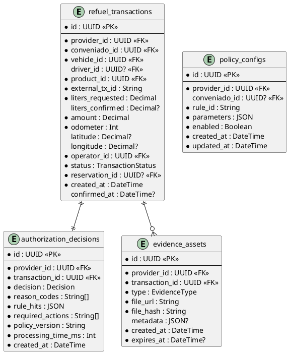

**Unique Constraint**: `(provider_id, external_tx_id)` em refuel_transactions

**Enums**:
- `TransactionStatus`: AUTHORIZED, CONFIRMED, CANCELLED, DENIED, REVIEW
- `Decision`: ALLOW, DENY, REVIEW
- `EvidenceType`: ODOMETER_PHOTO, GEO_PROOF, MANAGER_PIN, RECEIPT

#### T-033: Backend — Policy Engine Core
**US**: US-047

```plantuml
@startuml
title Pipeline do Policy Engine

start
:Receber AuthorizationRequest;

partition "1. Hard Blocks" {
  :AF-001: Convenio ativo?;
  :AF-002: Veiculo ativo?;
  :AF-003: Operador autorizado?;
  :AF-004: Produto permitido?;
  :AF-005: Contrato valido?;
  if (algum DENY?) then (sim)
    :return DENY + reason_codes;
    stop
  endif
}

partition "2. Governance" {
  :AF-010: Centro custo obrigatorio?;
  :AF-011: Motorista obrigatorio?;
  :AF-012: Dentro do horario?;
  :AF-013: Dentro da geofence?;
}

partition "3. Credit" {
  :AF-020: Limite global?;
  :AF-021: Limite veiculo?;
  :AF-022: Limite periodo?;
  :AF-023: Valor maximo transacao?;
  :AF-024: Aging > N dias (DENY)?;
  :AF-025: Aging 1-N dias (REVIEW)?;
  :AF-026: Reserva obrigatoria?;
  if (limite excedido?) then (sim)
    :return DENY + reason_codes;
    stop
  endif
}

partition "4. Anti-Fraud" {
  :AF-030: Duplicidade external_tx_id?;
  :AF-031: Frequencia abastecimento?;
  :AF-032: Capacidade tanque?;
  :AF-033: Regressao odometro?;
  :AF-034: km/l anomalo?;
  :AF-035: Preco divergente?;
  :AF-036: Risco operador?;
  :AF-037: Taxa estorno alta?;
}

partition "5. Step-up" {
  if (algum REVIEW?) then (sim)
    :AF-040: Exigir PIN gerente?;
    :AF-041: Capturar foto hodometro?;
    :AF-042: Capturar geo?;
    :return REVIEW + required_actions;
    stop
  endif
}

:return ALLOW;
stop
@enduml
```

```
ALGORITMO PolicyEngine.evaluate(request):
  context = buildPolicyContext(request)
  ruleHits = []
  requiredActions = []

  // Carregar configuracoes de regras do provider
  configs = loadPolicyConfigs(request.providerId, request.conveniadoId)

  // Fase 1: Hard Blocks
  PARA CADA regra IN hardBlockRules:
    SE configs[regra.id].enabled:
      result = regra.evaluate(context, configs[regra.id].parameters)
      SE result.triggered:
        ruleHits.push(result)
        SE result.severity == BLOCK_DENY:
          RETURN { decision: DENY, reasonCodes: [regra.id], ruleHits }

  // Fase 2-4: Governance, Credit, Anti-Fraud
  PARA CADA regra IN [...governanceRules, ...creditRules, ...antifraudRules]:
    SE configs[regra.id].enabled:
      result = regra.evaluate(context, configs[regra.id].parameters)
      SE result.triggered:
        ruleHits.push(result)
        SE result.severity == DENY:
          RETURN { decision: DENY, reasonCodes: ruleHits.map(r=>r.id), ruleHits }

  // Fase 5: Step-up
  reviewHits = ruleHits.filter(r => r.severity == REVIEW)
  SE reviewHits.length > 0:
    PARA CADA regra IN stepUpRules:
      SE regra.appliesTo(reviewHits):
        requiredActions.push(regra.action)
    RETURN { decision: REVIEW, reasonCodes: reviewHits.map(r=>r.id), ruleHits, requiredActions }

  RETURN { decision: ALLOW, reasonCodes: [], ruleHits: [] }
```

#### T-034: Backend — Regras Individuais (AF-001 a AF-042)
**US**: US-048–US-052

```
IMPLEMENTAR cada regra como classe independente:

interface PolicyRule {
  id: string             // ex: "AF-001"
  name: string
  severity: Severity     // BLOCK_DENY | DENY | REVIEW | STEP_UP
  evaluate(context: PolicyContext, params: RuleParams): RuleResult
}

Exemplos:

AF-031 (Frequencia):
  params: { maxRefuelsInWindow: 3, windowHours: 2 }
  evaluate:
    count = countRefuels(vehicleId, lastNHours(windowHours))
    SE count >= maxRefuelsInWindow:
      RETURN { triggered: true, severity: REVIEW, details: { count, max } }

AF-034 (km/l anomalo):
  params: { minKmPerLiter: 5, maxKmPerLiter: 15 }
  evaluate:
    lastRefuel = getLastRefuel(vehicleId)
    SE lastRefuel existe:
      km = currentOdometer - lastRefuel.odometer
      kml = km / liters
      SE kml < minKmPerLiter OU kml > maxKmPerLiter:
        RETURN { triggered: true, severity: REVIEW, details: { kml, range } }
```

#### T-035: Backend — Endpoints de Autorizacao
**US**: US-055, US-056

```
ENDPOINTS:

POST /api/refuel/authorize
  Headers: Authorization Bearer
  Body: {
    externalTxId, vehicleId, driverId?, productId,
    litersRequested, odometer, latitude?, longitude?
  }
  1. Verificar idempotencia (provider_id, external_tx_id)
  2. Carregar contexto completo (veiculo, conveniado, credit_account, ...)
  3. Executar PolicyEngine.evaluate()
  4. SE ALLOW: criar reserva de credito
  5. Criar refuel_transaction (status conforme decisao)
  6. Criar authorization_decision
  7. Audit log
  8. Retornar { decision, reasonCodes, requiredActions, transactionId, reservationId }

POST /api/refuel/confirm
  Body: { transactionId, litersConfirmed, evidences[]? }
  1. Buscar transacao AUTHORIZED
  2. Confirmar reserva com valor final
  3. Atualizar transacao: status=CONFIRMED, liters_confirmed
  4. Processar evidencias (upload)
  5. Audit log

POST /api/refuel/cancel
  Body: { transactionId, reason }
  1. Buscar transacao AUTHORIZED
  2. Cancelar reserva
  3. Atualizar transacao: status=CANCELLED
  4. Audit log

POST /api/refuel/step-up
  Body: { transactionId, managerPin?, evidences[]? }
  1. Buscar transacao REVIEW
  2. Validar step-up (PIN correto, evidencias presentes)
  3. Re-executar PolicyEngine com step-up satisfeito
  4. SE ALLOW agora: criar reserva, status=AUTHORIZED
  5. SE ainda DENY: manter status=DENIED
```

#### T-036: Frontend portal-provider — Configuracao Antifraude
**US**: US-053

```
PAGINA AntifraudConfigView.vue (/settings/antifraud):
- Lista de regras agrupadas por categoria:
  Hard Blocks | Governance | Credit | Anti-Fraud | Step-up
- Cada regra: switch habilitado/desabilitado + botao configurar
- Dialog de configuracao por regra:
  - Parametros especificos (ex: AF-031: maxRefuels, windowHours)
  - v-text-field ou v-slider conforme tipo do parametro
- Persistir em policy_configs
```

---

### E7 — Portal Provider — Operacoes + Billing

#### T-037: Schema Prisma — Entidades Billing Provider
**US**: US-061–US-065

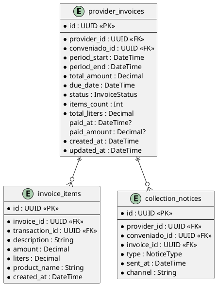

**Enums**:
- `InvoiceStatus`: DRAFT, OPEN, PAID, PAST_DUE, LOCKED, CANCELLED
- `NoticeType`: REMINDER, FIRST_NOTICE, FINAL_NOTICE, LOCK_NOTICE

#### T-038: Backend — Modulo Billing Provider
**US**: US-061–US-065

```
USE CASES:

1. GenerateInvoice(providerId, conveniadoId, periodStart, periodEnd)
   - Busca transacoes CONFIRMED do periodo
   - Cria invoice com items
   - Calcula total
   - Cria ledger_entry CREDIT (reconhecimento de receita)

2. GenerateMonthlyInvoices(providerId) — Job mensal ou manual
   - Para cada conveniado ativo:
     GenerateInvoice(providerId, conveniadoId, inicioMes, fimMes)

3. RegisterInvoicePayment(invoiceId, { paidAmount, paymentDate, method })
   - Atualiza invoice status=PAID
   - Cria ledger_entry CREDIT (pagamento)
   - Atualiza credit_account.current_balance

4. SendCollectionNotice(invoiceId, type)
   - Envia email de cobranca
   - Registra collection_notice

5. ApplyDelinquencyLock() — Job diario
   - Faturas PAST_DUE com > N dias:
     Atualiza invoice.status = LOCKED
     Atualiza credit_account.status = LOCKED
     Notifica provider

ENDPOINTS:
POST   /api/providers/:pid/invoices/generate
GET    /api/providers/:pid/invoices
GET    /api/providers/:pid/invoices/:id
POST   /api/providers/:pid/invoices/:id/payment
POST   /api/providers/:pid/invoices/:id/send-notice
GET    /api/providers/:pid/delinquency-report
```

#### T-039: Frontend portal-provider — Dashboard Operacional
**US**: US-057

```
PAGINA DashboardView.vue (/):
- Cards KPI: transacoes hoje, volume litros hoje, valor total hoje
- Card alertas antifraude (count REVIEW pendentes, link para lista)
- Card inadimplencia (count conveniados inadimplentes)
- Grafico barras: transacoes por dia (ultimos 7 dias)
- Lista "Ultimas 10 transacoes"
```

#### T-040: Frontend portal-provider — Transacoes + Detalhes
**US**: US-058, US-059, US-060

```
PAGINAS:

1. TransactionListView.vue (/transactions)
   - v-data-table server-side
   - Colunas: data, conveniado, veiculo, motorista, produto, litros, valor, status, decisao
   - Chips coloridos por decisao: ALLOW=green, DENY=red, REVIEW=orange
   - Filtros: periodo, conveniado, status, decisao
   - Tab "Alertas" filtra automaticamente por decisao=REVIEW

2. TransactionDetailView.vue (/transactions/:id)
   - Info completa da transacao
   - Card decisao: decision, reason_codes formatados, rule_hits
   - Evidencias: galeria de fotos (hodometro)
   - Mapa (se geo disponivel)
   - Acoes (se REVIEW): Aprovar / Rejeitar
```

#### T-041: Frontend portal-provider — Faturas + Inadimplencia
**US**: US-062, US-063, US-064, US-065

```
PAGINAS:

1. InvoiceListView.vue (/invoices)
   - v-data-table: conveniado, periodo, valor, vencimento, status
   - Chips coloridos: OPEN=blue, PAID=green, PAST_DUE=orange, LOCKED=red
   - Filtros: status, conveniado, periodo
   - Botao "Gerar Faturas do Mes"

2. InvoiceDetailView.vue (/invoices/:id)
   - Info fatura: conveniado, periodo, vencimento, total
   - Lista items: transacao, descricao, litros, valor
   - Acoes: Registrar Pagamento (dialog), Enviar Cobranca

3. DelinquencyReportView.vue (/delinquency)
   - v-data-table: conveniado, valor em aberto, dias atraso, status credito
   - Acoes: ver faturas, enviar cobranca, bloquear/desbloquear
```

---

### E8 — Portal Conveniado

#### T-042: Frontend portal-conveniado — Login + Layout
**US**: US-066, US-073

```
IMPLEMENTAR:

1. LoginView.vue — padrao ui-templates
   - Auth com conveniado_id no JWT
   - Verificacao status conveniado

2. ActivateUserView.vue (/activate-user/:token) — publico
   - Formulario: definir senha
   - Submit → ativa usuario
   - Redirect → login

3. AuthenticatedLayout.vue — conforme ui-templates
   - App bar: nome do provider (white-label), nome conveniado, avatar
   - Drawer: menu CONVENIADO_USER
   - Menu items: Dashboard, Extrato, Faturas, Veiculos, Motoristas, Centros de Custo
```

#### T-043: Frontend portal-conveniado — Dashboard + Extrato + Faturas
**US**: US-067, US-068, US-069

```
PAGINAS:

1. DashboardView.vue (/)
   - Cards: saldo disponivel, limite total, % utilizado (progress bar)
   - Card faturas pendentes (count + valor total)
   - Lista "Ultimos 10 abastecimentos"

2. ExtratoView.vue (/extrato)
   - v-data-table: data, veiculo, motorista, litros, valor, produto, status
   - Filtros: periodo, veiculo
   - Totalizadores: litros total, valor total
   - Botao export CSV

3. InvoiceListView.vue (/faturas)
   - v-data-table: periodo, valor, vencimento, status
   - Clique abre detalhe com items
   - Botao download PDF (futuro)
```

#### T-044: Frontend portal-conveniado — Veiculos, Motoristas, Centros Custo
**US**: US-070, US-071, US-072

```
PAGINAS:

1. VehicleListView.vue (/veiculos)
   - v-data-table: placa, modelo, ano, combustivel, status
   - Dialog para adicionar/editar veiculo
   - Nao permite excluir se tem transacoes

2. DriverListView.vue (/motoristas)
   - v-data-table: nome, CPF, status, veiculos vinculados
   - Dialog para adicionar/editar motorista
   - Associar/desassociar veiculos

3. CostCenterView.vue (/centros-custo)
   - v-data-table: nome, codigo, limite, gasto mensal
   - Expandir para ver veiculos associados + gastos
```

---

### E9 — App Frentista (Flutter)

#### T-045: App Frentista — Setup + Auth
**US**: US-074

```
IMPLEMENTAR:
1. Projeto Flutter com Clean Architecture
2. Tela login: email + senha
3. HTTP client com Bearer token
4. Persistencia local (SharedPreferences) para auto-login
5. Navegacao: Login → Home
```

#### T-046: App Frentista — Fluxo de Autorizacao
**US**: US-075, US-076, US-077, US-078

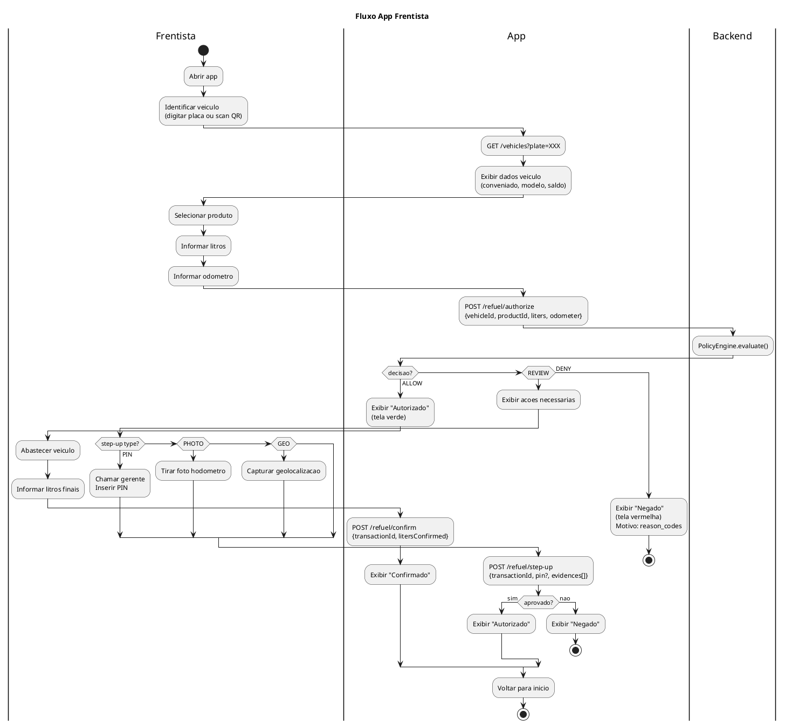

#### T-047: App Frentista — Evidencias + Historico
**US**: US-079, US-080

```
IMPLEMENTAR:
1. Integracao camera (image_picker)
2. Upload de imagem para backend (multipart/form-data)
3. Tela historico: lista transacoes do dia
   - Pull-to-refresh
   - Filtro por status (chips)
4. Tela detalhe transacao: dados + foto + status
```

---

### E10 — White-label + Polimento

#### T-048: Schema Prisma — White-label
**US**: US-081, US-082, US-083

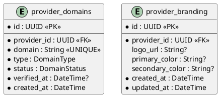

**Enums**:
- `DomainType`: SUBDOMAIN, CUSTOM_DOMAIN
- `DomainStatus`: PENDING, VERIFIED, FAILED

#### T-049: Backend — Modulo White-label
**US**: US-081, US-082, US-084

```
USE CASES:

1. SetSubdomain(providerId, subdomain)
   - Valida formato (alphanumerico + hifen)
   - Valida unicidade
   - Verifica plano Growth+
   - Cria provider_domain

2. SetCustomDomain(providerId, domain)
   - Verifica plano Pro+
   - Cria provider_domain (PENDING)
   - Retorna instrucoes DNS (CNAME)

3. VerifyDomain(domainId)
   - Verifica DNS lookup
   - Atualiza status → VERIFIED

4. ResolveDomain(domain) — Middleware
   - Busca provider_domains por domain
   - Injeta provider_id no request context
```

#### T-050: Frontend portal-provider — Configuracao White-label
**US**: US-081, US-082, US-083

```
PAGINA BrandingView.vue (/settings/branding):
- Upload logo (drag-and-drop ou file input)
- Color picker para cor primaria e secundaria
- Preview ao vivo (mini layout com cores/logo)
- Input subdominio (se Growth+)
- Input dominio proprio (se Pro+) com status verificacao
```

#### T-051: Testes E2E basicos
**US**: US-085

```
IMPLEMENTAR testes E2E (Cypress ou Playwright) para cada portal:

portal-acception:
  - Login → Dashboard → Lista Providers → Detalhe Provider

portal-solution:
  - Landing → Signup → Preencher form

portal-provider:
  - Login → Dashboard → Lista Conveniados → Detalhe → Adicionar Veiculo

portal-conveniado:
  - Login → Dashboard → Extrato → Faturas

backend:
  - Testes e2e do fluxo completo:
    Register → Activate → Login → Create Conveniado → Authorize Refuel → Confirm
```

---

## 4. Sprints

### Sprint 1 (S1) — Infraestrutura + Core
**Epico**: E1
**Dependencias**: Nenhuma
**Entregaveis**: Backend rodando, 4 portais com login funcional, auth JWT, RBAC, audit log

| Task | Descricao | Componente |
|------|-----------|------------|
| T-001 | Projeto NestJS com Clean Architecture | Backend |
| T-002 | Schema Prisma entidades core | Backend |
| T-003 | Modulo Auth (JWT + refresh) | Backend |
| T-004 | Modulo RBAC (guards + decorators) | Backend |
| T-005 | Modulo Audit Log | Backend |
| T-006 | Setup 4 portais frontend | Frontend |
| T-007 | Layout autenticado (todos portais) | Frontend |
| T-008 | Componentes globais (snackbar + dialog) | Frontend |

**Seed**: Criar usuario ACCEPTION_ADMIN de teste

---

### Sprint 2 (S2) — SaaS Billing + Portal Solution
**Epico**: E2
**Dependencias**: S1
**Entregaveis**: Planos SaaS, registro de provider, ativacao por email, trial funcional

| Task | Descricao | Componente |
|------|-----------|------------|
| T-009 | Schema Prisma SaaS billing | Backend |
| T-010 | Use cases SaaS billing | Backend |
| T-011 | Endpoints publicos portal-solution | Backend |
| T-012 | Frontend portal-solution (landing + signup + ativacao) | Frontend |

**Seed**: Criar 3 planos SaaS (Starter, Growth, Pro)

---

### Sprint 3 (S3) — Portal Acception (Admin SaaS)
**Epico**: E3
**Dependencias**: S2
**Entregaveis**: Portal administrativo funcional para gestao de providers e planos

| Task | Descricao | Componente |
|------|-----------|------------|
| T-013 | Portal-acception login + layout | Frontend |
| T-014 | Dashboard SaaS | Frontend + Backend |
| T-015 | CRUD providers | Frontend + Backend |
| T-016 | CRUD planos SaaS | Frontend + Backend |
| T-017 | Usuarios + auditoria | Frontend + Backend |

---

### Sprint 4 (S4) — Portal Provider — Onboarding + Convenios
**Epico**: E4
**Dependencias**: S2
**Entregaveis**: Provider faz login, completa onboarding, cria conveniados, gerencia frota e catalogo

| Task | Descricao | Componente |
|------|-----------|------------|
| T-018 | Schema Prisma provider domain | Backend |
| T-019 | Modulo conveniados | Backend |
| T-020 | Modulo veiculos, motoristas, centros custo | Backend |
| T-021 | Modulo produtos/catalogo | Backend |
| T-022 | Modulo provider plans | Backend |
| T-023 | Gestao usuarios provider | Backend |
| T-024 | Portal-provider login + layout + onboarding | Frontend |
| T-025 | CRUD conveniados | Frontend |
| T-026 | CRUD veiculos, motoristas, centros custo | Frontend |
| T-027 | Catalogo produtos | Frontend |

---

### Sprint 5 (S5) — Credito + Ledger
**Epico**: E5
**Dependencias**: S4
**Entregaveis**: Contas de credito, ledger append-only, reservas, aging, dashboard credito

| Task | Descricao | Componente |
|------|-----------|------------|
| T-028 | Schema Prisma credito + ledger | Backend |
| T-029 | Modulo credit | Backend |
| T-030 | Modulo ledger | Backend |
| T-031 | Dashboard credito + extrato (portal-provider) | Frontend |

---

### Sprint 6 (S6) — Policy Engine + Antifraude
**Epico**: E6
**Dependencias**: S5
**Entregaveis**: Policy engine funcional, 37 regras implementadas, endpoints de autorizacao

| Task | Descricao | Componente |
|------|-----------|------------|
| T-032 | Schema Prisma autorizacao + antifraude | Backend |
| T-033 | Policy engine core (pipeline) | Backend |
| T-034 | Regras individuais AF-001 a AF-042 | Backend |
| T-035 | Endpoints autorizacao (authorize/confirm/cancel/step-up) | Backend |
| T-036 | Configuracao antifraude (portal-provider) | Frontend |

---

### Sprint 7 (S7) — Portal Provider — Operacoes + Billing
**Epico**: E7
**Dependencias**: S6
**Entregaveis**: Dashboard operacional, gestao transacoes, faturamento, inadimplencia

| Task | Descricao | Componente |
|------|-----------|------------|
| T-037 | Schema Prisma billing provider | Backend |
| T-038 | Modulo billing provider | Backend |
| T-039 | Dashboard operacional | Frontend |
| T-040 | Transacoes + detalhes + alertas | Frontend |
| T-041 | Faturas + inadimplencia | Frontend |

---

### Sprint 8 (S8) — Portal Conveniado
**Epico**: E8
**Dependencias**: S5 (credito), S6 (transacoes)
**Entregaveis**: Portal do conveniado funcional com dashboard, extrato, faturas, gestao frota

| Task | Descricao | Componente |
|------|-----------|------------|
| T-042 | Portal-conveniado login + layout + ativacao | Frontend |
| T-043 | Dashboard + extrato + faturas | Frontend |
| T-044 | Veiculos, motoristas, centros custo | Frontend |

---

### Sprint 9 (S9) — App Frentista (Flutter)
**Epico**: E9
**Dependencias**: S6 (endpoints autorizacao)
**Entregaveis**: App mobile funcional com fluxo completo de autorizacao

| Task | Descricao | Componente |
|------|-----------|------------|
| T-045 | App setup + auth | Mobile |
| T-046 | Fluxo de autorizacao | Mobile |
| T-047 | Evidencias + historico | Mobile |

---

### Sprint 10 (S10) — White-label + Polimento
**Epico**: E10
**Dependencias**: S7, S8
**Entregaveis**: White-label funcional, branding customizavel, testes E2E

| Task | Descricao | Componente |
|------|-----------|------------|
| T-048 | Schema white-label | Backend |
| T-049 | Modulo white-label | Backend |
| T-050 | Configuracao branding (portal-provider) | Frontend |
| T-051 | Testes E2E basicos | Testes |

---

## 5. Diagramas de Arquitetura

### 5.1 Arquitetura Geral — Fase 1

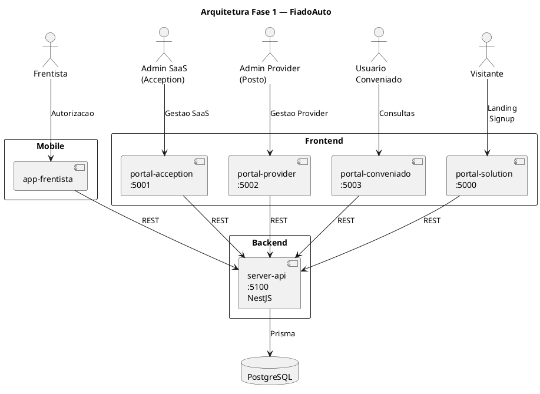

### 5.2 Diagrama de Modulos Backend

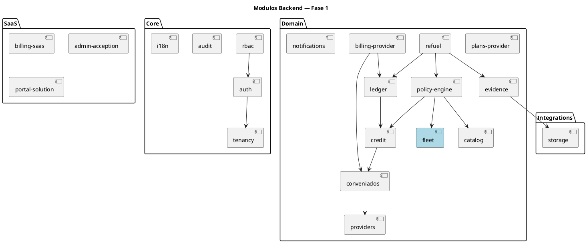

### 5.3 Modelo de Dados Consolidado

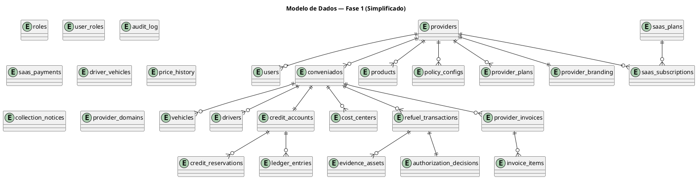

---

## 6. Dependencias entre Sprints

```
S1 (Core)
 ├──► S2 (SaaS Billing + Solution)
 │     ├──► S3 (Portal Acception)
 │     └──► S4 (Portal Provider Onboarding)
 │           └──► S5 (Credito + Ledger)
 │                 ├──► S6 (Policy Engine)
 │                 │     ├──► S7 (Provider Operacoes)
 │                 │     │     └──► S10 (White-label)
 │                 │     └──► S9 (App Frentista)
 │                 └──► S8 (Portal Conveniado)
 │                       └──► S10 (White-label)
```

**Paralelismo possivel**:
- S3 e S4 podem rodar em paralelo (ambos dependem de S2)
- S7 e S9 podem rodar em paralelo (ambos dependem de S6)
- S8 pode iniciar apos S5 (nao depende de S6)

---

## Apendice: Resumo de Endpoints por Modulo

| Modulo | Endpoints | Auth |
|--------|-----------|------|
| Auth | 4 (login, refresh, logout, me) | Publico/Privado |
| Solution | 3 (plans, register, activate) | Publico |
| Admin SaaS | 8 (dashboard, providers CRUD, plans CRUD, users, audit) | ACCEPTION_ADMIN |
| Conveniados | 7 (CRUD + activate/deactivate) | PROVIDER_ADMIN/MANAGER |
| Veiculos | 5 (CRUD) | PROVIDER_ADMIN/MANAGER |
| Motoristas | 5 (CRUD + link/unlink) | PROVIDER_ADMIN/MANAGER |
| Centros Custo | 3 (CRUD) | PROVIDER_ADMIN |
| Produtos | 4 (CRUD + update-price) | PROVIDER_ADMIN |
| Provider Plans | 4 (CRUD) | PROVIDER_ADMIN |
| Credit | 3 (adjust-limit, reservations, reconcile) | PROVIDER_ADMIN |
| Ledger | 2 (extract, entries) | PROVIDER roles |
| Refuel | 4 (authorize, confirm, cancel, step-up) | PROVIDER_OPERATOR |
| Billing Provider | 5 (generate, list, detail, payment, notice) | PROVIDER_ADMIN |
| White-label | 4 (subdomain, domain, verify, branding) | PROVIDER_ADMIN |
| Provider Users | 4 (invite, list, update, deactivate) | PROVIDER_ADMIN |
| Conveniado Portal | 6 (dashboard, extract, invoices, vehicles, drivers, cost-centers) | CONVENIADO_USER |

**Total: ~71 endpoints**
