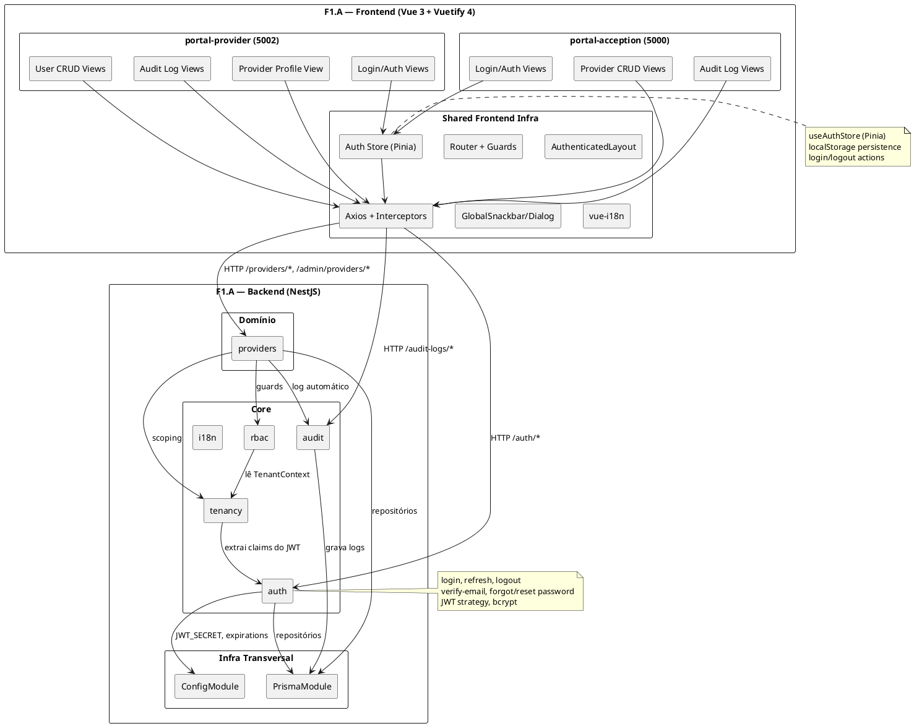
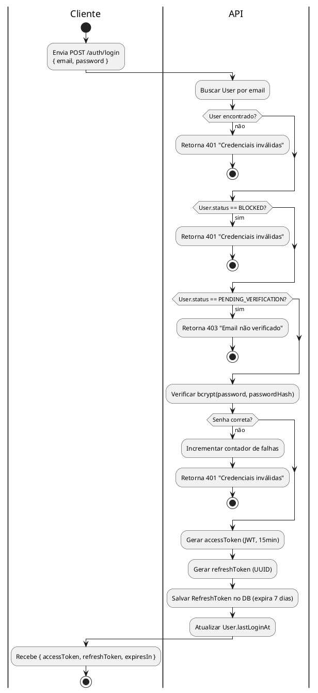
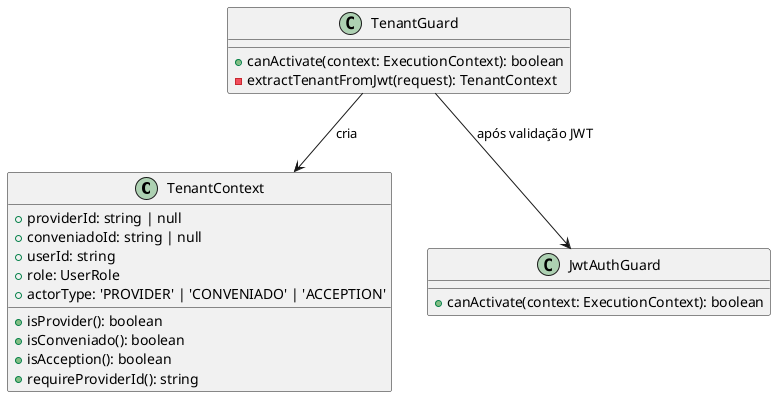
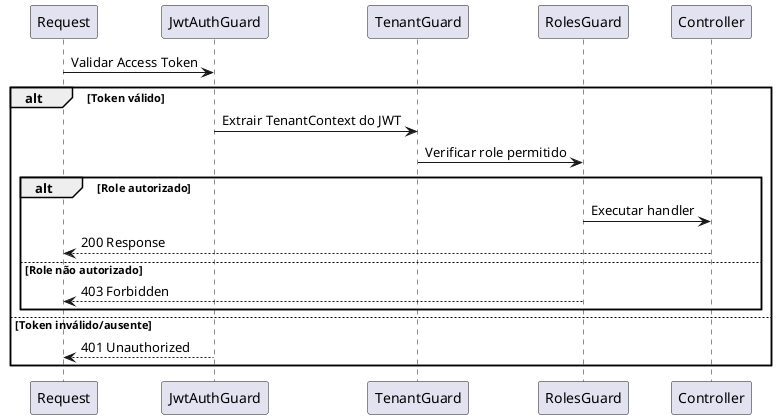
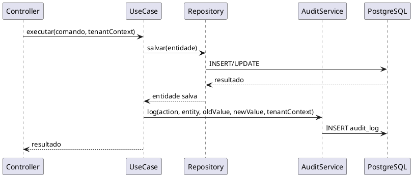
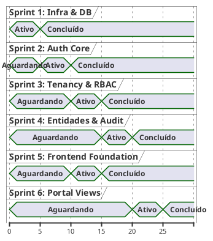
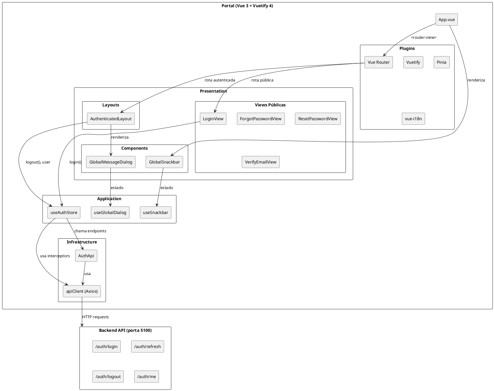
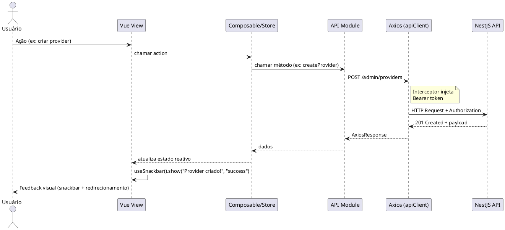

# F1.A — Plano de Implementação: Fundacional (Core + Auth + Tenancy)

**Versão:** 1.1
**Data:** 2026-02-27
**Base:** Phase1-Specification.md, Seção 5 | Guidelines/ui-templates.md

---

## Sumário

1. [Visão Geral da F1.A](#1-visão-geral)
2. [User Stories](#2-user-stories)
3. [Plano de Sprints](#3-plano-de-sprints)
4. [Sprint 1 — Infraestrutura & Database](#4-sprint-1--infraestrutura--database)
5. [Sprint 2 — Autenticação Core](#5-sprint-2--autenticação-core)
6. [Sprint 3 — Multitenancy & RBAC](#6-sprint-3--multitenancy--rbac)
7. [Sprint 4 — Gestão de Entidades, Auditoria & i18n](#7-sprint-4--gestão-de-entidades-auditoria--i18n)
8. [Sprint 5 — Frontend Foundation (UI Templates)](#8-sprint-5--frontend-foundation-ui-templates)
9. [Sprint 6 — Portal Views & Integração](#9-sprint-6--portal-views--integração)
10. [Definição de Pronto (DoD)](#10-definição-de-pronto-dod)

---

## 1. Visão Geral

### 1.1 Objetivo da F1.A

Entregar a **infraestrutura core** do backend que sustenta todas as fases seguintes: autenticação, multitenancy, controle de acesso, auditoria e gestão básica de providers e usuários.

### 1.2 Entregável

**Backend** — API NestJS funcional com:
- Autenticação JWT (login, refresh, logout, verificação de email, reset de senha)
- Multitenancy com scoping obrigatório por `provider_id`
- RBAC com 5 roles e guards
- Audit log append-only automático
- CRUD de Providers (via admin)
- CRUD de Users (dentro do escopo do provider)
- Seed do primeiro ACCEPTION_ADMIN
- i18n preparado (pt-BR)

**Frontend** — Dois portais Vue 3 + Vuetify 4 funcionais:
- **portal-acception** (porta 5000): login, dashboard, gestão de providers, audit logs
- **portal-provider** (porta 5002): login, dashboard, dados do posto, gestão de usuários, audit logs
- Infraestrutura compartilhada: Auth Store (Pinia), Axios com interceptors, Router com guards, layouts público/autenticado, componentes globais (snackbar, dialog), i18n (vue-i18n)

### 1.3 Limites de Escopo

| Incluído na F1.A | Excluído (fase posterior) |
|-------------------|--------------------------|
| Login, refresh, logout | Registro público de provider (F1.B) |
| Verificação de email, reset de senha | Planos SaaS, billing (F1.B) |
| CRUD Provider via admin | Onboarding engine (F1.B) |
| CRUD Users dentro do provider | Portal Solution frontend (F1.B) |
| TenantContext, TenantGuard | Conveniados, frota, crédito (F1.C) |
| RolesGuard, @Roles decorator | Policy Engine, refuel (F1.D) |
| Audit log automático | White-label, theming avançado (F1.E) |
| Seed ACCEPTION_ADMIN | Portal Conveniado (F1.E) |
| Portal Acception (scaffold + views core) | Views de billing, planos, onboarding (F1.B+) |
| Portal Provider (scaffold + views core) | Views de crédito, frota, abastecimento (F1.C+) |
| Infraestrutura frontend (auth, router, layout, i18n) | — |

### 1.4 Diagrama de Módulos F1.A



---

## 2. User Stories

### Épico A: Infraestrutura & Database

---

#### US-A01: Configuração do Schema Prisma

**Como** desenvolvedor,
**quero** que o schema Prisma contenha os modelos core (Provider, User, RefreshToken, EmailVerificationToken, AuditLog) com enums, relações e índices,
**para que** as migrações criem as tabelas necessárias e o Prisma Client esteja disponível.

**Critérios de aceite:**
- [ ] `npx prisma migrate dev` executa sem erros
- [ ] `npx prisma generate` gera o client com todos os modelos
- [ ] Tabelas criadas no PostgreSQL com colunas, tipos e índices corretos
- [ ] Enums `ProviderStatus`, `UserRole`, `UserStatus` criados no banco

---

#### US-A02: Seed do Primeiro Administrador

**Como** operador da plataforma (Acception),
**quero** que ao rodar o seed, um usuário ACCEPTION_ADMIN seja criado com credenciais configuráveis,
**para que** eu tenha o primeiro acesso ao sistema.

**Critérios de aceite:**
- [ ] `npx prisma db seed` cria usuário com role ACCEPTION_ADMIN
- [ ] Email e senha lidos de variáveis de ambiente (com fallback para valores default em dev)
- [ ] Senha armazenada como hash bcrypt
- [ ] Seed é idempotente (re-executar não duplica o usuário)

---

#### US-A03: Módulo Prisma Global

**Como** desenvolvedor,
**quero** um `PrismaModule` global que exponha o `PrismaService` para injeção em qualquer módulo,
**para que** todos os repositórios possam acessar o banco de forma consistente.

**Critérios de aceite:**
- [ ] `PrismaService` extends `PrismaClient` com `onModuleInit` e `onModuleDestroy`
- [ ] Módulo registrado como `@Global()` no `AppModule`
- [ ] Health check de conexão com o banco disponível

---

### Épico B: Autenticação

---

#### US-A04: Login com Email e Senha

**Como** usuário (provider admin, operator, manager, conveniado admin ou acception admin),
**quero** fazer login informando email e senha,
**para que** eu receba tokens de acesso e possa operar no sistema.

**Critérios de aceite:**
- [ ] `POST /auth/login` com `{ email, password }` retorna `{ accessToken, refreshToken, expiresIn }`
- [ ] Access token é JWT válido com claims: `sub`, `email`, `role`, `providerId`, `conveniadoId`
- [ ] Credenciais inválidas retornam 401 com mensagem genérica (sem indicar se email existe)
- [ ] Usuário com status `BLOCKED` não consegue fazer login (retorna 401)
- [ ] Usuário com status `PENDING_VERIFICATION` não consegue fazer login (retorna 403 com mensagem orientativa)
- [ ] `lastLoginAt` é atualizado no User

**Fluxo:**



---

#### US-A05: Renovação de Token (Refresh)

**Como** usuário logado,
**quero** renovar meu access token usando o refresh token antes que expire,
**para que** minha sessão continue sem precisar fazer login novamente.

**Critérios de aceite:**
- [ ] `POST /auth/refresh` com `{ refreshToken }` retorna novo `{ accessToken, refreshToken, expiresIn }`
- [ ] Refresh token antigo é revogado (single-use / rotação)
- [ ] Refresh token expirado retorna 401
- [ ] Refresh token já revogado retorna 401
- [ ] Novo refresh token tem nova expiração de 7 dias

---

#### US-A06: Logout

**Como** usuário logado,
**quero** fazer logout para revogar meu refresh token,
**para que** ninguém possa renovar minha sessão.

**Critérios de aceite:**
- [ ] `POST /auth/logout` com `{ refreshToken }` revoga o token
- [ ] Retorna 204 No Content
- [ ] Tentativa de refresh com token revogado retorna 401

---

#### US-A07: Verificação de Email

**Como** usuário recém-criado,
**quero** verificar meu email clicando no link recebido,
**para que** minha conta seja ativada.

**Critérios de aceite:**
- [ ] `POST /auth/verify-email` com `{ token }` ativa o usuário
- [ ] User.status muda de `PENDING_VERIFICATION` para `ACTIVE`
- [ ] `emailVerifiedAt` é preenchido
- [ ] Token expirado (>24h) retorna 400 "Token expirado"
- [ ] Token já usado retorna 400 "Token já utilizado"
- [ ] Token inválido retorna 400 "Token inválido"

---

#### US-A08: Solicitação de Reset de Senha

**Como** usuário que esqueceu a senha,
**quero** solicitar um link de reset informando meu email,
**para que** eu receba instruções para criar uma nova senha.

**Critérios de aceite:**
- [ ] `POST /auth/forgot-password` com `{ email }` sempre retorna 200 (sem indicar se email existe)
- [ ] Se email existe: cria token de reset (UUID, expira 1h) e envia via email adapter
- [ ] Se email não existe: retorna 200 mesmo assim (segurança)
- [ ] Tokens anteriores do mesmo usuário são invalidados

---

#### US-A09: Reset de Senha

**Como** usuário que recebeu o link de reset,
**quero** definir uma nova senha usando o token,
**para que** eu recupere acesso à minha conta.

**Critérios de aceite:**
- [ ] `POST /auth/reset-password` com `{ token, newPassword }` altera a senha
- [ ] Senha validada: mínimo 8 caracteres, 1 maiúscula, 1 número
- [ ] Hash bcrypt com cost 12 armazenado
- [ ] Token marcado como usado
- [ ] Todos os RefreshTokens do usuário são revogados (força re-login)
- [ ] Token expirado ou já usado retorna 400

---

#### US-A10: Consulta de Dados do Usuário Logado

**Como** usuário logado,
**quero** consultar meus dados e o contexto do meu tenant,
**para que** a aplicação frontend saiba quem sou e qual meu escopo.

**Critérios de aceite:**
- [ ] `GET /auth/me` retorna: `{ id, email, name, role, status, providerId, conveniadoId, provider: { id, tradeName, status } }`
- [ ] Requer access token válido (401 se ausente/expirado)
- [ ] Para ACCEPTION_ADMIN, `provider` é `null`

---

#### US-A11: Rate Limiting de Login

**Como** sistema,
**quero** bloquear temporariamente tentativas de login após 5 falhas consecutivas no mesmo email em 15 minutos,
**para que** ataques de força bruta sejam mitigados.

**Critérios de aceite:**
- [ ] Após 5 tentativas falhas em 15 min para o mesmo email: retorna 429 Too Many Requests
- [ ] Bloqueio é temporário (15 min) e se desfaz automaticamente
- [ ] Login bem-sucedido reseta o contador
- [ ] Contador armazenado em memória (Map ou cache) — não no DB

---

### Épico C: Multitenancy & Scoping

---

#### US-A12: Resolução Automática do Contexto de Tenant

**Como** sistema,
**quero** que toda requisição autenticada tenha um `TenantContext` resolvido automaticamente a partir do JWT,
**para que** todos os módulos possam operar com o escopo correto sem código repetido.

**Critérios de aceite:**
- [ ] `TenantGuard` extrai `providerId`, `conveniadoId`, `userId`, `role` do JWT
- [ ] `TenantContext` é injetável via `@Inject(TENANT_CONTEXT)` ou decorator customizado
- [ ] Para ACCEPTION_ADMIN: `providerId` é null, `actorType` é `ACCEPTION`
- [ ] Para PROVIDER_*: `actorType` é `PROVIDER`
- [ ] Para CONVENIADO_*: `actorType` é `CONVENIADO`

**Diagrama de classes:**



---

#### US-A13: Scoping Obrigatório em Repositórios

**Como** sistema,
**quero** que todo método de repositório exija `providerId` como parâmetro obrigatório,
**para que** nunca ocorra uma query sem filtro de tenant (fail-fast).

**Critérios de aceite:**
- [ ] Interface base `TenantScopedRepository` define assinatura com `providerId` obrigatório
- [ ] Chamada sem `providerId` lança `TenancyScopeError` (não retorna dados vazios)
- [ ] Repositórios de conveniado exigem adicionalmente `conveniadoId` quando ator é conveniado
- [ ] Teste unitário valida que query sem providerId falha

**Pseudo-código:**
```
class BaseRepository:
  método findAll(providerId: string, filtros?):
    SE providerId é vazio OU nulo:
      LANÇAR TenancyScopeError("providerId é obrigatório")
    RETORNAR prisma.entidade.findMany({ where: { providerId, ...filtros } })

  método findById(providerId: string, id: string):
    resultado = prisma.entidade.findFirst({ where: { id, providerId } })
    SE resultado é nulo:
      LANÇAR NotFoundException
    RETORNAR resultado
```

---

#### US-A14: Acesso Cross-Tenant para Acception Admin

**Como** ACCEPTION_ADMIN,
**quero** atuar no contexto de qualquer provider especificando `?providerId=xxx`,
**para que** eu possa dar suporte e gerenciar tenants.

**Critérios de aceite:**
- [ ] ACCEPTION_ADMIN pode enviar `?providerId=xxx` em endpoints com escopo de provider
- [ ] Cada acesso cross-tenant gera registro em audit log com ação `ACCEPTION_CROSS_TENANT_ACCESS`
- [ ] Se `providerId` não é fornecido e o endpoint exige, retorna 400
- [ ] Outros roles não podem usar o query param `providerId` (ignorado silenciosamente)

---

### Épico D: Controle de Acesso (RBAC)

---

#### US-A15: Proteção de Endpoints por Role

**Como** sistema,
**quero** que cada endpoint seja protegido por uma lista de roles permitidos via decorator,
**para que** usuários sem permissão recebam 403 Forbidden.

**Critérios de aceite:**
- [ ] Decorator `@Roles(UserRole.PROVIDER_ADMIN, UserRole.ACCEPTION_ADMIN)` nos controllers
- [ ] `RolesGuard` global verifica se `TenantContext.role` está na lista
- [ ] Role não autorizado retorna 403 com mensagem clara
- [ ] Decorator `@Public()` marca endpoints sem autenticação (login, registro, etc.)

**Diagrama de sequência — Guard chain:**



---

#### US-A16: Criação de Usuários pelo Provider Admin

**Como** PROVIDER_ADMIN,
**quero** criar usuários operadores e gerentes no meu posto,
**para que** eles possam acessar o sistema com seus respectivos papéis.

**Critérios de aceite:**
- [ ] `POST /users` com `{ email, name, password, role }` cria o usuário
- [ ] Roles permitidos para criação: `PROVIDER_OPERATOR`, `PROVIDER_MANAGER`
- [ ] PROVIDER_ADMIN não pode criar outro PROVIDER_ADMIN (restrição de negócio)
- [ ] PROVIDER_ADMIN não pode criar ACCEPTION_ADMIN ou CONVENIADO_ADMIN
- [ ] Email deve ser único no sistema
- [ ] Usuário criado com status `ACTIVE` (não precisa verificar email — admin é quem cria)
- [ ] `providerId` é automaticamente preenchido a partir do TenantContext
- [ ] Audit log gerado: `USER_CREATED`

---

#### US-A17: Listagem de Usuários do Provider

**Como** PROVIDER_ADMIN,
**quero** listar todos os usuários do meu posto,
**para que** eu veja quem tem acesso ao sistema.

**Critérios de aceite:**
- [ ] `GET /users` retorna lista paginada de usuários do provider
- [ ] Filtros: `?status=ACTIVE`, `?role=PROVIDER_OPERATOR`, `?search=nome_ou_email`
- [ ] Apenas usuários do mesmo `providerId` (scoping automático)
- [ ] Response inclui: `id, email, name, role, status, lastLoginAt, createdAt`
- [ ] Não retorna `passwordHash`

---

#### US-A18: Atualização de Usuário

**Como** PROVIDER_ADMIN,
**quero** atualizar os dados de um usuário do meu posto (nome, role),
**para que** eu possa corrigir dados e alterar permissões.

**Critérios de aceite:**
- [ ] `PATCH /users/:id` com `{ name?, role? }`
- [ ] Não permite alterar email (imutável na F1)
- [ ] Não permite alterar para ACCEPTION_ADMIN ou CONVENIADO_ADMIN
- [ ] Usuário deve pertencer ao mesmo provider (scoping)
- [ ] Audit log gerado: `USER_UPDATED` com `oldValue` e `newValue`

---

#### US-A19: Bloqueio e Desbloqueio de Usuário

**Como** PROVIDER_ADMIN,
**quero** bloquear e desbloquear um usuário do meu posto,
**para que** eu possa revogar e restaurar acesso rapidamente.

**Critérios de aceite:**
- [ ] `POST /users/:id/block` muda status para `BLOCKED`
- [ ] `POST /users/:id/unblock` muda status para `ACTIVE`
- [ ] Ao bloquear: todos os RefreshTokens do usuário são revogados
- [ ] Usuário bloqueado não consegue fazer login (verificado na US-A04)
- [ ] PROVIDER_ADMIN não pode bloquear a si mesmo
- [ ] Audit log gerado: `USER_BLOCKED` / `USER_UNBLOCKED`

---

#### US-A20: Desativação de Usuário

**Como** PROVIDER_ADMIN,
**quero** desativar (soft-delete) um usuário que não faz mais parte da equipe,
**para que** ele perca acesso mas o histórico seja mantido.

**Critérios de aceite:**
- [ ] `DELETE /users/:id` muda status para `BLOCKED` (soft-delete; sem exclusão física)
- [ ] Todos os RefreshTokens do usuário são revogados
- [ ] PROVIDER_ADMIN não pode desativar a si mesmo
- [ ] Audit log gerado: `USER_DEACTIVATED`

---

### Épico E: Gestão de Providers

---

#### US-A21: Listagem de Providers (Admin)

**Como** ACCEPTION_ADMIN,
**quero** listar todos os providers cadastrados na plataforma,
**para que** eu tenha visão geral dos tenants.

**Critérios de aceite:**
- [ ] `GET /admin/providers` retorna lista paginada
- [ ] Filtros: `?status=ACTIVE`, `?search=nome_ou_cnpj`
- [ ] Response: `id, tradeName, legalName, cnpj, status, createdAt`
- [ ] Apenas ACCEPTION_ADMIN tem acesso

---

#### US-A22: Detalhe do Provider (Admin)

**Como** ACCEPTION_ADMIN,
**quero** visualizar todos os dados de um provider,
**para que** eu tenha contexto para suporte.

**Critérios de aceite:**
- [ ] `GET /admin/providers/:id` retorna dados completos do provider
- [ ] Inclui contagem de usuários
- [ ] Apenas ACCEPTION_ADMIN tem acesso

---

#### US-A23: Criação Manual de Provider (Admin)

**Como** ACCEPTION_ADMIN,
**quero** criar um provider manualmente,
**para que** eu possa cadastrar postos de forma operacional ou para testes.

**Critérios de aceite:**
- [ ] `POST /admin/providers` com dados do provider + dados do usuário admin
- [ ] CNPJ validado (formato + dígitos verificadores)
- [ ] CNPJ único no sistema
- [ ] Cria Provider com status `TRIAL_ACTIVE` (sem necessidade de verificação de email)
- [ ] Cria User com role `PROVIDER_ADMIN` e status `ACTIVE`
- [ ] Audit log gerado: `PROVIDER_CREATED`

**Pseudo-código:**
```
função criarProviderManual(dados):
  VALIDAR cnpj (formato e dígitos)
  SE cnpj já existe:
    LANÇAR ConflictException("CNPJ já cadastrado")
  SE email já existe:
    LANÇAR ConflictException("Email já cadastrado")

  INICIAR transação DB:
    provider = CRIAR Provider(dados.provider, status=TRIAL_ACTIVE)
    hash = bcrypt(dados.admin.password, cost=12)
    user = CRIAR User(
      providerId = provider.id,
      email = dados.admin.email,
      passwordHash = hash,
      role = PROVIDER_ADMIN,
      status = ACTIVE
    )
  COMITAR transação

  REGISTRAR auditLog(PROVIDER_CREATED, provider)
  RETORNAR { provider, user }
```

---

#### US-A24: Atualização de Dados do Provider

**Como** PROVIDER_ADMIN,
**quero** atualizar os dados do meu posto (nome fantasia, endereço, telefone),
**para que** as informações estejam sempre corretas.

**Critérios de aceite:**
- [ ] `PATCH /providers/:id` com campos atualizáveis
- [ ] Campos atualizáveis: `tradeName`, `legalName`, `phone`, `address`, `responsibleName`
- [ ] `cnpj` e `email` NÃO são atualizáveis (imutáveis na F1)
- [ ] `providerId` do token deve corresponder ao `:id` (scoping)
- [ ] Audit log: `PROVIDER_UPDATED` com diff

---

#### US-A25: Consulta do Próprio Provider

**Como** PROVIDER_ADMIN,
**quero** visualizar os dados do meu posto,
**para que** eu veja as informações cadastradas.

**Critérios de aceite:**
- [ ] `GET /providers/me` retorna dados do provider do token
- [ ] Alias para `GET /providers/:id` onde `:id` = providerId do JWT
- [ ] Inclui campos: `id, tradeName, legalName, cnpj, email, phone, address, responsibleName, status, createdAt`

---

#### US-A26: Alteração de Status do Provider (Admin)

**Como** ACCEPTION_ADMIN,
**quero** alterar o status de um provider manualmente,
**para que** eu possa suspender, reativar ou cancelar um tenant.

**Critérios de aceite:**
- [ ] `PATCH /admin/providers/:id/status` com `{ status }`
- [ ] Transições permitidas: qualquer status → qualquer status (admin override)
- [ ] Audit log: `PROVIDER_STATUS_CHANGED` com oldStatus e newStatus
- [ ] Apenas ACCEPTION_ADMIN

---

### Épico F: Auditoria

---

#### US-A27: Registro Automático de Auditoria

**Como** sistema,
**quero** que toda operação de escrita (create/update/delete) em entidades de negócio gere automaticamente um registro de auditoria,
**para que** haja rastreabilidade completa de todas as mudanças.

**Critérios de aceite:**
- [ ] Interceptor ou serviço que captura operações de escrita
- [ ] Registro inclui: `action`, `entity`, `entityId`, `userId`, `providerId`, `oldValue`, `newValue`, `ipAddress`, `userAgent`
- [ ] AuditLog é append-only (nenhum método de update ou delete exposto)
- [ ] Funciona para todos os módulos da F1.A (providers, users)

**Diagrama de sequência — Audit automático:**



---

#### US-A28: Consulta de Logs de Auditoria

**Como** PROVIDER_ADMIN,
**quero** consultar o log de auditoria do meu posto,
**para que** eu saiba quem fez o quê e quando.

**Como** ACCEPTION_ADMIN,
**quero** consultar os logs de qualquer provider,
**para que** eu possa investigar problemas.

**Critérios de aceite:**
- [ ] `GET /audit-logs` com filtros: `?entity=User`, `?action=USER_CREATED`, `?startDate=`, `?endDate=`, `?userId=`
- [ ] Paginado (default 20, max 100 por página)
- [ ] PROVIDER_ADMIN: vê apenas logs do seu provider (scoping)
- [ ] ACCEPTION_ADMIN: vê logs de qualquer provider (com `?providerId=`)
- [ ] `GET /audit-logs/:id` retorna detalhe com `oldValue` e `newValue`

---

### Épico G: Internacionalização

---

#### US-A29: Estrutura de Internacionalização

**Como** desenvolvedor,
**quero** que todas as mensagens de erro, validação e sistema usem chaves de tradução,
**para que** o sistema suporte múltiplos idiomas no futuro.

**Critérios de aceite:**
- [ ] Módulo `i18n` configurado com `nestjs-i18n` ou pattern customizado
- [ ] Locale padrão: `pt-BR`
- [ ] Arquivo de traduções: `src/modules/i18n/translations/pt-BR.json`
- [ ] Todas as mensagens de erro da F1.A usam chaves (ex: `auth.invalid_credentials`)
- [ ] Mensagens de validação dos DTOs traduzíveis
- [ ] Header `Accept-Language` define o locale (fallback para pt-BR)

---

### Épico H: Infraestrutura Frontend

---

#### US-A30: Scaffold dos Projetos Vue 3 + Vuetify

**Como** desenvolvedor,
**quero** que os projetos `portal-acception` e `portal-provider` estejam configurados com Vue 3, Vuetify 4, Pinia, Vue Router, vue-i18n e Axios,
**para que** a base frontend esteja pronta para receber views.

**Critérios de aceite:**
- [ ] `npm run dev` inicia ambos os portais sem erros (portas 5000 e 5002)
- [ ] Vuetify configurado com tema light/dark, cores primárias e ícones MDI
- [ ] Pinia registrado como plugin global
- [ ] Vue Router configurado com `createWebHistory`
- [ ] vue-i18n configurado com locale padrão `pt-BR`
- [ ] Axios configurado como `apiClient` com `baseURL` apontando para `http://localhost:5100`
- [ ] Estrutura de diretórios conforme `ui-templates.md` seção 2

---

#### US-A31: Auth Store (Pinia) com Persistência

**Como** usuário do portal,
**quero** que meu estado de autenticação seja gerenciado centralmente e persista entre recarregamentos de página,
**para que** eu não perca a sessão ao navegar.

**Critérios de aceite:**
- [ ] `useAuthStore()` expõe: `user`, `accessToken`, `refreshToken`, `loading`, `error`
- [ ] Getters: `isAuthenticated`, `userRoles`, `isAdmin`
- [ ] Actions: `login()`, `logout()`, `loadStoredAuth()`, `refreshAccessToken()`
- [ ] Tokens e dados do usuário persistidos em `localStorage` (chaves: `accessToken`, `refreshToken`, `user`)
- [ ] `loadStoredAuth()` restaura estado ao iniciar a aplicação
- [ ] `login()` chama `POST /auth/login`, armazena tokens e dados do usuário
- [ ] `logout()` chama `POST /auth/logout`, limpa tokens e redireciona para `/login`

---

#### US-A32: HTTP Client (Axios) com Interceptors

**Como** aplicação frontend,
**quero** que todas as requisições HTTP incluam automaticamente o Bearer token e que respostas 401 limpem a sessão,
**para que** a autenticação seja transparente para os componentes.

**Critérios de aceite:**
- [ ] Interceptor de request injeta `Authorization: Bearer <token>` de `localStorage`
- [ ] Interceptor de response detecta 401, limpa `localStorage` e redireciona para `/login`
- [ ] `apiClient` exportado como instância Axios configurada com `baseURL`
- [ ] Módulos de API específicos (ex: `AuthApi.ts`) usam o `apiClient`

---

#### US-A33: Router com Guards de Autenticação

**Como** usuário,
**quero** ser redirecionado para o login quando acesso uma rota protegida sem estar autenticado, e para o dashboard quando acesso o login já autenticado,
**para que** a navegação seja segura e intuitiva.

**Critérios de aceite:**
- [ ] Rotas públicas com `meta: { requiresAuth: false }`: `/login`, `/forgot-password`, `/reset-password/:token`, `/verify-email/:token`
- [ ] Rotas protegidas como children de `AuthenticatedLayout` com `meta: { requiresAuth: true }`
- [ ] Guard global `beforeEach` implementa: redirecionar para `/login` se não autenticado, redirecionar para `/` se já autenticado e acessando rota pública
- [ ] Guard verifica roles via `meta.roles` quando definido, redirecionando para `/` se sem permissão
- [ ] Rota original salva em `query.redirect` ao redirecionar para login
- [ ] Após login bem-sucedido, redireciona para `query.redirect` ou `/`

---

#### US-A34: Layout Autenticado (App Bar + Drawer + Main)

**Como** usuário logado,
**quero** ver uma barra superior com meu avatar e um menu lateral com navegação,
**para que** eu possa acessar todas as funcionalidades do sistema.

**Critérios de aceite:**
- [ ] `AuthenticatedLayout.vue` usa `v-app` > `v-app-bar` + `v-navigation-drawer` + `v-main` > `<router-view />`
- [ ] App bar com: hamburger toggle, título da aplicação (i18n), menu do usuário (avatar com iniciais, nome, email, botão logout)
- [ ] Drawer com: info do usuário (avatar, nome, chip de role), lista de itens de menu com ícones
- [ ] Menu filtrado por roles do usuário autenticado (items com `roles[]` só aparecem se o usuário tem o role)
- [ ] Drawer aberto por padrão em desktop, colapsável via hamburger
- [ ] Botão de logout chama `authStore.logout()` e redireciona para `/login`

---

#### US-A35: Tela de Login (View Pública)

**Como** usuário não autenticado,
**quero** ver uma tela de login com email e senha, com visual centralizado e fundo gradiente,
**para que** eu possa acessar o sistema.

**Critérios de aceite:**
- [ ] `LoginView.vue` renderiza fora do layout autenticado (rota raiz pública)
- [ ] Layout: `v-container fluid fill-height` com fundo gradiente + `v-card` centralizado
- [ ] Campos: email (`v-text-field` com validação `IsEmail`), senha (`v-text-field` com toggle de visibilidade)
- [ ] Botão submit com `loading` state do `authStore`
- [ ] `v-alert` exibe `authStore.error` quando presente
- [ ] Validação client-side: email obrigatório e válido, senha obrigatória
- [ ] Submit chama `authStore.login()`, redireciona para `/` ou `query.redirect` em caso de sucesso
- [ ] Link para "Esqueci minha senha" → `/forgot-password`

---

#### US-A36: Views Públicas Auxiliares (Forgot/Reset Password, Verify Email)

**Como** usuário,
**quero** telas para recuperar senha e verificar email com o mesmo padrão visual do login,
**para que** o fluxo de autenticação esteja completo no frontend.

**Critérios de aceite:**
- [ ] `ForgotPasswordView.vue`: campo email, submit chama `POST /auth/forgot-password`, exibe mensagem de sucesso genérica
- [ ] `ResetPasswordView.vue`: campos nova senha + confirmação, token capturado da rota (`:token`), submit chama `POST /auth/reset-password`
- [ ] `VerifyEmailView.vue`: captura token da rota, chama `POST /auth/verify-email` automaticamente ao montar, exibe resultado (sucesso/erro)
- [ ] Todas seguem o padrão visual: `v-container` centralizado + `v-card` + fundo gradiente
- [ ] Mensagens de sucesso/erro via `v-alert`
- [ ] Links de navegação entre views (ex: "Voltar ao login")

---

#### US-A37: Componentes Globais (Snackbar e Dialog)

**Como** desenvolvedor,
**quero** componentes globais de notificação (toast) e diálogo modal acessíveis de qualquer view ou store,
**para que** feedback ao usuário seja consistente em toda a aplicação.

**Critérios de aceite:**
- [ ] `GlobalSnackbar.vue` renderizado no `App.vue` (funciona em contexto público e autenticado)
- [ ] Composable `useSnackbar()` expõe `show(message, type)` com tipos: `success`, `error`, `warning`, `info`
- [ ] Snackbar posicionado top-right, com auto-dismiss (3-5 segundos)
- [ ] `GlobalMessageDialog.vue` renderizado dentro do `AuthenticatedLayout.vue`
- [ ] Composable `useGlobalDialog()` expõe `show(title, message, type)` com tipos: `message`, `info`, `warning`, `error`
- [ ] Dialog modal com botão de fechar

---

#### US-A38: i18n Frontend (vue-i18n)

**Como** desenvolvedor,
**quero** que todas as strings de UI usem chaves de tradução via `t('chave')`,
**para que** o sistema suporte múltiplos idiomas no futuro.

**Critérios de aceite:**
- [ ] vue-i18n configurado com locale padrão `pt-BR`
- [ ] Arquivo `i18n/locales/pt-BR.json` com chaves para: layout (menu, logout, roles), views (login, forgot-password, etc.), common (app name, actions), validation (campo obrigatório, email inválido, etc.)
- [ ] Todas as strings visíveis ao usuário usam `t('chave')`, nunca hardcoded
- [ ] Chaves organizadas por contexto: `layout.*`, `views.*`, `common.*`, `validation.*`

---

### Épico I: Portal Acception — Views

---

#### US-A39: Dashboard Admin (portal-acception)

**Como** ACCEPTION_ADMIN,
**quero** ver um dashboard com visão geral dos providers cadastrados na plataforma,
**para que** eu tenha contexto rápido do estado do sistema.

**Critérios de aceite:**
- [ ] `HomeView.vue` exibe contadores: total de providers, providers ativos, providers em trial, providers bloqueados
- [ ] Cards ou widgets com ícones e cores indicativas
- [ ] Dados obtidos via API (endpoint `GET /admin/providers` com agregação ou endpoint dedicado)

---

#### US-A40: Listagem de Providers (portal-acception)

**Como** ACCEPTION_ADMIN,
**quero** visualizar a lista de providers com filtros e paginação no portal,
**para que** eu possa gerenciar os tenants da plataforma.

**Critérios de aceite:**
- [ ] `ProviderListView.vue` com `v-data-table` ou `v-table` exibindo: nome fantasia, CNPJ, status (chip colorido), data de criação
- [ ] Filtros: campo de busca (nome/CNPJ), seletor de status
- [ ] Paginação integrada com a API (`page`, `limit`)
- [ ] Botão "Novo Provider" abre diálogo ou navega para view de criação
- [ ] Clique na linha navega para detalhe do provider
- [ ] Rota: `/providers` com `meta.roles: ['ACCEPTION_ADMIN']`

---

#### US-A41: Criação de Provider (portal-acception)

**Como** ACCEPTION_ADMIN,
**quero** criar um provider manualmente via formulário no portal,
**para que** eu possa cadastrar postos de forma operacional.

**Critérios de aceite:**
- [ ] Formulário (dialog ou view dedicada) com campos: razão social, nome fantasia, CNPJ (com máscara), email, telefone, responsável
- [ ] Seção de dados do admin do provider: nome, email, senha
- [ ] Validação client-side: CNPJ com máscara e validação de dígitos, email válido, senha com requisitos mínimos
- [ ] Submit chama `POST /admin/providers`
- [ ] Feedback: snackbar de sucesso + redirecionamento para lista, ou alerta de erro inline
- [ ] Erros da API (CNPJ duplicado, email duplicado) exibidos ao usuário

---

#### US-A42: Detalhe e Alteração de Status do Provider (portal-acception)

**Como** ACCEPTION_ADMIN,
**quero** visualizar os detalhes de um provider e alterar seu status,
**para que** eu possa dar suporte e gerenciar tenants.

**Critérios de aceite:**
- [ ] `ProviderDetailView.vue` exibe todos os dados do provider em layout organizado (cards ou seções)
- [ ] Exibe contagem de usuários do provider
- [ ] Botão/seletor para alterar status com confirmação (dialog): "Tem certeza que deseja alterar o status para X?"
- [ ] Após alteração, atualiza a view e exibe snackbar de sucesso
- [ ] Rota: `/providers/:id` com `meta.roles: ['ACCEPTION_ADMIN']`

---

#### US-A43: Audit Logs (portal-acception)

**Como** ACCEPTION_ADMIN,
**quero** visualizar os logs de auditoria com filtros,
**para que** eu possa investigar operações realizadas na plataforma.

**Critérios de aceite:**
- [ ] `AuditLogListView.vue` com tabela exibindo: data/hora, ação, entidade, usuário, provider
- [ ] Filtros: entidade, ação, período (date range), provider
- [ ] Paginação
- [ ] Clique na linha abre detalhe com `oldValue`/`newValue` (JSON formatado)
- [ ] Rota: `/audit-logs` com `meta.roles: ['ACCEPTION_ADMIN']`

---

### Épico J: Portal Provider — Views

---

#### US-A44: Dashboard Provider (portal-provider)

**Como** PROVIDER_ADMIN,
**quero** ver um dashboard com visão geral do meu posto,
**para que** eu tenha contexto rápido do estado dos meus dados.

**Critérios de aceite:**
- [ ] `HomeView.vue` exibe: nome do posto, status do tenant (chip), contagem de usuários ativos
- [ ] Cards informativos com ícones
- [ ] Dados obtidos via API (`GET /providers/me`, `GET /users` count)

---

#### US-A45: Dados do Próprio Provider (portal-provider)

**Como** PROVIDER_ADMIN,
**quero** visualizar e editar os dados do meu posto no portal,
**para que** as informações estejam sempre corretas.

**Critérios de aceite:**
- [ ] `ProviderProfileView.vue` exibe dados do provider em modo leitura
- [ ] Botão "Editar" habilita modo de edição inline ou abre formulário
- [ ] Campos editáveis: nome fantasia, razão social, telefone, endereço, responsável
- [ ] Campos somente leitura: CNPJ, email, status, data de criação
- [ ] Submit chama `PATCH /providers/me`
- [ ] Feedback: snackbar de sucesso ou erro inline
- [ ] Rota: `/my-provider`

---

#### US-A46: Gestão de Usuários (portal-provider)

**Como** PROVIDER_ADMIN,
**quero** gerenciar os usuários do meu posto (listar, criar, editar, bloquear/desbloquear, desativar),
**para que** eu controle quem tem acesso ao sistema.

**Critérios de aceite:**
- [ ] `UserListView.vue` com tabela: nome, email, role (chip), status (chip colorido), último login
- [ ] Filtros: busca (nome/email), role, status
- [ ] Paginação
- [ ] Botão "Novo Usuário" abre dialog de criação com: nome, email, senha, role (select: Operador/Gerente)
- [ ] Ações por linha: editar (dialog), bloquear/desbloquear (com confirmação), desativar (com confirmação)
- [ ] Bloquear: chama `POST /users/:id/block`, exibe snackbar
- [ ] Desbloquear: chama `POST /users/:id/unblock`, exibe snackbar
- [ ] Desativar: chama `DELETE /users/:id`, exibe dialog de confirmação, atualiza lista
- [ ] Rota: `/users` com `meta.roles: ['PROVIDER_ADMIN']`

---

#### US-A47: Audit Logs (portal-provider)

**Como** PROVIDER_ADMIN,
**quero** visualizar os logs de auditoria do meu posto,
**para que** eu saiba quem fez o quê e quando.

**Critérios de aceite:**
- [ ] `AuditLogListView.vue` com tabela: data/hora, ação, entidade, usuário
- [ ] Filtros: entidade, ação, período, usuário
- [ ] Paginação
- [ ] Clique na linha abre detalhe com `oldValue`/`newValue`
- [ ] Scoping automático: API retorna apenas logs do provider do usuário logado
- [ ] Rota: `/audit-logs`

---

## 3. Plano de Sprints



| Sprint | Foco | User Stories | Depende de |
|--------|------|-------------|------------|
| **1** | Infraestrutura & Database | US-A01, US-A02, US-A03 | — |
| **2** | Autenticação Core | US-A04 a US-A11 | Sprint 1 |
| **3** | Multitenancy & RBAC | US-A12 a US-A15 | Sprint 2 |
| **4** | Entidades, Auditoria & i18n | US-A16 a US-A29 | Sprint 3 |
| **5** | Frontend Foundation (UI Templates) | US-A30 a US-A38 | Sprint 2 (API auth disponível) |
| **6** | Portal Views & Integração | US-A39 a US-A47 | Sprint 4 + Sprint 5 |

> **Nota:** Sprint 5 pode rodar **em paralelo** com Sprint 3, pois depende apenas da API de auth (Sprint 2). Sprint 6 depende de ambas as trilhas (backend Sprint 4 + frontend Sprint 5) estarem concluídas.

---

## 4. Sprint 1 — Infraestrutura & Database

### Objetivo
Preparar a fundação: banco de dados com modelos core, Prisma configurado, PrismaModule global, seed do primeiro admin.

### User Stories: US-A01, US-A02, US-A03

### Tasks

---

#### T-1.1: Schema Prisma — Modelos Core

**US:** US-A01
**Módulo:** `prisma/`

Criar o schema Prisma com os modelos e enums necessários exclusivamente para F1.A.

**Modelos a criar:**
- Enums: `ProviderStatus`, `UserRole`, `UserStatus`
- `Provider` (campos conforme seção 4.2 do Phase1-Specification — apenas campos core, sem relações com entidades de fases futuras)
- `User` (com `providerId` opcional, `conveniadoId` opcional, `email` unique global)
- `RefreshToken`
- `EmailVerificationToken`
- `AuditLog`

**Detalhes:**
- Relações de fases futuras (Conveniado, Vehicle, etc.) NÃO devem ser adicionadas ao schema nesta sprint
- Índices conforme definido na spec
- `AuditLog` sem `updatedAt` (append-only)

**Validação:**
```
npx prisma validate → sem erros
npx prisma migrate dev --name "f1a-core-models" → migration executada
npx prisma generate → client gerado
```

---

#### T-1.2: PrismaModule Global

**US:** US-A03
**Módulo:** `src/shared/prisma/` (ou `src/infrastructure/prisma/`)

Implementar módulo Prisma global para injeção de dependência.

**Pseudo-código:**
```
classe PrismaService extends PrismaClient:
  ao inicializar módulo:
    CONECTAR ao banco
  ao destruir módulo:
    DESCONECTAR do banco

módulo PrismaModule:
  marcar como @Global()
  prover PrismaService
  exportar PrismaService
```

**Inclui:**
- Registrar `PrismaModule` no `AppModule`
- Endpoint `GET /health` que verifica conexão com o banco (query `SELECT 1`)

---

#### T-1.3: Configuração Centralizada (ConfigModule)

**US:** US-A03
**Módulo:** `src/shared/config/`

Configurar `@nestjs/config` com validação de variáveis de ambiente.

**Variáveis obrigatórias para F1.A:**
```
DATABASE_URL        — connection string PostgreSQL
JWT_SECRET          — segredo para assinar tokens (min 32 chars)
JWT_ACCESS_EXPIRATION  — segundos (default: 900)
JWT_REFRESH_EXPIRATION — segundos (default: 604800)
SEED_ADMIN_EMAIL    — email do admin seed (default: admin@acception.com)
SEED_ADMIN_PASSWORD — senha do admin seed
```

**Detalhes:**
- Usar `Joi` ou `class-validator` para validação do schema de env
- Lançar exceção se variável obrigatória estiver ausente

---

#### T-1.4: Seed do ACCEPTION_ADMIN

**US:** US-A02
**Arquivo:** `prisma/seed.ts`

Script de seed que cria o primeiro administrador da plataforma.

**Pseudo-código:**
```
função seed():
  email = env.SEED_ADMIN_EMAIL ou "admin@acception.com"
  password = env.SEED_ADMIN_PASSWORD ou "Admin@123"

  usuario = BUSCAR User onde email = email
  SE usuario existe:
    IMPRIMIR "Admin já existe, pulando seed"
    RETORNAR

  hash = bcrypt(password, cost=12)
  CRIAR User(
    email = email,
    name = "Acception Admin",
    passwordHash = hash,
    role = ACCEPTION_ADMIN,
    status = ACTIVE,
    providerId = null,
    emailVerifiedAt = agora()
  )
  IMPRIMIR "Admin criado com sucesso"
```

- Configurar `prisma.seed` no `package.json`
- Executável via `npx prisma db seed`

---

#### T-1.5: Estrutura de Pastas Clean Architecture

**US:** US-A01
**Módulo:** Todos os módulos F1.A

Verificar e organizar a estrutura de camadas em cada módulo:

```
src/modules/<módulo>/
  presentation/    → controllers, DTOs, decorators, pipes
  application/     → use cases, services de orquestração
  domain/          → entidades, value objects, interfaces de repositório (ports)
  infrastructure/  → implementações Prisma dos repositórios (adapters)
  <módulo>.module.ts
```

Criar arquivos index (barrel exports) em cada camada.

---

#### T-1.6: Configuração Global da API

**US:** US-A03
**Arquivo:** `src/main.ts`

Configurar pipes, filtros e interceptors globais:

- `ValidationPipe` global com `whitelist: true, transform: true`
- `ClassSerializerInterceptor` para excluir campos sensíveis (ex: `passwordHash`)
- CORS habilitado para origins dos portais (`localhost:5000-5003`)
- Prefixo de API: `/api` (opcional, a definir)
- Swagger/OpenAPI para documentação automática dos endpoints

---

### Critérios de conclusão Sprint 1

- [ ] `npm run build` sem erros
- [ ] `npx prisma migrate dev` cria todas as tabelas
- [ ] `npx prisma db seed` cria admin
- [ ] `GET /health` retorna 200 com status do banco
- [ ] Swagger acessível em `/api/docs` (se configurado)

---

## 5. Sprint 2 — Autenticação Core

### Objetivo
Implementar o ciclo completo de autenticação: login, JWT, refresh, logout, verificação de email, reset de senha e rate limiting.

### User Stories: US-A04 a US-A11

### Tasks

---

#### T-2.1: JWT Strategy (Passport)

**US:** US-A04
**Módulo:** `auth/infrastructure/`

Configurar o Passport com JWT strategy para NestJS.

**Componentes:**
- `JwtStrategy` extends `PassportStrategy(Strategy)` — extrai e valida payload do token
- `JwtAuthGuard` extends `AuthGuard('jwt')` — guard global para endpoints autenticados
- Configuração: secret de `JWT_SECRET`, expiração de `JWT_ACCESS_EXPIRATION`

**Pseudo-código do JwtStrategy:**
```
classe JwtStrategy:
  validar(payload):
    SE payload.sub está vazio:
      LANÇAR UnauthorizedException
    RETORNAR {
      userId: payload.sub,
      email: payload.email,
      role: payload.role,
      providerId: payload.providerId,
      conveniadoId: payload.conveniadoId
    }
```

---

#### T-2.2: Serviço de Hashing (bcrypt)

**US:** US-A04
**Módulo:** `auth/infrastructure/`

Serviço encapsulando bcrypt para hash e verificação de senhas.

**Interface (Port):**
```
interface HashingPort:
  hash(plain: string): Promise<string>
  compare(plain: string, hashed: string): Promise<boolean>
```

**Implementação:** BcryptHashingAdapter com cost factor 12.

---

#### T-2.3: Serviço de Tokens

**US:** US-A04, US-A05
**Módulo:** `auth/application/`

Serviço responsável por gerar e validar tokens JWT e refresh tokens.

**Pseudo-código:**
```
classe TokenService:
  gerarAccessToken(user):
    payload = { sub: user.id, email, role, providerId, conveniadoId }
    RETORNAR jwt.sign(payload, secret, { expiresIn: ACCESS_EXPIRATION })

  gerarRefreshToken(userId):
    token = UUID aleatório
    expiresAt = agora() + REFRESH_EXPIRATION
    SALVAR RefreshToken(userId, token, expiresAt)
    RETORNAR token

  validarRefreshToken(token):
    registro = BUSCAR RefreshToken onde token = token
    SE não encontrado OU revokedAt não é nulo OU expiresAt < agora():
      LANÇAR UnauthorizedException
    RETORNAR registro

  revogarRefreshToken(token):
    ATUALIZAR RefreshToken SET revokedAt = agora() WHERE token = token

  revogarTodosTokensDoUsuario(userId):
    ATUALIZAR RefreshToken SET revokedAt = agora()
    WHERE userId = userId AND revokedAt IS NULL
```

---

#### T-2.4: Use Case — Login

**US:** US-A04
**Módulo:** `auth/application/`

**Pseudo-código:**
```
classe LoginUseCase:
  executar(email, password):
    user = BUSCAR User onde email = email
    SE não encontrado:
      LANÇAR UnauthorizedException("Credenciais inválidas")

    SE user.status == BLOCKED:
      LANÇAR UnauthorizedException("Credenciais inválidas")

    SE user.status == PENDING_VERIFICATION:
      LANÇAR ForbiddenException("Email não verificado")

    senhaCorreta = hashingService.compare(password, user.passwordHash)
    SE NÃO senhaCorreta:
      LANÇAR UnauthorizedException("Credenciais inválidas")

    accessToken = tokenService.gerarAccessToken(user)
    refreshToken = tokenService.gerarRefreshToken(user.id)
    ATUALIZAR User SET lastLoginAt = agora()

    RETORNAR { accessToken, refreshToken, expiresIn: ACCESS_EXPIRATION }
```

---

#### T-2.5: Use Case — Refresh Token

**US:** US-A05
**Módulo:** `auth/application/`

**Pseudo-código:**
```
classe RefreshTokenUseCase:
  executar(refreshToken):
    registro = tokenService.validarRefreshToken(refreshToken)
    tokenService.revogarRefreshToken(refreshToken)  // rotação

    user = BUSCAR User por registro.userId
    SE user.status != ACTIVE:
      LANÇAR UnauthorizedException

    novoAccessToken = tokenService.gerarAccessToken(user)
    novoRefreshToken = tokenService.gerarRefreshToken(user.id)

    RETORNAR { accessToken: novoAccessToken, refreshToken: novoRefreshToken, expiresIn }
```

---

#### T-2.6: Use Case — Logout

**US:** US-A06
**Módulo:** `auth/application/`

**Pseudo-código:**
```
classe LogoutUseCase:
  executar(refreshToken):
    tokenService.revogarRefreshToken(refreshToken)
    // Sem erro se token não existe — idempotente
```

---

#### T-2.7: Use Case — Verificar Email

**US:** US-A07
**Módulo:** `auth/application/`

**Pseudo-código:**
```
classe VerifyEmailUseCase:
  executar(token):
    registro = BUSCAR EmailVerificationToken onde token = token
    SE não encontrado:
      LANÇAR BadRequestException("Token inválido")
    SE registro.usedAt não é nulo:
      LANÇAR BadRequestException("Token já utilizado")
    SE registro.expiresAt < agora():
      LANÇAR BadRequestException("Token expirado")

    INICIAR transação:
      ATUALIZAR EmailVerificationToken SET usedAt = agora()
      ATUALIZAR User SET status = ACTIVE, emailVerifiedAt = agora()
    COMITAR

    RETORNAR { message: "Email verificado com sucesso" }
```

---

#### T-2.8: Use Case — Forgot Password

**US:** US-A08
**Módulo:** `auth/application/`

**Pseudo-código:**
```
classe ForgotPasswordUseCase:
  executar(email):
    user = BUSCAR User onde email = email
    SE user existe:
      // Invalidar tokens anteriores
      ATUALIZAR EmailVerificationToken SET usedAt = agora()
        WHERE userId = user.id AND usedAt IS NULL AND tipo = RESET

      token = UUID aleatório
      CRIAR EmailVerificationToken(
        userId = user.id,
        token = token,
        expiresAt = agora() + 1 hora
      )
      emailAdapter.enviar(email, "PASSWORD_RESET", { token, userName: user.name })

    // Sempre retorna sucesso (segurança)
    RETORNAR { message: "Se o email existir, instruções foram enviadas" }
```

---

#### T-2.9: Use Case — Reset Password

**US:** US-A09
**Módulo:** `auth/application/`

**Pseudo-código:**
```
classe ResetPasswordUseCase:
  executar(token, newPassword):
    VALIDAR newPassword (min 8 chars, 1 maiúscula, 1 número)

    registro = BUSCAR EmailVerificationToken onde token = token
    // Mesmas validações de VerifyEmail (expirado, usado, inválido)

    hash = hashingService.hash(newPassword)

    INICIAR transação:
      ATUALIZAR EmailVerificationToken SET usedAt = agora()
      ATUALIZAR User SET passwordHash = hash
      tokenService.revogarTodosTokensDoUsuario(registro.userId)
    COMITAR
```

---

#### T-2.10: Controller Auth + DTOs

**US:** US-A04 a US-A10
**Módulo:** `auth/presentation/`

Implementar o `AuthController` com DTOs de validação.

**Endpoints:**
| Método | Rota | DTO Input | DTO Output |
|--------|------|-----------|------------|
| POST | `/auth/login` | `LoginDto { email, password }` | `AuthTokensDto { accessToken, refreshToken, expiresIn }` |
| POST | `/auth/refresh` | `RefreshDto { refreshToken }` | `AuthTokensDto` |
| POST | `/auth/logout` | `LogoutDto { refreshToken }` | 204 |
| POST | `/auth/verify-email` | `VerifyEmailDto { token }` | `MessageDto` |
| POST | `/auth/forgot-password` | `ForgotPasswordDto { email }` | `MessageDto` |
| POST | `/auth/reset-password` | `ResetPasswordDto { token, newPassword }` | `MessageDto` |
| GET | `/auth/me` | — | `UserProfileDto` |

**DTOs com class-validator:**
- `LoginDto`: email (IsEmail), password (IsString, MinLength(1))
- `ResetPasswordDto`: password (MinLength(8), Matches(/regex/))
- Todos os DTOs com decorators i18n para mensagens traduzíveis

---

#### T-2.11: Email Adapter (Console)

**US:** US-A08
**Módulo:** `src/shared/email/` (ou `src/modules/notifications/`)

**Interface (Port):**
```
interface EmailPort:
  send(to: string, templateCode: string, variables: Record<string, any>): Promise<void>
```

**Implementação ConsoleEmailAdapter:**
```
classe ConsoleEmailAdapter implementa EmailPort:
  send(to, templateCode, variables):
    IMPRIMIR "[EMAIL] To: {to} | Template: {templateCode}"
    IMPRIMIR "[EMAIL] Variables: {JSON.stringify(variables)}"
```

Registrar como provider no módulo, selecionável via env `EMAIL_PROVIDER`.

---

#### T-2.12: Rate Limiting de Login

**US:** US-A11
**Módulo:** `auth/infrastructure/`

**Pseudo-código:**
```
classe LoginRateLimiter:
  // Map em memória: email → { count, firstAttemptAt }
  tentativas = new Map()

  verificar(email):
    registro = tentativas.get(email)
    SE registro E (agora() - registro.firstAttemptAt) < 15 minutos:
      SE registro.count >= 5:
        LANÇAR TooManyRequestsException("Tente novamente em X minutos")
    SENÃO:
      tentativas.delete(email)  // reset se janela expirou

  registrarFalha(email):
    registro = tentativas.get(email)
    SE registro E (agora() - registro.firstAttemptAt) < 15 minutos:
      registro.count += 1
    SENÃO:
      tentativas.set(email, { count: 1, firstAttemptAt: agora() })

  registrarSucesso(email):
    tentativas.delete(email)
```

---

#### T-2.13: Testes Unitários — Auth

**US:** US-A04 a US-A11
**Módulo:** `auth/`

Testes unitários para:
- `LoginUseCase` — cenários: sucesso, senha errada, user bloqueado, user pendente
- `RefreshTokenUseCase` — cenários: sucesso, token expirado, token revogado
- `VerifyEmailUseCase` — cenários: sucesso, token expirado, token usado
- `ResetPasswordUseCase` — cenários: sucesso, senha fraca, token inválido
- `LoginRateLimiter` — cenários: abaixo do limite, no limite, após janela

---

### Critérios de conclusão Sprint 2

- [ ] Login com credenciais válidas retorna JWT funcional
- [ ] Login com credenciais inválidas retorna 401
- [ ] Refresh token funciona com rotação
- [ ] Logout revoga refresh token
- [ ] Verificação de email ativa conta
- [ ] Reset de senha funciona end-to-end (com email console)
- [ ] Rate limiting bloqueia após 5 falhas
- [ ] Testes unitários passando

---

## 6. Sprint 3 — Multitenancy & RBAC

### Objetivo
Implementar a camada de isolamento multi-tenant e controle de acesso por roles, que protegerão todos os endpoints das sprints seguintes.

### User Stories: US-A12 a US-A15

### Tasks

---

#### T-3.1: TenantContext e Decorator

**US:** US-A12
**Módulo:** `tenancy/domain/`

**Componentes:**
- Classe `TenantContext` com métodos auxiliares (`isProvider()`, `requireProviderId()`, etc.)
- Decorator `@CurrentTenant()` para injetar TenantContext no controller
- Constante `TENANT_CONTEXT` para request-scoped injection

**Pseudo-código:**
```
classe TenantContext:
  providerId: string | null
  conveniadoId: string | null
  userId: string
  role: UserRole
  actorType: 'PROVIDER' | 'CONVENIADO' | 'ACCEPTION'

  isProvider(): boolean → actorType == 'PROVIDER'
  isConveniado(): boolean → actorType == 'CONVENIADO'
  isAcception(): boolean → actorType == 'ACCEPTION'

  requireProviderId(): string →
    SE providerId é nulo: LANÇAR ForbiddenException("Contexto de provider necessário")
    RETORNAR providerId
```

---

#### T-3.2: TenantGuard

**US:** US-A12
**Módulo:** `tenancy/presentation/`

Guard que constrói TenantContext a partir do payload JWT validado.

**Pseudo-código:**
```
classe TenantGuard:
  canActivate(context):
    request = context.switchToHttp().getRequest()
    jwtPayload = request.user  // já validado pelo JwtAuthGuard

    actorType = determinarActorType(jwtPayload.role)

    tenantCtx = new TenantContext(
      providerId = jwtPayload.providerId,
      conveniadoId = jwtPayload.conveniadoId,
      userId = jwtPayload.sub,
      role = jwtPayload.role,
      actorType = actorType
    )

    // Acception admin pode especificar provider via query param
    SE actorType == 'ACCEPTION' E request.query.providerId:
      tenantCtx.providerId = request.query.providerId

    request.tenantContext = tenantCtx
    RETORNAR true
```

---

#### T-3.3: Base Repository com Scoping

**US:** US-A13
**Módulo:** `src/shared/database/`

Classe base abstrata que todo repositório de entidade scoped deve estender.

**Pseudo-código:**
```
classe abstrata TenantScopedRepository<T>:
  construtor(prisma, modelName):
    this.model = prisma[modelName]

  findAll(providerId: string, filtros?):
    this.assertProviderId(providerId)
    RETORNAR this.model.findMany({ where: { providerId, ...filtros } })

  findById(providerId: string, id: string):
    this.assertProviderId(providerId)
    resultado = this.model.findFirst({ where: { id, providerId } })
    SE resultado é nulo: LANÇAR NotFoundException
    RETORNAR resultado

  create(providerId: string, data):
    this.assertProviderId(providerId)
    RETORNAR this.model.create({ data: { ...data, providerId } })

  update(providerId: string, id: string, data):
    this.assertProviderId(providerId)
    // Primeiro verifica existência no escopo
    EXECUTAR this.findById(providerId, id)
    RETORNAR this.model.update({ where: { id }, data })

  private assertProviderId(providerId):
    SE providerId é vazio, nulo ou undefined:
      LANÇAR TenancyScopeError("providerId é obrigatório")
```

---

#### T-3.4: Acception Admin Cross-Tenant Access

**US:** US-A14
**Módulo:** `tenancy/application/`

Interceptor que registra acesso cross-tenant do Acception Admin.

**Pseudo-código:**
```
classe CrossTenantAuditInterceptor:
  intercept(context, next):
    request = context.switchToHttp().getRequest()
    tenantCtx = request.tenantContext

    SE tenantCtx.isAcception() E request.query.providerId:
      auditService.log(
        action = "ACCEPTION_CROSS_TENANT_ACCESS",
        entity = "Provider",
        entityId = request.query.providerId,
        userId = tenantCtx.userId,
        ipAddress = request.ip
      )

    RETORNAR next.handle()
```

---

#### T-3.5: RolesGuard e @Roles Decorator

**US:** US-A15
**Módulo:** `rbac/presentation/`

**Componentes:**

1. **Decorator `@Roles(...roles)`**: armazena roles permitidos via Reflector metadata
2. **Decorator `@Public()`**: marca endpoint como público (sem auth)
3. **RolesGuard**: verifica se o role do TenantContext está na lista permitida

**Pseudo-código:**
```
decorator @Roles(...roles: UserRole[]):
  SetMetadata('roles', roles)

decorator @Public():
  SetMetadata('isPublic', true)

classe RolesGuard:
  canActivate(context):
    isPublic = reflector.get('isPublic', context.getHandler())
    SE isPublic: RETORNAR true

    roles = reflector.get('roles', context.getHandler())
    SE roles está vazio: RETORNAR true  // sem restrição de role

    request = context.switchToHttp().getRequest()
    tenantCtx = request.tenantContext

    SE tenantCtx.role NÃO ESTÁ em roles:
      LANÇAR ForbiddenException("Acesso não autorizado para este role")

    RETORNAR true
```

---

#### T-3.6: Registrar Guards Globais

**US:** US-A12, US-A15
**Módulo:** `app.module.ts`

Registrar a cadeia de guards globais no AppModule:

1. `JwtAuthGuard` (exceto @Public)
2. `TenantGuard` (constrói TenantContext)
3. `RolesGuard` (verifica role)

Ordem é crucial — JWT primeiro, depois Tenant, depois Roles.

---

#### T-3.7: Testes Unitários — Tenancy & RBAC

**US:** US-A12 a US-A15

- `TenantGuard` — cenários: provider user, conveniado user, acception admin, acception com query param
- `RolesGuard` — cenários: role permitido, role não permitido, endpoint público
- `TenantScopedRepository` — cenários: com providerId, sem providerId (TenancyScopeError)
- `CrossTenantAuditInterceptor` — cenários: acception acessa provider, provider acessa próprio

---

### Critérios de conclusão Sprint 3

- [ ] TenantContext disponível em todo endpoint autenticado
- [ ] Endpoint sem token retorna 401
- [ ] Endpoint com role errado retorna 403
- [ ] Endpoint @Public acessível sem token
- [ ] Repository sem providerId lança TenancyScopeError
- [ ] Acception admin com `?providerId` funciona e gera audit log
- [ ] Testes unitários passando

---

## 7. Sprint 4 — Gestão de Entidades, Auditoria & i18n

### Objetivo
Implementar CRUD de Providers e Users com auditoria automática, internacionalização e testes de integração end-to-end.

### User Stories: US-A16 a US-A29

### Tasks

---

#### T-4.1: Repository — Provider

**US:** US-A21 a US-A26
**Módulo:** `providers/infrastructure/`

Implementar `PrismaProviderRepository` implementando `ProviderRepositoryPort`.

**Interface (Port):**
```
interface ProviderRepositoryPort:
  findAll(filtros: { status?, search?, page, limit }): PaginatedResult<Provider>
  findById(id: string): Provider
  create(data: CreateProviderData): Provider
  update(id: string, data: UpdateProviderData): Provider
  updateStatus(id: string, status: ProviderStatus): Provider
  countByStatus(): Record<ProviderStatus, number>
```

**Nota:** Provider é especial — não é scoped por `providerId` (ele É o tenant). Acesso restrito a ACCEPTION_ADMIN nos endpoints admin, e self-access via JWT para provider users.

---

#### T-4.2: Use Cases — Provider

**US:** US-A21 a US-A26
**Módulo:** `providers/application/`

| Use Case | Descrição |
|----------|-----------|
| `ListProvidersUseCase` | Lista paginada com filtros (admin) |
| `GetProviderUseCase` | Detalhe por ID (admin) ou por tenantContext (self) |
| `CreateProviderUseCase` | Criação manual (admin) — inclui criação do user admin |
| `UpdateProviderUseCase` | Atualização de dados do provider (self ou admin) |
| `ChangeProviderStatusUseCase` | Alteração de status (admin) |

**Validação de CNPJ (pseudo-código):**
```
função validarCNPJ(cnpj):
  cnpj = remover caracteres não numéricos
  SE tamanho != 14: RETORNAR falso
  SE todos os dígitos iguais: RETORNAR falso
  // Calcular dígitos verificadores
  RETORNAR dígito1 correto E dígito2 correto
```

---

#### T-4.3: Controller — Provider (Admin e Self)

**US:** US-A21 a US-A26
**Módulo:** `providers/presentation/`

**Dois controllers:**

1. **AdminProviderController** (`/admin/providers`) — ACCEPTION_ADMIN:

| Método | Rota | Ação |
|--------|------|------|
| GET | `/admin/providers` | Listar todos |
| GET | `/admin/providers/:id` | Detalhe |
| POST | `/admin/providers` | Criar manualmente |
| PATCH | `/admin/providers/:id/status` | Alterar status |

2. **ProviderController** (`/providers`) — PROVIDER_ADMIN:

| Método | Rota | Ação |
|--------|------|------|
| GET | `/providers/me` | Dados do próprio provider |
| PATCH | `/providers/me` | Atualizar dados |

**DTOs:**
- `CreateProviderDto` — validações de CNPJ, email, campos obrigatórios
- `UpdateProviderDto` — campos atualizáveis (sem cnpj, sem email)
- `ChangeStatusDto` — { status: ProviderStatus }
- `ProviderResponseDto` — serialização de resposta (sem campos internos)

---

#### T-4.4: Repository — User

**US:** US-A16 a US-A20
**Módulo:** `auth/infrastructure/` (ou módulo `users/` separado se preferir)

Implementar `PrismaUserRepository` extendendo `TenantScopedRepository`.

**Interface (Port):**
```
interface UserRepositoryPort:
  findAllByProvider(providerId, filtros: { role?, status?, search?, page, limit }): PaginatedResult<User>
  findById(providerId, id): User
  findByEmail(email): User | null
  create(providerId, data): User
  update(providerId, id, data): User
  updateStatus(providerId, id, status): User
```

---

#### T-4.5: Use Cases — User Management

**US:** US-A16 a US-A20
**Módulo:** `auth/application/` (ou `users/application/`)

| Use Case | Descrição |
|----------|-----------|
| `CreateUserUseCase` | Criar operador/gerente. Valida: role permitido, email único, limite |
| `ListUsersUseCase` | Lista paginada com filtros |
| `UpdateUserUseCase` | Atualizar nome, role |
| `BlockUserUseCase` | Bloquear + revogar tokens |
| `UnblockUserUseCase` | Desbloquear |
| `DeactivateUserUseCase` | Soft-delete (status BLOCKED) |

**Regra crítica — CreateUserUseCase:**
```
roles permitidos para criação = [PROVIDER_OPERATOR, PROVIDER_MANAGER]
SE role solicitado NÃO ESTÁ em roles permitidos:
  LANÇAR ForbiddenException("Não é possível criar usuário com este role")
```

---

#### T-4.6: Controller — Users

**US:** US-A16 a US-A20
**Módulo:** `auth/presentation/` (ou `users/presentation/`)

| Método | Rota | Auth | Ação |
|--------|------|------|------|
| GET | `/users` | PROVIDER_ADMIN | Listar do provider |
| POST | `/users` | PROVIDER_ADMIN | Criar operador/gerente |
| GET | `/users/:id` | PROVIDER_ADMIN | Detalhe |
| PATCH | `/users/:id` | PROVIDER_ADMIN | Atualizar |
| POST | `/users/:id/block` | PROVIDER_ADMIN | Bloquear |
| POST | `/users/:id/unblock` | PROVIDER_ADMIN | Desbloquear |
| DELETE | `/users/:id` | PROVIDER_ADMIN | Desativar |

---

#### T-4.7: AuditService

**US:** US-A27
**Módulo:** `audit/application/`

Serviço para registrar logs de auditoria.

**Interface:**
```
interface AuditServicePort:
  log(params: {
    action: string,
    entity: string,
    entityId?: string,
    providerId?: string,
    userId?: string,
    oldValue?: any,
    newValue?: any,
    ipAddress?: string,
    userAgent?: string
  }): Promise<void>
```

**Implementação:** Insere na tabela `AuditLog` via Prisma. Não lança exceções que interrompam o fluxo principal (fire-and-forget com try/catch + log de erro).

---

#### T-4.8: AuditInterceptor Automático

**US:** US-A27
**Módulo:** `audit/presentation/`

Interceptor NestJS que captura automaticamente operações de escrita.

**Estratégia:** Decorar use cases com `@Auditable(action, entity)` e usar o interceptor para capturar automaticamente.

**Alternativa mais simples para F1.A:** Chamadas explícitas ao `AuditService` dentro de cada use case (mais verboso, mas mais controlado e sem magia).

**Recomendação:** Chamada explícita nos use cases na F1.A. Interceptor automático pode ser adicionado como refinamento.

---

#### T-4.9: Controller — AuditLog

**US:** US-A28
**Módulo:** `audit/presentation/`

| Método | Rota | Auth | Ação |
|--------|------|------|------|
| GET | `/audit-logs` | PROVIDER_ADMIN, ACCEPTION_ADMIN | Listar (paginado, filtros) |
| GET | `/audit-logs/:id` | PROVIDER_ADMIN, ACCEPTION_ADMIN | Detalhe |

**Filtros:** `entity`, `action`, `userId`, `startDate`, `endDate`
**Scoping:** PROVIDER_ADMIN vê apenas do seu provider; ACCEPTION_ADMIN vê qualquer.

---

#### T-4.10: Módulo i18n

**US:** US-A29
**Módulo:** `i18n/`

**Implementação:**
- Instalar e configurar `nestjs-i18n`
- Criar arquivo `src/modules/i18n/translations/pt-BR.json` com chaves para:
  - Erros de autenticação (`auth.invalid_credentials`, `auth.email_not_verified`, etc.)
  - Erros de validação (`validation.email_required`, `validation.password_min_length`, etc.)
  - Erros de tenancy (`tenancy.scope_error`, `tenancy.provider_required`, etc.)
  - Erros de RBAC (`rbac.forbidden`, `rbac.insufficient_permissions`, etc.)
  - Mensagens de sucesso (`auth.email_verified`, `auth.password_reset`, etc.)
- Configurar resolver de locale via header `Accept-Language`
- Integrar com `ValidationPipe` para mensagens traduzidas

---

#### T-4.11: Paginação Padronizada

**US:** US-A17, US-A21, US-A28
**Módulo:** `src/shared/pagination/`

Estrutura reutilizável para paginação.

**Pseudo-código:**
```
classe PaginationDto:
  page: number = 1       // mínimo 1
  limit: number = 20     // mínimo 1, máximo 100

classe PaginatedResult<T>:
  data: T[]
  meta:
    page: number
    limit: number
    total: number
    totalPages: number
    hasNext: boolean
    hasPrevious: boolean

função paginate(prismaModel, where, paginationDto):
  [data, total] = EXECUTAR em paralelo:
    prismaModel.findMany({ where, skip: (page-1)*limit, take: limit, orderBy: { createdAt: 'desc' } })
    prismaModel.count({ where })
  RETORNAR PaginatedResult(data, { page, limit, total, ... })
```

---

#### T-4.12: Testes de Integração (E2E)

**US:** Todas
**Arquivo:** `test/f1a.e2e-spec.ts`

Testes E2E que validam fluxos completos:

**Cenários:**
1. **Fluxo admin completo:**
   - Seed admin existe → login → criar provider → listar providers → detalhe

2. **Fluxo provider:**
   - Login como provider admin → consultar `/providers/me` → atualizar dados → consultar audit log

3. **Fluxo users:**
   - Login como provider admin → criar operador → listar users → bloquear → tentar login (falha) → desbloquear

4. **Scoping:**
   - Criar 2 providers → login como admin do provider A → listar users → não vê users do provider B

5. **Auth avançado:**
   - Login → refresh → logout → refresh com token revogado (401)
   - Forgot password → reset → login com nova senha

6. **Rate limiting:**
   - 5 logins falhos → 6º retorna 429 → aguardar 15min ou sucesso

---

#### T-4.13: Swagger/OpenAPI

**US:** US-A03
**Módulo:** `src/main.ts`

Configurar Swagger com NestJS:
- Título: "FiadoAuto API"
- Descrição e versão
- Auth: Bearer token no header
- Groupar por tags (Auth, Providers, Users, Audit)
- Decorar DTOs com `@ApiProperty()`

Acessível em `GET /api/docs`.

---

### Critérios de conclusão Sprint 4

- [ ] ACCEPTION_ADMIN consegue criar provider manualmente com validação de CNPJ
- [ ] ACCEPTION_ADMIN consegue listar, ver detalhe e alterar status de providers
- [ ] PROVIDER_ADMIN consegue ver e atualizar dados do próprio posto
- [ ] PROVIDER_ADMIN consegue criar, listar, atualizar, bloquear e desativar usuários
- [ ] Toda operação de escrita gera audit log com diff (oldValue/newValue)
- [ ] Audit logs consultáveis com filtros e paginação
- [ ] Mensagens de erro em pt-BR via i18n
- [ ] Scoping impede acesso cross-tenant
- [ ] Testes E2E passando para todos os fluxos
- [ ] Swagger funcional em `/api/docs`

---

## 8. Sprint 5 — Frontend Foundation (UI Templates)

### Objetivo
Implementar a infraestrutura frontend compartilhada para `portal-acception` e `portal-provider`: scaffold do projeto, autenticação (Pinia store + Axios interceptors), router com guards, layouts (público/autenticado), componentes globais e i18n.

### User Stories: US-A30 a US-A38

### Diagrama de Componentes Frontend



### Tasks

---

#### T-5.1: Scaffold Vue 3 + Dependências

**US:** US-A30
**Portais:** `portal-acception`, `portal-provider`

Verificar e completar a configuração dos projetos Vue 3 existentes.

**Dependências a instalar:**
```
vuetify @mdi/font vite-plugin-vuetify
pinia vue-router
vue-i18n
axios
```

**Estrutura de diretórios a criar:**
```
src/
├── App.vue
├── main.ts
├── router/
│   ├── index.ts
│   └── guards/
│       └── authGuard.ts
├── presentation/
│   ├── layouts/
│   │   └── AuthenticatedLayout.vue
│   ├── views/
│   │   ├── LoginView.vue
│   │   ├── ForgotPasswordView.vue
│   │   ├── ResetPasswordView.vue
│   │   ├── VerifyEmailView.vue
│   │   └── HomeView.vue
│   └── components/
│       ├── common/
│       │   └── GlobalSnackbar.vue
│       └── GlobalMessageDialog.vue
├── application/
│   ├── stores/
│   │   └── auth.ts
│   └── composables/
│       ├── useSnackbar.ts
│       └── useGlobalDialog.ts
├── infrastructure/
│   └── http/
│       ├── apiClient.ts
│       └── AuthApi.ts
├── plugins/
│   └── vuetify.ts
└── i18n/
    ├── index.ts
    └── locales/
        └── pt-BR.json
```

**`main.ts` (pseudo-código):**
```
importar App, Pinia, Router, Vuetify, i18n

criar app Vue(App)
app.use(Pinia)
app.use(Router)
app.use(Vuetify)
app.use(i18n)
app.mount('#app')
```

---

#### T-5.2: Plugin Vuetify (Tema e Ícones)

**US:** US-A30
**Arquivo:** `src/plugins/vuetify.ts`

Configurar Vuetify com tema e ícones MDI.

**Pseudo-código:**
```
importar 'vuetify/styles'
importar '@mdi/font/css/materialdesignicons.css'

exportar createVuetify({
  tema: {
    padrão: 'light',
    temas: {
      light: {
        cores: {
          primary: '#1976D2',
          secondary: '#424242',
          accent: '#82B1FF',
          error: '#FF5252',
          success: '#4CAF50',
          warning: '#FB8C00'
        }
      }
    }
  },
  ícones: { defaultSet: 'mdi' }
})
```

**Configurar no `vite.config.ts`:**
- Adicionar `vite-plugin-vuetify` ao array de plugins

---

#### T-5.3: HTTP Client (Axios + Interceptors)

**US:** US-A32
**Arquivo:** `src/infrastructure/http/apiClient.ts`

**Pseudo-código:**
```
apiClient = axios.create({
  baseURL: import.meta.env.VITE_API_URL ou 'http://localhost:5100',
  timeout: 15000,
  headers: { 'Content-Type': 'application/json' }
})

// Interceptor de Request
apiClient.interceptors.request.use(config => {
  token = localStorage.getItem('accessToken')
  SE token E config.headers:
    config.headers.Authorization = 'Bearer ' + token
  RETORNAR config
})

// Interceptor de Response
apiClient.interceptors.response.use(
  response => response,
  error => {
    SE error.response.status == 401:
      localStorage.removeItem('accessToken')
      localStorage.removeItem('refreshToken')
      localStorage.removeItem('user')
      SE window.location.pathname NÃO contém '/login':
        window.location.href = '/login'
    RETORNAR Promise.reject(error)
  }
)
```

**Arquivo:** `src/infrastructure/http/AuthApi.ts`

```
classe AuthApi:
  login(email, password):
    RETORNAR apiClient.post('/auth/login', { email, password })

  refresh(refreshToken):
    RETORNAR apiClient.post('/auth/refresh', { refreshToken })

  logout(refreshToken):
    RETORNAR apiClient.post('/auth/logout', { refreshToken })

  me():
    RETORNAR apiClient.get('/auth/me')

  forgotPassword(email):
    RETORNAR apiClient.post('/auth/forgot-password', { email })

  resetPassword(token, newPassword):
    RETORNAR apiClient.post('/auth/reset-password', { token, newPassword })

  verifyEmail(token):
    RETORNAR apiClient.post('/auth/verify-email', { token })
```

---

#### T-5.4: Auth Store (Pinia)

**US:** US-A31
**Arquivo:** `src/application/stores/auth.ts`

**Pseudo-código:**
```
defineStore('auth', () => {
  // State
  user = ref(null)
  accessToken = ref(null)
  refreshToken = ref(null)
  loading = ref(false)
  error = ref(null)

  // Getters
  isAuthenticated = computed(() => !!accessToken.value E !!user.value)
  userRoles = computed(() => user.value?.roles ?? [])
  isAdmin = computed(() => userRoles.value.includes('ACCEPTION_ADMIN'))

  // Actions
  função login(credentials):
    loading.value = true
    error.value = null
    TENTAR:
      response = AuthApi.login(credentials.email, credentials.password)
      accessToken.value = response.data.accessToken
      refreshToken.value = response.data.refreshToken
      localStorage.setItem('accessToken', accessToken.value)
      localStorage.setItem('refreshToken', refreshToken.value)

      userResponse = AuthApi.me()
      user.value = userResponse.data
      localStorage.setItem('user', JSON.stringify(user.value))
    CAPTURAR erro:
      error.value = erro.response?.data?.message ou 'Erro ao fazer login'
      LANÇAR erro
    FINALMENTE:
      loading.value = false

  função logout():
    TENTAR:
      SE refreshToken.value:
        AuthApi.logout(refreshToken.value)
    FINALMENTE:
      clearAuthState()

  função loadStoredAuth():
    token = localStorage.getItem('accessToken')
    SE token:
      accessToken.value = token
      refreshToken.value = localStorage.getItem('refreshToken')
      userData = localStorage.getItem('user')
      SE userData:
        user.value = JSON.parse(userData)

  função clearAuthState():
    user.value = null
    accessToken.value = null
    refreshToken.value = null
    localStorage.removeItem('accessToken')
    localStorage.removeItem('refreshToken')
    localStorage.removeItem('user')
})
```

---

#### T-5.5: Router e Auth Guard

**US:** US-A33
**Arquivos:** `src/router/index.ts`, `src/router/guards/authGuard.ts`

**Auth Guard (pseudo-código):**
```
função authGuard(to, from, next):
  authStore = useAuthStore()

  // 1. Restaurar auth do localStorage se não carregado
  SE NÃO authStore.isAuthenticated E localStorage.getItem('accessToken'):
    authStore.loadStoredAuth()

  requiresAuth = to.meta.requiresAuth ?? true
  isPublicPage = to.meta.requiresAuth === false

  // 2. Rota protegida + não autenticado → login
  SE requiresAuth E NÃO authStore.isAuthenticated:
    RETORNAR next({ name: 'login', query: { redirect: to.fullPath } })

  // 3. Página pública + já autenticado → home
  SE isPublicPage E authStore.isAuthenticated:
    RETORNAR next({ name: 'home' })

  // 4. Verificação de roles
  requiredRoles = to.meta.roles
  SE requiredRoles E NENHUM role do usuário está em requiredRoles:
    RETORNAR next({ name: 'home' })

  next()
```

**Rotas (portal-acception):**
```
rotas = [
  // Públicas
  { path: '/login', name: 'login', meta: { requiresAuth: false }, component: LoginView },
  { path: '/forgot-password', meta: { requiresAuth: false }, component: ForgotPasswordView },
  { path: '/reset-password/:token', meta: { requiresAuth: false }, component: ResetPasswordView },
  { path: '/verify-email/:token', meta: { requiresAuth: false }, component: VerifyEmailView },

  // Autenticadas (dentro do AuthenticatedLayout)
  {
    path: '/',
    component: AuthenticatedLayout,
    meta: { requiresAuth: true },
    children: [
      { path: '', name: 'home', component: HomeView },
      { path: 'providers', name: 'provider-list', component: ProviderListView },
      { path: 'providers/:id', name: 'provider-detail', component: ProviderDetailView },
      { path: 'audit-logs', name: 'audit-logs', component: AuditLogListView },
    ]
  }
]
```

**Rotas (portal-provider):**
```
rotas = [
  // Públicas (mesmas)
  ...

  // Autenticadas
  {
    path: '/',
    component: AuthenticatedLayout,
    meta: { requiresAuth: true },
    children: [
      { path: '', name: 'home', component: HomeView },
      { path: 'my-provider', name: 'my-provider', component: ProviderProfileView },
      { path: 'users', name: 'user-list', component: UserListView },
      { path: 'audit-logs', name: 'audit-logs', component: AuditLogListView },
    ]
  }
]
```

---

#### T-5.6: App.vue (Componente Raiz)

**US:** US-A30, US-A37
**Arquivo:** `src/App.vue`

```
<template>
  <router-view />
  <GlobalSnackbar />
</template>
```

- Apenas renderiza `<router-view />` (que será LoginView ou AuthenticatedLayout)
- `GlobalSnackbar` fora do layout para funcionar em ambos os contextos

---

#### T-5.7: AuthenticatedLayout.vue

**US:** US-A34
**Arquivo:** `src/presentation/layouts/AuthenticatedLayout.vue`

Implementar conforme seção 5 do `ui-templates.md`.

**Componentes Vuetify utilizados:**
- `v-app` → container raiz
- `v-app-bar` → barra superior (color="primary", elevation="0")
  - `v-app-bar-nav-icon` → toggle drawer
  - `v-toolbar-title` → título (i18n)
  - `v-spacer`
  - `v-menu` + `v-avatar` → menu do usuário (iniciais, nome, email, logout)
- `v-navigation-drawer` → menu lateral (v-model="drawer")
  - `v-list-item` → info do usuário (avatar + nome + chip role)
  - `v-list` → itens de menu (density="compact", nav)
  - `v-list-item` → item simples (`:to`, `:prepend-icon`, `:title`, `router`, `exact`)
  - `v-list-group` → grupo expansível (`:prepend-icon`, slot `#activator`)
- `v-main` → área de conteúdo (`<router-view />`)
- `GlobalMessageDialog` → dentro do layout

**Menu items (portal-acception):**
```
menuItems = [
  { title: 'Dashboard', icon: 'mdi-view-dashboard', to: '/' },
  { title: 'Providers', icon: 'mdi-gas-station', to: '/providers' },
  { title: 'Audit Logs', icon: 'mdi-clipboard-text-clock', to: '/audit-logs' },
]
```

**Menu items (portal-provider):**
```
menuItems = [
  { title: 'Dashboard', icon: 'mdi-view-dashboard', to: '/' },
  { title: 'Meu Posto', icon: 'mdi-store', to: '/my-provider' },
  { title: 'Usuários', icon: 'mdi-account-group', to: '/users', roles: ['PROVIDER_ADMIN'] },
  { title: 'Audit Logs', icon: 'mdi-clipboard-text-clock', to: '/audit-logs', roles: ['PROVIDER_ADMIN'] },
]
```

**Filtragem por roles:**
```
filteredMenuItems = computed(() => {
  userRoles = authStore.userRoles
  RETORNAR menuItems.filter(item => {
    SE item.roles vazio: RETORNAR true
    RETORNAR item.roles.algum(r => userRoles.includes(r))
  })
})
```

---

#### T-5.8: LoginView.vue

**US:** US-A35
**Arquivo:** `src/presentation/views/LoginView.vue`

Implementar conforme seção 4 do `ui-templates.md`.

**Estrutura:**
```
v-container(fluid, fill-height, classe "login-container" com gradiente)
  v-row(justify="center", align="center")
    v-col(cols="12" sm="8" md="5" lg="4" xl="3")
      v-card(elevation="8", pa-6)
        v-card-title → logo/título (i18n)
        v-card-text
          v-form(ref, v-model, @submit.prevent)
            v-text-field → email (type="email", prepend-inner-icon="mdi-email", rules, variant="outlined")
            v-text-field → senha (type toggle, prepend-inner-icon="mdi-lock", append-inner-icon toggle, rules, variant="outlined")
            v-alert(v-if="authStore.error", type="error", variant="tonal")
            v-btn(type="submit", color="primary", block, loading, disabled)
          Link "Esqueci minha senha" → /forgot-password
```

**Estilo:**
```css
.login-container {
  background: linear-gradient(135deg, #667eea 0%, #764ba2 100%);
  min-height: 100vh;
}
```

---

#### T-5.9: Views Públicas Auxiliares

**US:** US-A36
**Arquivos:** `ForgotPasswordView.vue`, `ResetPasswordView.vue`, `VerifyEmailView.vue`

Todas seguem o mesmo padrão visual do LoginView (container centralizado + card + gradiente).

**ForgotPasswordView:**
- Campo email
- Submit → `AuthApi.forgotPassword(email)`
- Exibe mensagem genérica de sucesso (v-alert type="success")
- Link "Voltar ao login"

**ResetPasswordView:**
- Token capturado de `route.params.token`
- Campos: nova senha, confirmar senha
- Validação: mín 8 chars, 1 maiúscula, 1 número, senhas coincidem
- Submit → `AuthApi.resetPassword(token, newPassword)`
- Sucesso: snackbar + redireciona para `/login`

**VerifyEmailView:**
- Token capturado de `route.params.token`
- `onMounted` → chama `AuthApi.verifyEmail(token)` automaticamente
- Loading state enquanto processa
- Exibe resultado: sucesso (v-alert success) ou erro (v-alert error)
- Link "Ir para login"

---

#### T-5.10: Composables e Componentes Globais

**US:** US-A37

**`useSnackbar.ts`:**
```
// Estado global (singleton via ref no módulo)
snackbarState = reactive({
  show: false,
  message: '',
  type: 'info',   // success | error | warning | info
  timeout: 3000
})

exportar função useSnackbar():
  função show(message, type = 'info', timeout = 3000):
    snackbarState.message = message
    snackbarState.type = type
    snackbarState.timeout = timeout
    snackbarState.show = true

  RETORNAR { state: snackbarState, show }
```

**`GlobalSnackbar.vue`:**
```
v-snackbar(v-model="state.show", :color="state.type", :timeout="state.timeout", location="top right")
  {{ state.message }}
  template #actions
    v-btn(variant="text", @click="state.show = false") Fechar
```

**`useGlobalDialog.ts`:**
```
dialogState = reactive({
  show: false,
  title: '',
  message: '',
  type: 'info'
})

exportar função useGlobalDialog():
  função show(title, message, type = 'info'):
    dialogState.title = title
    dialogState.message = message
    dialogState.type = type
    dialogState.show = true

  RETORNAR { state: dialogState, show }
```

**`GlobalMessageDialog.vue`:**
```
v-dialog(v-model="state.show", max-width="500")
  v-card
    v-card-title → state.title
    v-card-text → state.message
    v-card-actions
      v-spacer
      v-btn(@click="state.show = false") Fechar
```

---

#### T-5.11: i18n Frontend

**US:** US-A38
**Arquivos:** `src/i18n/index.ts`, `src/i18n/locales/pt-BR.json`

**Setup:**
```
importar { createI18n } from 'vue-i18n'
importar ptBR from './locales/pt-BR.json'

exportar createI18n({
  locale: 'pt-BR',
  fallbackLocale: 'pt-BR',
  messages: { 'pt-BR': ptBR }
})
```

**Estrutura de chaves `pt-BR.json`:**
```json
{
  "common": {
    "appName": "FiadoAuto",
    "actions": { "close": "Fechar", "save": "Salvar", "cancel": "Cancelar", "edit": "Editar", "delete": "Excluir", "create": "Criar", "confirm": "Confirmar", "back": "Voltar", "search": "Buscar" }
  },
  "layout": {
    "title": "FiadoAuto Admin",
    "logout": "Sair",
    "menu": {
      "dashboard": "Dashboard",
      "providers": "Providers",
      "myProvider": "Meu Posto",
      "users": "Usuários",
      "auditLogs": "Logs de Auditoria",
      "settings": "Configurações"
    }
  },
  "views": {
    "login": {
      "subtitle": "Acesse sua conta",
      "emailLabel": "E-mail",
      "passwordLabel": "Senha",
      "submit": "Entrar",
      "forgotPassword": "Esqueci minha senha"
    },
    "forgotPassword": {
      "title": "Recuperar Senha",
      "subtitle": "Informe seu e-mail para receber instruções",
      "submit": "Enviar",
      "success": "Se o e-mail existir, as instruções foram enviadas"
    },
    "resetPassword": {
      "title": "Nova Senha",
      "newPasswordLabel": "Nova senha",
      "confirmPasswordLabel": "Confirmar senha",
      "submit": "Alterar senha",
      "success": "Senha alterada com sucesso"
    },
    "verifyEmail": {
      "verifying": "Verificando e-mail...",
      "success": "E-mail verificado com sucesso!",
      "error": "Erro ao verificar e-mail",
      "goToLogin": "Ir para login"
    }
  },
  "validation": {
    "required": "Campo obrigatório",
    "emailInvalid": "E-mail inválido",
    "passwordMin": "Mínimo 8 caracteres",
    "passwordUppercase": "Deve conter ao menos 1 letra maiúscula",
    "passwordNumber": "Deve conter ao menos 1 número",
    "passwordMismatch": "As senhas não coincidem"
  }
}
```

---

### Critérios de conclusão Sprint 5

- [ ] `npm run dev` inicia portal-acception (porta 5000) e portal-provider (porta 5002) sem erros
- [ ] Login funcional: submete credenciais, recebe tokens, armazena no localStorage, redireciona para dashboard
- [ ] Logout funcional: limpa tokens, redireciona para login
- [ ] Acesso a rota protegida sem login redireciona para `/login`
- [ ] Acesso a `/login` logado redireciona para `/`
- [ ] Layout autenticado renderiza: app bar, drawer com menu filtrado por roles, conteúdo
- [ ] Views públicas (login, forgot, reset, verify) com padrão visual consistente
- [ ] Snackbar global funcional (chamável de qualquer composable/view)
- [ ] Todas as strings visíveis usam `t('chave')`
- [ ] Dashboard placeholder renderiza dentro do layout

---

## 9. Sprint 6 — Portal Views & Integração

### Objetivo
Implementar as views de CRUD que consomem os endpoints do backend (Sprint 4), completando o ciclo funcional end-to-end para `portal-acception` e `portal-provider`.

### User Stories: US-A39 a US-A47

### Diagrama de Sequência — Fluxo CRUD Frontend-Backend



### Tasks

---

#### T-6.1: API Modules (Infrastructure Layer)

**US:** US-A39 a US-A47
**Arquivos:** `src/infrastructure/http/ProviderApi.ts`, `UserApi.ts`, `AuditApi.ts`

Criar módulos de API que encapsulam as chamadas HTTP para cada recurso.

**ProviderApi (portal-acception):**
```
classe ProviderApi:
  list(params: { page, limit, status?, search? }):
    RETORNAR apiClient.get('/admin/providers', { params })

  getById(id):
    RETORNAR apiClient.get('/admin/providers/' + id)

  create(data):
    RETORNAR apiClient.post('/admin/providers', data)

  changeStatus(id, status):
    RETORNAR apiClient.patch('/admin/providers/' + id + '/status', { status })
```

**ProviderApi (portal-provider):**
```
classe ProviderApi:
  getMe():
    RETORNAR apiClient.get('/providers/me')

  updateMe(data):
    RETORNAR apiClient.patch('/providers/me', data)
```

**UserApi (portal-provider):**
```
classe UserApi:
  list(params: { page, limit, role?, status?, search? }):
    RETORNAR apiClient.get('/users', { params })

  create(data):
    RETORNAR apiClient.post('/users', data)

  update(id, data):
    RETORNAR apiClient.patch('/users/' + id, data)

  block(id):
    RETORNAR apiClient.post('/users/' + id + '/block')

  unblock(id):
    RETORNAR apiClient.post('/users/' + id + '/unblock')

  deactivate(id):
    RETORNAR apiClient.delete('/users/' + id)
```

**AuditApi (ambos portais):**
```
classe AuditApi:
  list(params: { page, limit, entity?, action?, startDate?, endDate?, userId?, providerId? }):
    RETORNAR apiClient.get('/audit-logs', { params })

  getById(id):
    RETORNAR apiClient.get('/audit-logs/' + id)
```

---

#### T-6.2: Dashboard Admin (portal-acception)

**US:** US-A39
**Arquivo:** `portal-acception/src/presentation/views/HomeView.vue`

**Estrutura:**
```
v-container
  v-row
    v-col(cols="12" sm="6" md="3") → v-card: Total Providers (ícone mdi-gas-station, cor primary)
    v-col(cols="12" sm="6" md="3") → v-card: Ativos (ícone mdi-check-circle, cor success)
    v-col(cols="12" sm="6" md="3") → v-card: Em Trial (ícone mdi-clock, cor warning)
    v-col(cols="12" sm="6" md="3") → v-card: Bloqueados (ícone mdi-block-helper, cor error)
```

**Lógica:**
- `onMounted` → chamar `ProviderApi.list()` com paginação mínima para obter totais
- Ou criar endpoint dedicado no backend (`GET /admin/providers/stats`) se necessário

---

#### T-6.3: Listagem de Providers (portal-acception)

**US:** US-A40
**Arquivo:** `portal-acception/src/presentation/views/ProviderListView.vue`

**Estrutura:**
```
v-container
  v-card
    v-card-title
      "Providers"
      v-spacer
      v-btn(color="primary") "Novo Provider"

    // Filtros
    v-card-text
      v-row
        v-col → v-text-field(v-model="search", prepend-inner-icon="mdi-magnify", label="Buscar")
        v-col → v-select(v-model="statusFilter", items=statusOptions, label="Status")

    // Tabela
    v-data-table(:items="providers", :headers="headers", :loading="loading")
      template #item.status → v-chip(:color="statusColor")
      template #item.actions → v-btn(icon, @click="navigateToDetail")

    // Paginação
    v-pagination(v-model="page", :length="totalPages")
```

**Headers da tabela:**
| Campo | Label |
|-------|-------|
| `tradeName` | Nome Fantasia |
| `cnpj` | CNPJ |
| `status` | Status |
| `createdAt` | Criado em |
| `actions` | Ações |

---

#### T-6.4: Criação de Provider (portal-acception)

**US:** US-A41
**Componente:** Dialog dentro de `ProviderListView` ou view dedicada

**Formulário (v-dialog ou v-card):**
```
v-form(@submit.prevent)
  // Dados do Provider
  v-text-field → Razão Social (required)
  v-text-field → Nome Fantasia (required)
  v-text-field → CNPJ (com máscara XX.XXX.XXX/XXXX-XX, required)
  v-text-field → Email (type="email", required)
  v-text-field → Telefone
  v-text-field → Responsável

  v-divider

  // Dados do Admin
  v-text-field → Nome do Admin (required)
  v-text-field → Email do Admin (type="email", required)
  v-text-field → Senha do Admin (type="password", required, rules: min 8, 1 upper, 1 number)

  v-btn(type="submit", color="primary", :loading) Criar Provider
```

**Validação CNPJ client-side:**
```
função validarCNPJ(valor):
  numeros = remover não-numéricos de valor
  SE tamanho != 14: RETORNAR "CNPJ inválido"
  SE todos dígitos iguais: RETORNAR "CNPJ inválido"
  // Calcular dígitos verificadores
  SE dígitos verificadores incorretos: RETORNAR "CNPJ inválido"
  RETORNAR true
```

---

#### T-6.5: Detalhe e Status do Provider (portal-acception)

**US:** US-A42
**Arquivo:** `portal-acception/src/presentation/views/ProviderDetailView.vue`

**Estrutura:**
```
v-container
  v-card
    v-card-title
      {{ provider.tradeName }}
      v-spacer
      v-chip(:color="statusColor") {{ provider.status }}

    v-card-text
      v-row
        v-col → Razão Social
        v-col → CNPJ
      v-row
        v-col → Email
        v-col → Telefone
      v-row
        v-col → Responsável
        v-col → Criado em

      v-divider

      // Estatísticas
      v-row
        v-col → Total de Usuários

    v-card-actions
      v-select(v-model="newStatus", :items="statusOptions", label="Alterar Status")
      v-btn(color="warning", @click="confirmStatusChange") Alterar Status

  // Dialog de confirmação
  v-dialog(v-model="confirmDialog")
    v-card
      v-card-title "Confirmar alteração"
      v-card-text "Tem certeza que deseja alterar o status para {{ newStatus }}?"
      v-card-actions
        v-btn(@click="confirmDialog = false") Cancelar
        v-btn(color="warning", @click="changeStatus") Confirmar
```

---

#### T-6.6: Dashboard Provider (portal-provider)

**US:** US-A44
**Arquivo:** `portal-provider/src/presentation/views/HomeView.vue`

**Estrutura:**
```
v-container
  v-row
    v-col(cols="12")
      v-card
        v-card-title {{ provider.tradeName }}
        v-card-subtitle
          v-chip(:color="statusColor") {{ provider.status }}
  v-row
    v-col(cols="12" sm="4") → v-card: Usuários Ativos (ícone mdi-account-group)
    v-col(cols="12" sm="4") → v-card: Último Login (ícone mdi-clock-outline)
    v-col(cols="12" sm="4") → v-card: Status do Posto (ícone mdi-check-decagram)
```

---

#### T-6.7: Perfil do Provider (portal-provider)

**US:** US-A45
**Arquivo:** `portal-provider/src/presentation/views/ProviderProfileView.vue`

**Estrutura:**
```
v-container
  v-card
    v-card-title "Dados do Posto"
      v-spacer
      v-btn(v-if="!editing", icon, @click="editing = true") mdi-pencil

    v-card-text
      SE editing:
        v-form(@submit.prevent="saveProfile")
          v-text-field(v-model="form.tradeName", label="Nome Fantasia")
          v-text-field(v-model="form.legalName", label="Razão Social")
          v-text-field(:model-value="provider.cnpj", label="CNPJ", disabled, readonly)
          v-text-field(:model-value="provider.email", label="Email", disabled, readonly)
          v-text-field(v-model="form.phone", label="Telefone")
          v-text-field(v-model="form.address", label="Endereço")
          v-text-field(v-model="form.responsibleName", label="Responsável")
          v-btn(type="submit", color="primary", :loading) Salvar
          v-btn(@click="cancelEdit") Cancelar
      SENÃO:
        // Modo leitura com v-list-item ou v-row/v-col
        Exibir todos os campos em modo somente leitura
```

---

#### T-6.8: Gestão de Usuários (portal-provider)

**US:** US-A46
**Arquivo:** `portal-provider/src/presentation/views/UserListView.vue`

**Estrutura principal:**
```
v-container
  v-card
    v-card-title
      "Usuários"
      v-spacer
      v-btn(color="primary", @click="openCreateDialog") "Novo Usuário"

    v-card-text
      // Filtros
      v-row
        v-col → v-text-field(v-model="search", label="Buscar")
        v-col → v-select(v-model="roleFilter", items=roleOptions)
        v-col → v-select(v-model="statusFilter", items=statusOptions)

    // Tabela
    v-data-table(:items="users", :headers="headers", :loading)
      template #item.role → v-chip(:color="roleColor") {{ roleLabel }}
      template #item.status → v-chip(:color="statusColor") {{ statusLabel }}
      template #item.actions
        v-btn(icon, @click="openEditDialog(item)") mdi-pencil
        v-btn(icon, @click="toggleBlock(item)")
          mdi-lock / mdi-lock-open (conforme status)
        v-btn(icon, color="error", @click="confirmDeactivate(item)") mdi-account-off

    v-pagination
```

**Dialog de Criação:**
```
v-dialog(v-model="createDialog")
  v-card
    v-card-title "Novo Usuário"
    v-card-text
      v-form
        v-text-field → Nome (required)
        v-text-field → Email (required, type="email")
        v-text-field → Senha (required, type="password")
        v-select → Role (items: ['Operador', 'Gerente'], values: ['PROVIDER_OPERATOR', 'PROVIDER_MANAGER'])
    v-card-actions
      v-btn(@click="createDialog = false") Cancelar
      v-btn(color="primary", @click="createUser", :loading) Criar
```

**Dialog de Edição:**
```
v-dialog(v-model="editDialog")
  v-card
    v-card-title "Editar Usuário"
    v-card-text
      v-form
        v-text-field → Nome
        v-text-field → Email (disabled, readonly)
        v-select → Role
    v-card-actions
      v-btn Cancelar
      v-btn(color="primary", @click="updateUser") Salvar
```

**Dialog de Confirmação (bloquear/desativar):**
```
v-dialog(v-model="confirmDialog")
  v-card
    v-card-title "Confirmar ação"
    v-card-text {{ confirmMessage }}
    v-card-actions
      v-btn Cancelar
      v-btn(color="warning", @click="executeAction") Confirmar
```

---

#### T-6.9: Audit Logs View (ambos portais)

**US:** US-A43, US-A47
**Arquivo:** `src/presentation/views/AuditLogListView.vue`

View reutilizável em ambos os portais (mesma estrutura, diferença no scoping é feita pela API).

**Estrutura:**
```
v-container
  v-card
    v-card-title "Logs de Auditoria"
    v-card-text
      // Filtros
      v-row
        v-col → v-select(v-model="entityFilter", items=entityOptions, label="Entidade")
        v-col → v-select(v-model="actionFilter", items=actionOptions, label="Ação")
        v-col → v-text-field(v-model="startDate", type="date", label="Data Início")
        v-col → v-text-field(v-model="endDate", type="date", label="Data Fim")

    v-data-table(:items="logs", :headers="headers", :loading)
      template #item.createdAt → formatDate(item.createdAt)
      template #item.action → v-chip(size="small") {{ item.action }}
      template #item.details → v-btn(icon, size="small", @click="showDetail(item)") mdi-eye

    v-pagination

  // Dialog de detalhe
  v-dialog(v-model="detailDialog", max-width="700")
    v-card
      v-card-title "Detalhe do Log"
      v-card-text
        v-row
          v-col → Ação: {{ detail.action }}
          v-col → Entidade: {{ detail.entity }}
        v-row
          v-col → Usuário: {{ detail.userId }}
          v-col → Data: {{ formatDate(detail.createdAt) }}

        SE detail.oldValue:
          v-card(variant="outlined", class="mt-4")
            v-card-title "Valor Anterior"
            v-card-text
              pre {{ JSON.stringify(detail.oldValue, null, 2) }}

        SE detail.newValue:
          v-card(variant="outlined", class="mt-4")
            v-card-title "Novo Valor"
            v-card-text
              pre {{ JSON.stringify(detail.newValue, null, 2) }}
```

---

#### T-6.10: i18n — Chaves das Views de CRUD

**US:** US-A38
**Arquivo:** `src/i18n/locales/pt-BR.json`

Adicionar chaves para as views de CRUD:

```json
{
  "views": {
    "providers": {
      "title": "Providers",
      "newProvider": "Novo Provider",
      "fields": {
        "tradeName": "Nome Fantasia",
        "legalName": "Razão Social",
        "cnpj": "CNPJ",
        "email": "E-mail",
        "phone": "Telefone",
        "responsibleName": "Responsável",
        "status": "Status",
        "createdAt": "Criado em"
      },
      "create": { "title": "Novo Provider", "adminSection": "Dados do Administrador" },
      "detail": { "changeStatus": "Alterar Status", "confirmStatusChange": "Tem certeza que deseja alterar o status para {status}?" },
      "status": { "TRIAL_ACTIVE": "Trial Ativo", "ACTIVE": "Ativo", "SUSPENDED": "Suspenso", "CANCELLED": "Cancelado" }
    },
    "users": {
      "title": "Usuários",
      "newUser": "Novo Usuário",
      "fields": { "name": "Nome", "email": "E-mail", "role": "Perfil", "status": "Status", "lastLoginAt": "Último Login" },
      "roles": { "PROVIDER_ADMIN": "Administrador", "PROVIDER_MANAGER": "Gerente", "PROVIDER_OPERATOR": "Operador" },
      "actions": { "block": "Bloquear", "unblock": "Desbloquear", "deactivate": "Desativar" },
      "confirmBlock": "Tem certeza que deseja bloquear {name}?",
      "confirmDeactivate": "Tem certeza que deseja desativar {name}? Esta ação não pode ser desfeita facilmente."
    },
    "auditLogs": {
      "title": "Logs de Auditoria",
      "fields": { "action": "Ação", "entity": "Entidade", "user": "Usuário", "date": "Data/Hora", "provider": "Provider" },
      "detail": { "title": "Detalhe do Log", "oldValue": "Valor Anterior", "newValue": "Novo Valor" }
    },
    "myProvider": {
      "title": "Dados do Posto",
      "editMode": "Editar",
      "save": "Salvar",
      "cancel": "Cancelar"
    },
    "dashboard": {
      "totalProviders": "Total Providers",
      "activeProviders": "Ativos",
      "trialProviders": "Em Trial",
      "blockedProviders": "Bloqueados",
      "activeUsers": "Usuários Ativos",
      "providerStatus": "Status do Posto"
    }
  }
}
```

---

#### T-6.11: Testes de Integração Frontend

**US:** US-A39 a US-A47

Validação manual end-to-end (testes automatizados com Cypress/Playwright são escopo de melhoria futura):

**Cenários de validação:**

1. **Login → Dashboard (portal-acception):**
   - Acessar `http://localhost:5000` → redireciona para `/login`
   - Informar credenciais do admin seed → login → exibe dashboard com contadores

2. **CRUD Provider (portal-acception):**
   - Criar provider via formulário → provider aparece na lista
   - Clicar no provider → exibe detalhe
   - Alterar status → confirmação → status atualizado

3. **Login → Dashboard (portal-provider):**
   - Acessar `http://localhost:5002` → redireciona para `/login`
   - Login como PROVIDER_ADMIN → exibe dashboard com dados do posto

4. **Perfil do Provider:**
   - Acessar "Meu Posto" → exibe dados → editar → salvar → dados atualizados

5. **CRUD Usuários:**
   - Criar operador → aparece na lista
   - Editar role → role atualizado
   - Bloquear → status muda → tentar login com operador (falha)
   - Desbloquear → login funciona novamente

6. **Audit Logs:**
   - Verificar que operações de CRUD geraram logs
   - Filtrar por entidade e ação
   - Visualizar detalhe com oldValue/newValue

---

### Critérios de conclusão Sprint 6

- [ ] Dashboard portal-acception exibe contadores de providers
- [ ] CRUD completo de providers funcional no portal-acception (listar, criar, detalhe, alterar status)
- [ ] Dashboard portal-provider exibe dados do posto e contadores
- [ ] Perfil do provider editável no portal-provider
- [ ] CRUD completo de usuários funcional no portal-provider (listar, criar, editar, bloquear, desbloquear, desativar)
- [ ] Audit logs visualizáveis com filtros e detalhe em ambos os portais
- [ ] Snackbar de feedback em todas as operações
- [ ] Dialogs de confirmação para ações destrutivas (bloquear, desativar, alterar status)
- [ ] Validação client-side funcional (CNPJ, email, senha)
- [ ] Strings i18n para todas as views de CRUD
- [ ] Fluxo end-to-end validado: login → CRUD → audit log → logout

---

## 10. Definição de Pronto (DoD)

Uma Sprint é considerada **pronta** quando:

**Backend (Sprints 1-4):**
- [ ] Todas as tasks estão implementadas
- [ ] Testes unitários escritos e passando (cobertura mínima: 80% dos use cases)
- [ ] Testes E2E escritos e passando para os fluxos da sprint
- [ ] Código passa no `npm run lint` sem erros
- [ ] `npm run build` executa sem erros
- [ ] DTOs com validação via class-validator
- [ ] Endpoints documentados no Swagger
- [ ] Campos sensíveis (`passwordHash`) nunca expostos em responses
- [ ] Audit logs gerados para operações de escrita
- [ ] Code review realizado

**Frontend (Sprints 5-6):**
- [ ] `npm run dev` inicia sem erros
- [ ] `npm run build` executa sem erros (vue-tsc + vite build)
- [ ] Todas as strings visíveis usam `t('chave')` (sem hardcoded)
- [ ] Validação client-side em todos os formulários
- [ ] Feedback ao usuário (snackbar/alert) em todas as operações
- [ ] Dialog de confirmação para ações destrutivas
- [ ] Rotas protegidas redirecionam para login se não autenticado
- [ ] Menu filtrado por roles do usuário
- [ ] Code review realizado

### Critérios de aceite globais F1.A (da Phase1-Specification)

**Backend:**
- [ ] Provider admin consegue fazer login e receber JWT válido
- [ ] Refresh token funciona e rotaciona corretamente
- [ ] Tentativa de acesso sem token retorna 401
- [ ] Tentativa de acesso a dados de outro provider retorna 403
- [ ] Toda operação de escrita gera audit log
- [ ] Repositórios rejeitam queries sem `providerId` (teste unitário)
- [ ] Rate limiting de login funciona (5 tentativas / 15 min)

**Frontend:**
- [ ] Portal Acception: login → dashboard → CRUD providers → audit logs (fluxo completo)
- [ ] Portal Provider: login → dashboard → perfil → CRUD users → audit logs (fluxo completo)
- [ ] Login com credenciais inválidas exibe mensagem de erro
- [ ] Logout limpa sessão e redireciona para login
- [ ] Acesso direto a URL protegida sem login redireciona para `/login` e retorna após login
- [ ] Menu lateral exibe apenas itens permitidos para o role do usuário

### Métricas de qualidade

| Métrica | Meta |
|---------|------|
| Cobertura de testes backend (use cases) | ≥ 80% |
| Testes E2E backend passando | 100% |
| Lint errors (backend + frontend) | 0 |
| Build errors (backend + frontend) | 0 |
| Endpoints documentados no Swagger | 100% |
| Strings i18n (sem hardcoded) | 100% |
