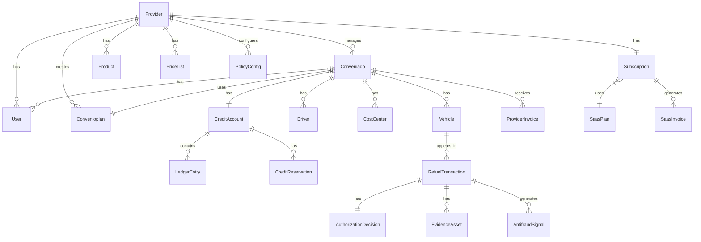

# Fase 1 — Especificação Consolidada de Implementação

> **Status:** Aprovado — Todas as decisões registradas
> **Última atualização:** 2026-04-11
> **Escopo:** Postos de combustível — Crédito, Ledger, Antifraude Determinístico, App Frentista, Billing SaaS, Billing Provider

---

## Sumário

1. [Objetivo e Escopo da Fase 1](#1-objetivo-e-escopo-da-fase-1)
2. [Decisões Arquiteturais Aplicadas](#2-decisões-arquiteturais-aplicadas)
3. [Épicos e Módulos](#3-épicos-e-módulos)
4. [E1 — Foundation: Multitenancy, Auth, RBAC](#4-e1--foundation-multitenancy-auth-rbac)
5. [E2 — Portal da Solução e Registro do Provider](#5-e2--portal-da-solução-e-registro-do-provider)
6. [E3 — Billing SaaS (Acception)](#6-e3--billing-saas-acception)
7. [E4 — Onboarding e Gestão do Provider](#7-e4--onboarding-e-gestão-do-provider)
8. [E5 — Gestão de Convênios e Planos do Provider](#8-e5--gestão-de-convênios-e-planos-do-provider)
9. [E6 — Frota (Veículos, Motoristas, Centros de Custo)](#9-e6--frota-veículos-motoristas-centros-de-custo)
10. [E7 — Crédito e Ledger](#10-e7--crédito-e-ledger)
11. [E8 — Policy Engine e Antifraude Determinístico](#11-e8--policy-engine-e-antifraude-determinístico)
12. [E9 — Autorização de Abastecimento (Refuel)](#12-e9--autorização-de-abastecimento-refuel)
13. [E10 — App Frentista](#13-e10--app-frentista)
14. [E11 — Billing Provider (Contas a Receber)](#14-e11--billing-provider-contas-a-receber)
15. [E12 — Portal Conveniado](#15-e12--portal-conveniado)
16. [E13 — Notificações e Evidence Vault](#16-e13--notificações-e-evidence-vault)
17. [Modelo de Dados Consolidado](#17-modelo-de-dados-consolidado)
18. [Requisitos Não Funcionais](#18-requisitos-não-funcionais)
19. [Mapa de Dependências entre Épicos](#19-mapa-de-dependências-entre-épicos)
20. [Decisões Tomadas — Registro](#20-decisões-tomadas--registro)
21. [Planejamento de Sprints](#21-planejamento-de-sprints)

---

## 1. Objetivo e Escopo da Fase 1

### 1.1 Objetivo

Entregar a plataforma funcional para **postos de combustível (providers SMB)** gerenciarem crédito próprio (fiado) para empresas conveniadas, com:

- Controle de limite de crédito por convênio e veículo
- Autorização de abastecimentos com antifraude determinístico
- App para frentista (online obrigatório)
- Billing SaaS (Acception → Provider)
- Billing Provider (Provider → Conveniado)
- Portais web para Provider, Conveniado e Acception

### 1.2 O que está fora do escopo da Fase 1

| Fora do escopo | Fase prevista |
|---|---|
| IA (score de crédito, fraude ML) | Fase 2 |
| Oficinas e Ordens de Serviço | Fase 3 |
| Parcerias e limite compartilhado | Fase 4 |
| App Mecânico | Fase 3 |
| Renegociação parcelada de faturas | Fase posterior |
| Catálogo público de postos (busca/filtro) | Fase posterior (D-5: fora do escopo F1) |
| Contrato digital do conveniado | Fase posterior (D-6: sem contrato digital no MVP) |
| Gestão de motoristas (UI) | Fase posterior (D-8: schema exists, sem UI) |
| Impersonation de provider pela Acception | Fase posterior (D-10: não implementado no MVP) |
| Gateway de pagamento (SaaS e Provider) | Fase posterior (D-1 e D-2: billing manual no MVP) |

### 1.3 Entregáveis da Fase 1

- `backend/server-api` — módulos core + domain + saas (Fase 1)
- `frontend/portal-acception` — gestão SaaS
- `frontend/portal-solution` — landing page + registro provider
- `frontend/portal-provider` — gestão operacional do posto
- `frontend/portal-conveniado` — consulta e frota da empresa
- `mobile/app-frentista` — autorização de abastecimento
- Prisma schema completo para Fase 1
- Suite de testes (unitários + e2e críticos)

---

## 2. Decisões Arquiteturais Aplicadas

As decisões abaixo estão registradas nos ADRs e **não devem ser revisadas durante a Fase 1**.

| # | Decisão | Impacto na Fase 1 |
|---|---|---|
| ADR-001/002 | Provider = Tenant real do SaaS | `provider_id` obrigatório em todas entidades de negócio |
| ADR-003 | Empresa conveniada = escopo dentro do provider | `conveniado_id` obrigatório em entidades da empresa |
| ADR-004 | Monólito modular NestJS + Clean Architecture | Estrutura de módulos em `src/modules/{core,domain,saas,integrations}` |
| ADR-005 | Ledger append-only + saldos materializados | Imutabilidade do ledger + `credit_accounts` com materialização |
| ADR-006 | Policy Engine determinístico (Fase 1) | Regras AF-001..AF-042, sem IA |
| ADR-008 | App frentista online obrigatório | Offline = pré-captura sem débito; débito apenas após sync online |
| ADR-009 | White-label a partir do plano Growth | Starter sem white-label; Growth = subdomínio; Pro = domínio próprio |
| ADR-010 | Billing SaaS e Billing Provider na mesma estrutura | Módulos separados (`billing-saas`, `billing-provider`) mas padrão arquitetural compartilhado |
| ADR-011 | Trial e suspensão configuráveis por plano | `plan_policy_config` controla trial e suspensão |

### 2.1 Isolamento Multi-tenant — Regras de Ouro

```
TenantContext (presente em toda requisição):
  providerId         → sempre obrigatório
  actorType          → PROVIDER_USER | CONVENIADO_USER | ACCEPTION_ADMIN
  conveniadoId       → obrigatório quando actorType = CONVENIADO_USER
  roles[]
  permissions[]
```

- **Provider user**: vê todos os dados do seu provider
- **Conveniado user**: vê apenas dados com `provider_id + conveniado_id` dele
- **Acception admin**: acesso cross-tenant com trilha de auditoria
- Repositórios **falham imediatamente** (fail-fast) se `providerId` ausente
- Sem RLS na Fase 1 — isolamento via RBAC + scoping obrigatório + guards

---

## 3. Épicos e Módulos

| Épico | Módulos Backend | Portais | App |
|---|---|---|---|
| E1 Foundation | `auth`, `tenancy`, `rbac`, `audit` | — | — |
| E2 Portal Solução | `portal-solution` (API) | `portal-solution` | — |
| E3 Billing SaaS | `billing-saas` | `portal-acception` | — |
| E4 Provider Admin | `providers` | `portal-provider` (admin area) | — |
| E5 Convênios | `conveniados`, `plans-provider` | `portal-provider`, `portal-conveniado` | — |
| E6 Frota | `fleet` | `portal-provider`, `portal-conveniado` | — |
| E7 Crédito/Ledger | `credit`, `ledger` | `portal-provider`, `portal-conveniado` | — |
| E8 Policy Engine | `policy-engine`, `catalog` | `portal-provider` | — |
| E9 Autorização | `refuel` | `portal-provider` | `app-frentista` |
| E10 App Frentista | `refuel` | — | `app-frentista` |
| E11 Billing Provider | `billing-provider`, `notifications` | `portal-provider`, `portal-conveniado` | — |
| E12 Portal Conveniado | (todos acima) | `portal-conveniado` | — |
| E13 Notificações/Evidence | `notifications`, `evidence`, `storage` | — | `app-frentista` |

**Ordem de implementação recomendada:** E1 → E2 → E3 → E4 → E5 → E6 → E7 → E8 → E9 → E10 → E11 → E12 → E13

---

## 4. E1 — Foundation: Multitenancy, Auth, RBAC

### 4.1 Contexto

Base de toda a plataforma. Sem este épico, nenhum outro pode ser implementado. Deve ser construído para suportar todos os cenários de multitenancy definidos.

### 4.2 Módulos

#### `auth` — Autenticação

**Responsabilidades:**
- Registro de usuário (hash de senha com argon2)
- Login por email/senha → JWT (access token + refresh token)
- Confirmação de email por token (expiração 24h)
- Reset de senha por token (expiração 1h)
- Revogação de tokens (logout)

**Tokens JWT:**
```json
{
  "sub": "user_id",
  "providerId": "uuid",
  "actorType": "PROVIDER_USER | CONVENIADO_USER | ACCEPTION_ADMIN",
  "conveniadoId": "uuid | null",
  "roles": ["PROVIDER_ADMIN"],
  "iat": 1234567890,
  "exp": 1234567890
}
```

**APIs:**
| Método | Rota | Descrição |
|---|---|---|
| POST | `/auth/register` | Registro de novo provider (cria tenant + usuário admin) |
| POST | `/auth/confirm-email` | Confirma email por token |
| POST | `/auth/login` | Login → retorna access + refresh token |
| POST | `/auth/refresh` | Renova access token via refresh token |
| POST | `/auth/logout` | Invalida refresh token |
| POST | `/auth/forgot-password` | Solicita reset de senha |
| POST | `/auth/reset-password` | Confirma novo password por token |
| POST | `/auth/invite/accept` | Aceita convite de usuário (provider ou conveniado) |

#### `tenancy` — Resolução de Tenant

**Responsabilidades:**
- Resolver `providerId` por: (1) host header (white-label) ou (2) claim do JWT
- Injetar `TenantContext` no request scope via NestJS REQUEST scope
- Validar que o tenant está ativo para requisições de negócio

**Regra de resolução:**
```
1. Se header Host = subdomínio/domínio white-label → lookup na tabela provider_domains
2. Senão → extrair providerId do JWT claim
3. Se tenant suspenso por inadimplência SaaS:
   - FULL_BLOCK → retornar 403 em toda rota de negócio
   - BLOCK_AUTH_ONLY → retornar 403 apenas em rotas de autorização de abastecimento
```

#### `rbac` — Roles e Permissões

**Roles definidas para Fase 1:**

| Role | Descrição | Escopo |
|---|---|---|
| `ACCEPTION_ADMIN` | Admin da Acception | Cross-tenant |
| `PROVIDER_ADMIN` | Admin do posto | Provider |
| `PROVIDER_MANAGER` | Gerente do posto (autoriza step-up) | Provider |
| `PROVIDER_OPERATOR` | Operador/frentista (acesso portal) | Provider |
| `CONVENIADO_ADMIN` | Admin da empresa conveniada | Provider + Conveniado |
| `CONVENIADO_USER` | Usuário da empresa (consulta) | Provider + Conveniado |

**Permissions (exemplos críticos):**
- `refuel:authorize` — PROVIDER_MANAGER, PROVIDER_OPERATOR
- `credit:manage` — PROVIDER_ADMIN, PROVIDER_MANAGER
- `conveniado:manage` — PROVIDER_ADMIN
- `billing-saas:manage` — ACCEPTION_ADMIN
- `tenant:impersonate` — ACCEPTION_ADMIN (com audit obrigatório)

#### `audit` — Audit Log Imutável

**Regra:** Todo evento de negócio crítico gera um `audit_log` entry imutável.

**Eventos auditados obrigatoriamente:**
- Criação/alteração de tenant, usuário, convênio
- Toda decisão de autorização (ALLOW/DENY/REVIEW)
- Criação de ledger entries
- Alterações de limite de crédito
- Bloqueios/desbloqueios de convênio
- Impersonation por Acception Admin
- Alteração de plano SaaS

### 4.3 Modelo de Dados — Foundation

```prisma
model Provider {
  id             String   @id @default(uuid())
  legalName      String
  tradeName      String
  cnpj           String   @unique
  email          String
  phone          String?
  status         ProviderStatus @default(PENDING_VERIFICATION)
  timezone       String   @default("America/Sao_Paulo")
  addressJson    Json?
  geofenceLat    Float?
  geofenceLng    Float?
  geofenceRadiusM Int?
  createdAt      DateTime @default(now())
  updatedAt      DateTime @updatedAt

  users          User[]
  domains        ProviderDomain[]
  subscription   Subscription?
  conveniados    Conveniado[]
}

enum ProviderStatus {
  PENDING_VERIFICATION
  TRIAL_ACTIVE
  ACTIVE
  SUSPENDED_SAAS_FULL
  SUSPENDED_SAAS_AUTH_ONLY
  CANCELLED
}

model User {
  id           String   @id @default(uuid())
  providerId   String?  // null para ACCEPTION_ADMIN
  conveniadoId String?  // apenas para CONVENIADO_USER
  email        String
  name         String
  passwordHash String
  status       UserStatus @default(PENDING_EMAIL_CONFIRMATION)
  actorType    ActorType
  createdAt    DateTime @default(now())

  roles        UserRole[]
  provider     Provider?  @relation(fields: [providerId], references: [id])
  conveniado   Conveniado? @relation(fields: [conveniadoId], references: [id])

  @@unique([providerId, email])
}

enum ActorType {
  ACCEPTION_ADMIN
  PROVIDER_USER
  CONVENIADO_USER
}

model ProviderDomain {
  id         String   @id @default(uuid())
  providerId String
  domain     String   @unique
  type       DomainType // SUBDOMAIN | CUSTOM
  status     DomainStatus @default(PENDING_VERIFICATION)
  verifiedAt DateTime?
  createdAt  DateTime @default(now())

  provider   Provider @relation(fields: [providerId], references: [id])
}

model AuditLog {
  id          String   @id @default(uuid())
  providerId  String?
  actorUserId String?
  actorType   String
  action      String   // AUTH_REQUESTED, LEDGER_POSTED, CONVENIADO_BLOCKED...
  entityType  String
  entityId    String?
  detailsJson Json
  ipAddress   String?
  createdAt   DateTime @default(now())

  @@index([providerId, createdAt])
  @@index([entityType, entityId])
}
```

### 4.4 Critérios de Aceite

- [ ] Login retorna JWT com todos claims corretos
- [ ] Rota sem `providerId` válido retorna 401/403
- [ ] CONVENIADO_USER não consegue acessar dados de outro conveniado
- [ ] CONVENIADO_USER não consegue acessar dados de outro provider
- [ ] Audit log registrado em todos eventos críticos
- [ ] Confirmação de email expira após 24h
- [ ] Token de reset de senha expira após 1h

---

## 5. E2 — Portal da Solução e Registro do Provider

### 5.1 Contexto

Ponto de entrada público da plataforma. Permite que postos descubram a solução e criem sua conta.

### 5.2 Funcionalidades — Phase 1 MVP

**Portal da Solução (`portal-solution`):**
- Landing page institucional (produto, benefícios, planos SaaS)
- Formulário de registro de provider
- Página de confirmação de email
- Página de login (redirect para portal-provider após login)

> **Decisão D-5 (registrada):** Catálogo público de postos fora do escopo da Fase 1. Portal da Solução = landing page institucional + formulário de registro. Catálogo entra em fase posterior.

### 5.3 Fluxo de Registro

```
1. Usuário acessa portal-solution
2. Clica em "Criar conta para meu posto"
3. Preenche formulário de registro:
   - Dados do posto: razão social, nome fantasia, CNPJ, endereço, telefone
   - Dados do admin: nome, email, senha
   - Aceite dos termos de uso
4. Backend cria:
   - Provider com status PENDING_VERIFICATION
   - User com role PROVIDER_ADMIN e status PENDING_EMAIL_CONFIRMATION
   - Envia email de confirmação (token, 24h)
5. Usuário confirma email
6. Provider muda para TRIAL_ACTIVE
7. User muda para ACTIVE
8. Redireciona para portal-provider (onboarding wizard)
```

### 5.4 Validações de Registro

- CNPJ válido (algoritmo de validação)
- Email único no sistema (não só por tenant)
- Senha: mínimo 8 caracteres, 1 maiúsculo, 1 número
- Aceite de termos obrigatório

### 5.5 APIs

| Método | Rota | Descrição |
|---|---|---|
| POST | `/providers/register` | Cria provider + user admin (público) |
| GET | `/providers/plans` | Lista planos SaaS disponíveis (público) |

### 5.6 Critérios de Aceite

- [ ] CNPJ duplicado retorna erro com mensagem clara
- [ ] Email duplicado retorna erro com mensagem clara
- [ ] Provider criado em status PENDING_VERIFICATION
- [ ] Email de confirmação enviado em até 30s
- [ ] Token de confirmação expira em 24h
- [ ] Após confirmação, provider muda para TRIAL_ACTIVE automaticamente

---

## 6. E3 — Billing SaaS (Acception)

### 6.1 Contexto

Controla como a Acception cobra os providers pelo uso da plataforma. Inclui planos, trial, assinaturas e suspensão por inadimplência.

### 6.2 Planos SaaS (Fase 1)

| Atributo | Starter | Growth | Pro |
|---|---|---|---|
| Max convênios ativos | 10 | 50 | Ilimitado (ou 200+) |
| Max veículos | 50 | 300 | Ilimitado |
| Max transações/mês | 1.000 | 5.000 | Ilimitado |
| Transação extra (acima do limite) | R$ 0,50/tx | R$ 0,40/tx | R$ 0,30/tx |
| White-label | Não | Subdomínio | Domínio próprio |
| Antifraude determinístico | ✅ | ✅ | ✅ |
| Suporte | Padrão | Prioritário | Implantação assistida |
| IA (Fase 2) | Não | Score básico | IA completa |

**Configuração do plano (gerenciado pela Acception):**
- Trial: período em dias (ex: 14 dias) e/ou limite de transações configurável por plano
- Suspensão por inadimplência: FULL_BLOCK (bloqueia tudo) ou BLOCK_AUTH_ONLY (apenas bloqueia novas autorizações)
- Grace period para pagamento (ex: 5 dias antes de suspender)

### 6.3 Ciclo de Vida do Tenant

```
PENDING_VERIFICATION → (confirma email) → TRIAL_ACTIVE
TRIAL_ACTIVE → (escolhe plano + paga) → ACTIVE
ACTIVE → (inadimplência > grace_period) → SUSPENDED_SAAS_FULL | SUSPENDED_SAAS_AUTH_ONLY
SUSPENDED_SAAS_* → (pagamento confirmado) → ACTIVE
ACTIVE → (cancelamento) → CANCELLED
```

### 6.4 Módulo `billing-saas`

**Responsabilidades:**
- CRUD de planos SaaS (Acception Admin)
- Criação e gestão de assinaturas (Subscription)
- Controle de trial (ativação automática ao expirar trial se houver assinatura)
- Apuração de uso (transações/convênios para cobrança variável)
- Suspensão automática por inadimplência
- Reativação automática após pagamento
- Geração de invoices SaaS mensais

> **Decisão D-1 (registrada):** Sem gateway de pagamento na Fase 1. Acception gerencia assinaturas e ativação de planos manualmente via portal-acception. Invoice SaaS gerada no sistema para controle interno, mas pagamento e confirmação são externos à plataforma. Gateway SaaS será integrado em fase posterior.

### 6.5 Modelo de Dados — Billing SaaS

```prisma
model SaasPlan {
  id                    String   @id @default(uuid())
  name                  String   // Starter, Growth, Pro
  code                  String   @unique
  baseMonthlyPrice      Decimal
  maxConvenios          Int?     // null = ilimitado
  maxVehicles           Int?
  maxTransactionsMonth  Int?
  extraTxPrice          Decimal?
  whitelabelType        WhitelabelType @default(NONE) // NONE | SUBDOMAIN | CUSTOM_DOMAIN
  trialDays             Int      @default(14)
  trialMaxTransactions  Int?
  suspensionMode        SuspensionMode @default(FULL_BLOCK)
  gracePeriodDays       Int      @default(5)
  isActive              Boolean  @default(true)
  createdAt             DateTime @default(now())

  subscriptions         Subscription[]
}

enum WhitelabelType { NONE SUBDOMAIN CUSTOM_DOMAIN }
enum SuspensionMode { FULL_BLOCK BLOCK_AUTH_ONLY }

model Subscription {
  id              String   @id @default(uuid())
  providerId      String   @unique
  planId          String
  status          SubscriptionStatus @default(TRIAL)
  trialEndsAt     DateTime?
  currentPeriodStart DateTime?
  currentPeriodEnd   DateTime?
  cancelledAt     DateTime?
  createdAt       DateTime @default(now())

  provider        Provider   @relation(fields: [providerId], references: [id])
  plan            SaasPlan   @relation(fields: [planId], references: [id])
  invoices        SaasInvoice[]
}

enum SubscriptionStatus {
  TRIAL
  ACTIVE
  PAST_DUE
  SUSPENDED
  CANCELLED
}

model SaasInvoice {
  id              String   @id @default(uuid())
  providerId      String
  subscriptionId  String
  periodStart     DateTime
  periodEnd       DateTime
  baseAmount      Decimal
  usageAmount     Decimal  @default(0)
  totalAmount     Decimal
  status          InvoiceStatus @default(OPEN)
  dueDate         DateTime
  paidAt          DateTime?
  externalRef     String?  // ID no gateway, se integrado
  createdAt       DateTime @default(now())

  subscription    Subscription @relation(fields: [subscriptionId], references: [id])
}

enum InvoiceStatus { OPEN PAST_DUE PAID CANCELLED }
```

### 6.6 Portal Acception — Funcionalidades MVP

- Dashboard: nº tenants ativos, trial, suspensos, MRR
- Lista de providers (status, plano, trial expiry)
- Detalhe do provider (assinatura, invoices, uso)
- Criar/editar planos SaaS
- Suspender/reativar tenant manualmente
- Log de auditoria cross-tenant
- ~~Impersonation~~ (D-10: fora do escopo da Fase 1 — suporte feito via portal-acception)

### 6.7 Critérios de Aceite

- [ ] Tenant trial expira automaticamente na data correta
- [ ] Tenant suspenso por FULL_BLOCK recebe 403 em toda rota de negócio
- [ ] Tenant suspenso por BLOCK_AUTH_ONLY consegue visualizar dados mas não autorizar abastecimentos
- [ ] Reativação após pagamento remove suspensão em até 5 minutos
- [ ] Limite de convênios/veículos/transações do plano é verificado antes de criar novos
- [ ] Excesso de transações gera cobrança variável na invoice do mês

---

## 7. E4 — Onboarding e Gestão do Provider

### 7.1 Contexto

Após criação da conta, o provider precisa configurar seu posto antes de iniciar operações. Onboarding garante que os requisitos mínimos estejam preenchidos.

### 7.2 Estado do Onboarding

O provider tem um checklist de onboarding com etapas:

| Etapa | Obrigatória para operar? |
|---|---|
| 1. Configurar dados do posto (endereço, geofence) | Sim |
| 2. Definir política básica de crédito | Sim |
| 3. Cadastrar catálogo de produtos (combustíveis) | Sim |
| 4. Cadastrar preço vigente de pelo menos 1 produto | Sim |
| 5. Criar primeiro plano de convênio | Sim |
| 6. Cadastrar primeiro conveniado | Não (pode operar após etapas 1-5) |
| 7. Escolher plano SaaS | Não (trial permite operar) |

> **Decisão D-4 (registrada):** Backend state machine + checklist simples. O estado de cada etapa é persistido no backend (`onboarding_steps`). O portal-provider exibe um checklist visual com status (completo/pendente) e links diretos para cada etapa. Sem wizard animado ou multi-step guiado. Provider tem acesso restrito às funções operacionais enquanto as etapas obrigatórias (1–5) não estiverem concluídas.

### 7.3 Módulo `providers` — Configurações do Posto

**Dados gerenciáveis:**
- Dados cadastrais (razão social, nome fantasia, CNPJ, endereço)
- Geofence (lat, lng, raio em metros)
- Timezone
- Configurações white-label (logo, cor primária, cor secundária)
- Subdomínio (Growth+) / domínio próprio (Pro+)

**APIs:**
| Método | Rota | Descrição |
|---|---|---|
| GET | `/providers/me` | Retorna dados do provider logado |
| PATCH | `/providers/me` | Atualiza dados do provider |
| POST | `/providers/me/domains` | Registra subdomínio/domínio próprio |
| GET | `/providers/me/onboarding` | Status do checklist de onboarding |

### 7.4 Catálogo de Produtos (`catalog`)

**Produtos padrão:**
- DIESEL_COMUM
- DIESEL_S10
- GASOLINA_COMUM
- GASOLINA_ADITIVADA
- ETANOL
- GNV (opcional, Fase 1)

**Price list:**
- Histórico de preços vigentes
- Apenas 1 preço ativo por produto por vez
- Histórico preservado para auditoria de transações antigas

### 7.5 Modelo de Dados

```prisma
model Product {
  id         String  @id @default(uuid())
  providerId String
  code       String  // DIESEL_S10, GASOLINA_COMUM...
  name       String
  unitType   String  @default("LITER")
  status     Status  @default(ACTIVE)
  createdAt  DateTime @default(now())

  provider   Provider  @relation(fields: [providerId], references: [id])
  priceLists PriceList[]

  @@unique([providerId, code])
}

model PriceList {
  id             String   @id @default(uuid())
  providerId     String
  productId      String
  pricePerUnit   Decimal
  validFrom      DateTime
  validTo        DateTime?
  createdAt      DateTime @default(now())

  product        Product  @relation(fields: [productId], references: [id])

  @@index([providerId, productId, validFrom])
}
```

---

## 8. E5 — Gestão de Convênios e Planos do Provider

### 8.1 Contexto

Provider cria planos de convênio parametrizáveis e os associa às empresas clientes. Cada empresa tem exatamente 1 plano ativo.

### 8.2 Planos do Provider (parametrizáveis)

O provider cria seus próprios planos, não são fixos. O sistema oferece template com todos os parâmetros disponíveis.

**Parâmetros do plano:**

```
Crédito:
  - creditLimit: limite global (R$)
  - vehicleCreditLimit: limite por veículo (R$, opcional)
  - periodLimits: { daily?, weekly?, monthly? } (R$, opcional)
  - paymentDueDays: prazo de pagamento (15, 30, 45 dias)
  - lateFeePercent: multa por atraso (%)
  - lateInterestPercent: juros por atraso ao mês (%)
  - lockAfterDays: bloquear após X dias de atraso

Governança:
  - requireDriver: exigir motorista?
  - requireCostCenter: exigir centro de custo?
  - allowedDays: dias permitidos (json array)
  - allowedTimeStart / allowedTimeEnd: horário permitido
  - allowedProducts: lista de produtos permitidos
  - minRefuelIntervalMinutes: intervalo mínimo entre abastecimentos

Antifraude:
  - requireOdometer: exigir hodômetro?
  - maxTxAmount: valor máximo por transação (acima → step-up PIN)
  - geofenceRequired: exigir geolocalização?

Condições Comerciais:
  - discountPercent: desconto por litro (%, opcional)
  - adminFeePercent: taxa administrativa (%, opcional)
```

**Limite de planos por provider:** definido pelo plano SaaS (ex: Starter = até 5 planos, Growth = até 20, Pro = ilimitado — configurável na Acception).

**Versionamento:** planos têm versão. Alterar parâmetros cria nova versão; convênios associados continuam na versão anterior até migração explícita.

### 8.3 Gestão de Conveniados

**Status do convênio:**
```
PENDING_APPROVAL → ACTIVE → BLOCKED → DELINQUENT → SUSPENDED → CLOSED
```

**Transições:**
- `PENDING_APPROVAL` → `ACTIVE`: provider aprova + conveniado completa onboarding
- `ACTIVE` → `BLOCKED`: provider bloqueia manualmente
- `ACTIVE` → `DELINQUENT`: fatura vencida → `lockAfterDays` dias → bloqueio automático
- `DELINQUENT` → `ACTIVE`: pagamento registrado
- `*` → `CLOSED`: encerramento do convênio

**Fluxo de criação de convênio:**

**Modelo A (provider cria — padrão SMB):**
1. Provider cadastra empresa (dados, CNPJ, email)
2. Provider define plano
3. Sistema gera link de ativação (token, 72h)
4. Empresa recebe email com link
5. Empresa confirma conta e completa onboarding (veículos, motoristas opcionais)
6. Convênio fica ACTIVE

> **Decisão D-6 (registrada):** Sem contrato digital na Fase 1. Sistema registra apenas a `createdAt` como data de ativação do convênio. Contratos são gerenciados externamente pelo provider (papel, PDF, etc.). Os campos `contractAcceptedAt` e `contractIpAddress` permanecem no schema para uso futuro sem necessidade de migração.

### 8.4 Modelo de Dados

```prisma
model Convenioplan {
  id              String   @id @default(uuid())
  providerId      String
  name            String
  version         Int      @default(1)
  isActive        Boolean  @default(true)
  // Crédito
  creditLimit     Decimal
  vehicleCreditLimit Decimal?
  periodLimitsJson Json?   // { daily?, weekly?, monthly? }
  paymentDueDays  Int      @default(30)
  lateFeePercent  Decimal  @default(2)
  lateInterestPercent Decimal @default(1)
  lockAfterDays   Int      @default(10)
  // Governança
  requireDriver   Boolean  @default(false)
  requireCostCenter Boolean @default(false)
  allowedDaysJson Json?
  allowedTimeStart String? // "HH:MM"
  allowedTimeEnd  String?
  allowedProductsJson Json?
  minRefuelIntervalMinutes Int @default(60)
  // Antifraude
  requireOdometer Boolean  @default(true)
  maxTxAmount     Decimal?
  geofenceRequired Boolean @default(false)
  // Comercial
  discountPercent Decimal? @default(0)
  adminFeePercent Decimal? @default(0)
  createdAt       DateTime @default(now())

  provider        Provider   @relation(fields: [providerId], references: [id])
  conveniados     Conveniado[]
}

model Conveniado {
  id              String   @id @default(uuid())
  providerId      String
  planId          String
  legalName       String
  cnpj            String
  email           String
  phone           String?
  addressJson     Json?
  responsibleName String
  status          ConveniadoStatus @default(PENDING_APPROVAL)
  billingCycleDay Int      @default(5)  // dia do mês para fechar a fatura
  contractAcceptedAt DateTime?
  contractIpAddress  String?
  createdAt       DateTime @default(now())

  provider        Provider    @relation(fields: [providerId], references: [id])
  plan            Convenioplan @relation(fields: [planId], references: [id])
  vehicles        Vehicle[]
  drivers         Driver[]
  costCenters     CostCenter[]
  creditAccount   CreditAccount?
  users           User[]

  @@unique([providerId, cnpj])
}

enum ConveniadoStatus {
  PENDING_APPROVAL
  ACTIVE
  BLOCKED
  DELINQUENT
  SUSPENDED
  CLOSED
}
```

### 8.5 Critérios de Aceite

- [ ] Provider não pode criar mais convênios do que o plano SaaS permite
- [ ] Convênio com status BLOCKED/DELINQUENT recebe DENY em toda tentativa de autorização
- [ ] Alterar plano do convênio cria nova versão do plano; histórico preservado
- [ ] Link de ativação expira após 72h
- [ ] CNPJ único por provider (não global — mesmo CNPJ pode ser conveniado de múltiplos providers)

---

## 9. E6 — Frota (Veículos, Motoristas, Centros de Custo)

### 9.1 Contexto

Entidades que participam das transações de abastecimento. Pertencentes ao conveniado dentro de um provider.

### 9.2 Veículos

**Dados do veículo:**
- Placa (única por provider+conveniado)
- Tipo: CAR, MOTO, TRUCK, VAN, BUS
- Combustível permitido (relação com products)
- Capacidade do tanque (litros, para regra AF-032)
- Limite de crédito próprio (opcional, override do plano)
- Último hodômetro registrado (read model)
- Último abastecimento (timestamp, para regra AF-031)

**Status:** ACTIVE, INACTIVE, STOLEN (bloqueia automaticamente)

### 9.3 Motoristas

> **Decisão D-8 (registrada):** Tabela `drivers` implementada no schema Prisma mas **sem endpoints CRUD nem UI** na Fase 1. `require_driver` sempre `false` na Fase 1 (regra AF-011 desativada). CRUD de motoristas com UI entra em sprint posterior. Os campos já existem no schema para evitar migração futura.

Estrutura mínima no schema (sem API exposta):
- Nome, documento (CPF), status
- Vinculado ao conveniado

### 9.4 Centros de Custo

- Código, nome, status
- Vinculado ao conveniado
- Usado para agrupar transações nos extratos

### 9.5 Modelo de Dados

```prisma
model Vehicle {
  id                   String   @id @default(uuid())
  providerId           String
  conveniadoId         String
  plate                String
  type                 VehicleType
  tankCapacityLiters   Float?
  vehicleCreditLimit   Decimal?
  status               VehicleStatus @default(ACTIVE)
  // read models (atualizados a cada autorização)
  lastOdometerKm       Float?
  lastRefuelAt         DateTime?
  lastRefuelLiters     Float?
  createdAt            DateTime @default(now())

  conveniado           Conveniado @relation(fields: [conveniadoId], references: [id])
  allowedProducts      VehicleAllowedProduct[]

  @@unique([providerId, plate])
}

enum VehicleType { CAR MOTO TRUCK VAN BUS }
enum VehicleStatus { ACTIVE INACTIVE STOLEN }

model Driver {
  id           String   @id @default(uuid())
  providerId   String
  conveniadoId String
  name         String
  document     String?
  status       Status   @default(ACTIVE)
  createdAt    DateTime @default(now())

  conveniado   Conveniado @relation(fields: [conveniadoId], references: [id])
}

model CostCenter {
  id           String   @id @default(uuid())
  providerId   String
  conveniadoId String
  code         String
  name         String
  status       Status   @default(ACTIVE)
  createdAt    DateTime @default(now())

  conveniado   Conveniado @relation(fields: [conveniadoId], references: [id])

  @@unique([providerId, conveniadoId, code])
}
```

---

## 10. E7 — Crédito e Ledger

### 10.1 Contexto

Núcleo financeiro da plataforma. O ledger é append-only e imutável. Saldos são materializados para performance. Fundamental para todas as decisões de autorização.

### 10.2 Conta de Crédito (`credit_accounts`)

Uma conta de crédito por conveniado. Materializa:
- `creditLimit`: limite vigente (pode ser sobrescrito manualmente)
- `currentBalance`: total devido (soma de débitos - créditos pagos)
- `reservedAmount`: reservas ativas (pré-autorizações)
- `availableBalance`: `creditLimit - currentBalance - reservedAmount`

**Regra:** `availableBalance` deve ser sempre ≥ 0 para ALLOW.

### 10.3 Ledger (`ledger_entries`)

**Tipos de lançamento:**
| Tipo | Descrição |
|---|---|
| `DEBIT` | Abastecimento efetivado (débito no conveniado) |
| `CREDIT` | Pagamento registrado pelo provider |
| `REVERSAL` | Estorno de abastecimento |
| `ADJUSTMENT` | Ajuste manual com justificativa (auditado) |
| `FEE` | Juros/multa gerados automaticamente |

**Imutabilidade:** nenhuma entrada pode ser excluída ou alterada. Correções = novos lançamentos do tipo REVERSAL ou ADJUSTMENT.

### 10.4 Reservas de Crédito (`credit_reservations`)

- Criadas junto com decisão ALLOW/REVIEW
- TTL padrão: 600 segundos (10 minutos) — configurável
- Status: `ACTIVE`, `CONSUMED` (após efetivar), `EXPIRED` (TTL), `CANCELLED`
- Expiração: job periódico (a cada 1 min) cancela reservas vencidas e libera crédito

### 10.5 Read Models para Performance

Para manter P95 ≤ 300ms na autorização, os seguintes valores são **materializados e atualizados transacionalmente** após cada abastecimento:

| Read Model | Tabela/Campo | Atualizado em |
|---|---|---|
| Saldo atual | `credit_accounts.currentBalance` | Ledger DEBIT/CREDIT |
| Reservado | `credit_accounts.reservedAmount` | Reserva criada/consumida/expirada |
| Último odômetro | `vehicles.lastOdometerKm` | Abastecimento efetivado |
| Último abastecimento | `vehicles.lastRefuelAt` | Abastecimento efetivado |
| Gasto diário convênio | `spend_daily_snapshots` | Abastecimento efetivado |
| Gasto por período do veículo | `vehicle_period_spends` | Abastecimento efetivado |
| Taxa de reversão por operador | `operator_stats` | Reversão registrada |

### 10.6 Modelo de Dados

```prisma
model CreditAccount {
  id              String   @id @default(uuid())
  providerId      String
  conveniadoId    String   @unique
  creditLimit     Decimal
  currentBalance  Decimal  @default(0)  // materialized
  reservedAmount  Decimal  @default(0)  // materialized
  status          CreditAccountStatus @default(ACTIVE)
  updatedAt       DateTime @updatedAt
  createdAt       DateTime @default(now())

  conveniado      Conveniado @relation(fields: [conveniadoId], references: [id])
  reservations    CreditReservation[]
  ledgerEntries   LedgerEntry[]
}

model LedgerEntry {
  id              String   @id @default(uuid())
  providerId      String
  conveniadoId    String
  vehicleId       String?
  creditAccountId String
  type            LedgerEntryType
  amount          Decimal
  currency        String   @default("BRL")
  referenceType   String?  // REFUEL_TX, INVOICE_PAYMENT, MANUAL_ADJUSTMENT
  referenceId     String?
  description     String?
  metadataJson    Json?
  createdAt       DateTime @default(now())

  creditAccount   CreditAccount @relation(fields: [creditAccountId], references: [id])

  @@index([providerId, conveniadoId, createdAt])
}

enum LedgerEntryType { DEBIT CREDIT REVERSAL ADJUSTMENT FEE }

model CreditReservation {
  id              String   @id @default(uuid())
  providerId      String
  conveniadoId    String
  vehicleId       String?
  creditAccountId String
  externalTxId    String
  amount          Decimal
  status          ReservationStatus @default(ACTIVE)
  expiresAt       DateTime
  createdAt       DateTime @default(now())

  creditAccount   CreditAccount @relation(fields: [creditAccountId], references: [id])

  @@unique([providerId, externalTxId])
}

enum ReservationStatus { ACTIVE CONSUMED EXPIRED CANCELLED }
```

### 10.7 APIs

| Método | Rota | Descrição |
|---|---|---|
| GET | `/credit/accounts/:conveniadoId` | Saldo e limites do conveniado |
| GET | `/ledger/:conveniadoId` | Extrato (paginado) |
| POST | `/ledger/adjustment` | Ajuste manual (PROVIDER_ADMIN, auditado) |
| GET | `/credit/accounts/:conveniadoId/aging` | Aging da dívida |

### 10.8 Critérios de Aceite

- [ ] Nenhuma ledger entry pode ser deletada ou modificada
- [ ] `currentBalance` sempre consistente com soma do ledger (reconciliação verificável)
- [ ] Reserva expirada libera crédito automaticamente
- [ ] Ajuste manual exige justificativa e gera audit log
- [ ] P95 de leitura de saldo ≤ 50ms (read model materializado)

---

## 11. E8 — Policy Engine e Antifraude Determinístico

### 11.1 Contexto

Coração da autorização. Avalia o request de abastecimento contra todas as regras e retorna ALLOW/DENY/REVIEW com reason codes.

### 11.2 Arquitetura do Policy Engine

**Entrada (`AuthorizationRequest`):**
```typescript
{
  providerId: string
  conveniadoId: string
  vehicleId: string
  driverId?: string
  costCenterId?: string
  productCode: string
  liters: number
  totalAmount: number
  pricePerLiter: number
  odometerKm?: number
  operatorUserId: string
  deviceId?: string
  geoLat?: number
  geoLng?: number
  externalTxId: string       // idempotência
  requestedAt: Date
}
```

**Saída (`AuthorizationDecision`):**
```typescript
{
  decision: 'ALLOW' | 'DENY' | 'REVIEW'
  reasonCodes: string[]       // ['AF-031', 'AF-034']
  requiredActions: string[]   // ['MANAGER_PIN', 'ODOMETER_PHOTO']
  policyVersion: string
  ruleHits: RuleHit[]         // detalhes de cada regra disparada
  reservationId?: string      // criada para ALLOW/REVIEW
}
```

### 11.3 Ordem de Avaliação das Regras

O engine avalia as regras **em ordem**. O resultado de uma regra DENY interrompe a avaliação (fail-fast). REVIEWs acumulam.

```
1. Hard Blocks → DENY imediato (AF-001..005)
2. Governança de uso → REVIEW/DENY (AF-010..013)
3. Crédito e exposição → DENY/REVIEW (AF-020..026)
4. Antifraude determinístico → REVIEW (AF-030..037)
5. Step-up obrigatório → acumula ações (AF-040..042)
```

### 11.4 Catálogo de Regras (Fase 1)

| ID | Nome | Severidade | Configurável |
|---|---|---|---|
| AF-001 | CONVENIO_BLOCKED | BLOCK_DENY | Não |
| AF-002 | VEHICLE_NOT_ALLOWED | BLOCK_DENY | Não |
| AF-003 | OPERATOR_NOT_ALLOWED | BLOCK_DENY | Não |
| AF-004 | PRODUCT_NOT_ALLOWED | BLOCK_DENY | Por plano |
| AF-005 | CONTRACT_INVALID | BLOCK_DENY | Não |
| AF-010 | MISSING_COST_CENTER | REVIEW | `requireCostCenter` |
| AF-011 | MISSING_DRIVER | REVIEW | `requireDriver` |
| AF-012 | OUT_OF_ALLOWED_SCHEDULE | REVIEW/DENY | `allowedDays/Time`, `mode` |
| AF-013 | GEOFENCE_MISMATCH | REVIEW | `geofenceRadiusM` |
| AF-020 | CREDIT_LIMIT_EXCEEDED | DENY | `creditLimit` |
| AF-021 | VEHICLE_LIMIT_EXCEEDED | DENY/REVIEW | `vehicleCreditLimit`, `mode` |
| AF-022 | PERIOD_LIMIT_EXCEEDED | DENY/REVIEW | `periodLimits`, `mode` |
| AF-023 | TX_AMOUNT_ABOVE_MAX | REVIEW | `maxTxAmount` |
| AF-024 | PAST_DUE_LOCK | DENY | `lockAfterDays` |
| AF-025 | PAST_DUE_REVIEW | REVIEW | `lockAfterDays` |
| AF-030 | DUPLICATE_TX | DENY | Não |
| AF-031 | FREQUENT_REFUELING | REVIEW | `minRefuelIntervalMinutes` |
| AF-032 | TANK_CAPACITY_EXCEEDED | REVIEW/DENY | `tankOverfillFactor` |
| AF-033 | ODOMETER_REGRESSION | REVIEW | `odometerRegressionToleranceKm` |
| AF-034 | KM_PER_L_ANOMALY | REVIEW | `kmPerLThresholds` por tipo |
| AF-035 | PRICE_MISMATCH | REVIEW | `priceTolerance` |
| AF-036 | OPERATOR_RISK | REVIEW | `operatorExceptionThreshold` |
| AF-037 | REVERSAL_RATE_HIGH | REVIEW | `reversalRateThreshold` |
| AF-040 | REQUIRE_MANAGER_PIN | STEP_UP | Disparado por AF-023, AF-025 |
| AF-041 | CAPTURE_ODOMETER_PHOTO | STEP_UP | Disparado por AF-031, AF-033, AF-034 |
| AF-042 | CAPTURE_GEO_PROOF | STEP_UP | Disparado por AF-013 |

### 11.5 Configuração de Política

As regras são configuráveis em dois escopos:
1. **Provider** (`scope_type = PROVIDER`) — padrão para todos convênios
2. **Convênio** (`scope_type = CONVENIADO`) — override por convênio

Herança: convênio herda do provider, com override seletivo.

```prisma
model PolicyConfig {
  id                          String   @id @default(uuid())
  providerId                  String
  scopeType                   PolicyScopeType // PROVIDER | CONVENIADO
  scopeId                     String?  // null para PROVIDER scope
  policyVersion               String
  // Governança
  requireDriver               Boolean  @default(false)
  requireCostCenter           Boolean  @default(false)
  allowedDaysJson             Json?    // ["MON","TUE","WED","THU","FRI"]
  allowedTimeStart            String?
  allowedTimeEnd              String?
  outOfScheduleMode           String   @default("REVIEW")
  geofenceRequiredMode        String   @default("REVIEW")
  // Crédito
  vehicleLimitMode            String   @default("DENY")
  periodLimitMode             String   @default("DENY")
  maxTxAmount                 Decimal?
  lockAfterDays               Int      @default(10)
  // Antifraude
  minRefuelIntervalMinutes    Int      @default(60)
  tankOverfillFactor          Float    @default(1.1)
  odometerRegressionToleranceKm Float  @default(5)
  kmPerLThresholdsJson        Json?
  priceTolerance              Float    @default(0.02)
  operatorExceptionThreshold  Int      @default(5)
  operatorWindowHours         Int      @default(6)
  reversalRateThreshold       Float    @default(0.1)
  reversalWindowDays          Int      @default(7)
  reservationTtlSeconds       Int      @default(600)
  isActive                    Boolean  @default(true)
  createdAt                   DateTime @default(now())

  @@index([providerId, scopeType, scopeId])
}

model AuthorizationDecision {
  id                  String   @id @default(uuid())
  providerId          String
  externalTxId        String
  conveniadoId        String
  vehicleId           String?
  decision            DecisionType
  policyVersion       String
  ruleHitsJson        Json
  requiredActionsJson Json?
  reservationId       String?
  createdAt           DateTime @default(now())

  @@unique([providerId, externalTxId])
  @@index([providerId, conveniadoId, createdAt])
}

enum DecisionType { ALLOW DENY REVIEW }
```

### 11.6 Idempotência

- Unique constraint em `(providerId, externalTxId)` na tabela `authorization_decisions`
- Se `externalTxId` já processado → retornar decisão anterior (não reprocessar)
- Previne double charge em retransmissões do app

### 11.7 Step-up — Manager PIN

> **Decisão D-7 (registrada):** PIN numérico cadastrado pelo provider no sistema. Frentista digita o PIN no app quando step-up AF-040 é exigido. Backend valida o hash. Gerente não precisa estar presente fisicamente.

**Funcionamento:**
- Provider Admin ou Manager configura um PIN numérico de 6 dígitos no portal-provider
- PIN armazenado como hash (argon2) em `provider_manager_pins`
- Quando AF-040 dispara, app exibe campo de entrada de PIN
- Frentista obtém o PIN do gerente (verbalmente ou por outro canal) e digita no app
- App envia PIN junto com `POST /refuel/complete`
- Backend valida hash; se inválido, retorna erro e não efetiva débito
- Tentativas inválidas: máximo 5 por sessão de autorização; excedido → DENY automático

**Modelo:**
```prisma
model ProviderManagerPin {
  id         String   @id @default(uuid())
  providerId String   @unique
  pinHash    String   // argon2
  updatedAt  DateTime @updatedAt
  createdAt  DateTime @default(now())

  provider   Provider @relation(fields: [providerId], references: [id])
}
```

**API:**
| Método | Rota | Descrição |
|---|---|---|
| PUT | `/providers/me/manager-pin` | Define/altera PIN do gerente (PROVIDER_ADMIN apenas) |

**Evolução futura:** PIN pessoal por usuário PROVIDER_MANAGER (D-7 alternativa C) pode substituir este mecanismo sem impacto no contrato de API do app.

### 11.8 Critérios de Aceite

- [ ] Idempotência: mesmo `externalTxId` retorna mesma decisão
- [ ] DENY em AF-001 (convênio bloqueado) não cria reserva
- [ ] REVIEW acumula todas ações requeridas sem parar a avaliação
- [ ] Todas as regras disparadas estão presentes em `ruleHits`
- [ ] `policyVersion` registrada em toda decisão
- [ ] Latência P95 ≤ 300ms para o endpoint de autorização

---

## 12. E9 — Autorização de Abastecimento (Refuel)

### 12.1 Fluxo Completo

```
POST /refuel/authorize
  ↓
Validação JWT + TenantGuard
  ↓
Idempotência (externalTxId já existe?)
  ↓ não existe
PolicyEngine.evaluate(context)
  ↓
DENY → registra AuthorizationDecision, retorna 200 {decision: DENY}
  ↓ ALLOW/REVIEW
Cria CreditReservation (TTL 10min)
Atualiza credit_accounts.reservedAmount
Registra AuthorizationDecision
Retorna 200 {decision, requiredActions, reservationId}

Se REVIEW:
  App coleta evidências (PIN/foto/geo)
  POST /refuel/complete (com evidências)
    ↓
    Valida step-up (verifica PIN, foto etc.)
    ↓ válido
    Efetiva: cria LedgerEntry DEBIT
    Consome reserva (CONSUMED)
    Atualiza read models (balance, lastOdometer, lastRefuelAt)
    Cria RefuelTransaction (status=POSTED)
    Armazena evidências (evidence_assets)
    ↓
    Retorna recibo

Se ALLOW:
  POST /refuel/complete (sem step-up necessário)
    ↓ (mesmo fluxo sem validação de step-up)
```

### 12.2 APIs

| Método | Rota | Descrição |
|---|---|---|
| POST | `/refuel/authorize` | Solicita autorização de abastecimento |
| POST | `/refuel/complete` | Confirma abastecimento (efetiva débito) |
| POST | `/refuel/cancel` | Cancela reserva antes de completar |
| GET | `/refuel/transactions` | Lista transações (paginado, filtros) |
| GET | `/refuel/transactions/:id` | Detalhe de transação |
| POST | `/refuel/transactions/:id/reverse` | Estorno (PROVIDER_MANAGER+) |

### 12.3 Modelo de Dados

```prisma
model RefuelTransaction {
  id              String   @id @default(uuid())
  providerId      String
  externalTxId    String
  conveniadoId    String
  vehicleId       String
  driverId        String?
  costCenterId    String?
  operatorUserId  String
  deviceId        String?
  productId       String
  liters          Float
  totalAmount     Decimal
  pricePerLiter   Decimal
  odometerKm      Float?
  geoLat          Float?
  geoLng          Float?
  status          RefuelStatus @default(PENDING_AUTHORIZATION)
  reservationId   String?
  ledgerEntryId   String?
  authDecisionId  String?
  createdAt       DateTime @default(now())
  completedAt     DateTime?

  evidences       EvidenceAsset[]

  @@unique([providerId, externalTxId])
  @@index([providerId, conveniadoId, createdAt])
  @@index([providerId, vehicleId, createdAt])
}

enum RefuelStatus {
  PENDING_AUTHORIZATION
  AUTHORIZED
  REVIEW_PENDING
  POSTED
  DENIED
  CANCELLED
  REVERSED
}
```

### 12.4 Critérios de Aceite

- [ ] Abastecimento DENY não gera ledger entry nem reserva
- [ ] Reserva não consumida expira em 10min e libera crédito
- [ ] REVIEW sem step-up válido não efetiva débito
- [ ] Estorno cria LedgerEntry REVERSAL e atualiza saldo materializado
- [ ] Transaction idempotente por externalTxId

---

## 13. E10 — App Frentista

### 13.1 Contexto

Aplicativo Flutter usado pelo frentista no posto para capturar e autorizar abastecimentos em tempo real.

### 13.2 Funcionalidades MVP

**Autenticação:**
- Login por email/senha
- JWT armazenado de forma segura (flutter_secure_storage)
- Auto-refresh de token

**Identificação do Veículo:**
> **Decisão D-3 (registrada):** QR Code como método principal + entrada manual de placa como fallback obrigatório. Sem NFC na Fase 1.

- **Método primário:** Frentista escaneia o QR Code do veículo com a câmera do celular
- **Fallback:** Frentista digita a placa manualmente (campo de texto) — usado quando QR está ilegível/danificado
- Ambos os caminhos levam ao mesmo fluxo de autorização
- QR Code gerado e imprimível via portal-provider por veículo

**Fluxo de abastecimento:**
1. Frentista abre app e está logado
2. Escaneia QR Code do veículo (placa encoded)
3. App busca dados do veículo e conveniado
4. Frentista informa: litros, hodômetro, produto
5. App calcula valor com preço vigente
6. App envia `POST /refuel/authorize`
7. **Se DENY:** app exibe motivo e encerra
8. **Se ALLOW:** app exibe confirmação → frentista confirma → `POST /refuel/complete`
9. **Se REVIEW:** app exibe ações requeridas (PIN, foto, etc.) → frentista coleta → `POST /refuel/complete`
10. App exibe recibo (imprimível via Bluetooth, futuro)

**Offline / Pré-captura:**
- Se app detectar ausência de conectividade: modo pré-captura
- Armazena localmente (SQLite): externalTxId, veículo, litros, hodômetro, timestamp, operador
- **Não efetiva débito offline**
- Ao reconectar: exibe lista de pré-capturas pendentes
- Frentista confirma e app envia para autorização online
- Pré-captura pode ser negada pelo backend (ex: crédito insuficiente) → frentista notificado

### 13.3 Geração do QR Code do Veículo

- QR Code gerado pelo portal-provider para cada veículo
- Conteúdo: `{vehicleId, providerId, checksum}` (base64 assinado)
- Frentista imprime e cola no para-brisa do veículo
- Cada veículo tem 1 QR ativo; geração de novo invalida o anterior

### 13.4 Critérios de Aceite

- [ ] Login persistido entre sessões
- [ ] QR Code identifica veículo corretamente
- [ ] Modo offline armazena pré-captura localmente sem tentar débito
- [ ] Pré-capturas sincronizadas ao reconectar
- [ ] Foto de hodômetro capturada e enviada para evidence vault
- [ ] Recibo exibido com dados completos após confirmação

---

## 14. E11 — Billing Provider (Contas a Receber)

### 14.1 Contexto

O provider gerencia as cobranças para seus conveniados. Geração de faturas, controle de inadimplência, registro de pagamentos.

### 14.2 Ciclo de Faturamento

- Fatura mensal por conveniado
- Dia de fechamento: configurado por conveniado (`billingCycleDay`, ex: dia 5)
- Período: do dia de fechamento do mês anterior até o dia de fechamento do mês atual
- Vencimento: `billingCycleDay + paymentDueDays` dias após o fechamento

**Geração:** automática via job diário (verifica se algum conveniado tem ciclo fechando hoje).

### 14.3 Composição da Fatura

- Total de abastecimentos do período (itemizados por data/veículo/produto)
- Descontos aplicados (se plano tem desconto)
- Taxa administrativa (se configurado)
- Juros/multas de faturas anteriores em atraso

### 14.4 Contrato Padrão

- Template padrão fornecido pela plataforma
- Provider pode personalizar o template (texto, cabeçalho)
- Contrato gerado automaticamente no onboarding do conveniado
- Contrato aceito eletronicamente pelo conveniado (IP + timestamp)

### 14.5 Inadimplência

| Estado | Ação automática |
|---|---|
| Fatura vencida | Envio de notificação automática |
| 1..`lockAfterDays` dias | Regra AF-025: REVIEW + PIN em autorizações |
| > `lockAfterDays` dias | Regra AF-024: DENY automático + convênio → DELINQUENT |
| Pagamento registrado | Convênio → ACTIVE, regras voltam ao normal |

### 14.6 Cobrança

> **Decisão D-2 (registrada):** Apenas cobrança manual na Fase 1. Sem integração de gateway provider. Add-on de gateway (Asaas/Pagar.me) implementado em fase posterior.

**Modelo (sem gateway):**
- Provider registra pagamento manualmente
- Sistema atualiza status da fatura e do convênio
- Gera LedgerEntry CREDIT correspondente

### 14.7 Modelo de Dados

```prisma
model ProviderInvoice {
  id              String   @id @default(uuid())
  providerId      String
  conveniadoId    String
  periodStart     DateTime
  periodEnd       DateTime
  totalAmount     Decimal
  baseAmount      Decimal
  feeAmount       Decimal  @default(0)
  discountAmount  Decimal  @default(0)
  penaltyAmount   Decimal  @default(0)
  status          ProviderInvoiceStatus @default(OPEN)
  dueDate         DateTime
  paidAt          DateTime?
  paidAmount      Decimal?
  externalRef     String?  // ref pagamento, se gateway
  createdAt       DateTime @default(now())

  items           ProviderInvoiceItem[]
  conveniado      Conveniado @relation(fields: [conveniadoId], references: [id])

  @@index([providerId, conveniadoId, periodStart])
}

enum ProviderInvoiceStatus { OPEN PAST_DUE PAID PARTIALLY_PAID CANCELLED }

model ProviderInvoiceItem {
  id              String   @id @default(uuid())
  invoiceId       String
  refuelTxId      String?
  description     String
  quantity        Float
  unitPrice       Decimal
  totalAmount     Decimal
  createdAt       DateTime @default(now())

  invoice         ProviderInvoice @relation(fields: [invoiceId], references: [id])
}
```

### 14.8 Critérios de Aceite

- [ ] Fatura gerada automaticamente no dia de fechamento do conveniado
- [ ] Fatura inclui todos abastecimentos do período (nenhum duplicado/faltante)
- [ ] Pagamento manual atualiza status da fatura e desbloqueia convênio automaticamente
- [ ] Aviso de vencimento enviado por email 3 dias antes e no dia do vencimento
- [ ] Bloqueio automático após `lockAfterDays` sem pagamento

---

## 15. E12 — Portal Conveniado

### 15.1 Contexto

Portal white-label (da marca do provider) para o usuário da empresa conveniada visualizar seu consumo e gerenciar frota.

### 15.2 Funcionalidades MVP

> **Decisão D-9 (registrada):** Portal conveniado view-only na Fase 1. Conveniado visualiza dados mas não gerencia frota via portal (veículos são cadastrados pelo provider ou por endpoints do backend direto). Gestão de frota pelo conveniado (add/edit veículos, motoristas, centros de custo) entra em fase posterior.

**Funcionalidades:**

| Feature | Descrição |
|---|---|
| Dashboard | Saldo disponível, crédito utilizado, próxima fatura |
| Extrato | Histórico de abastecimentos (filtros: período, veículo, motorista) |
| Faturas | Lista e detalhe de faturas do provider |
| Frota | Lista de veículos e status |
| Download | Extrato em CSV/PDF |

---

## 16. E13 — Notificações e Evidence Vault

### 16.1 Notificações

**Canal Fase 1:** Email (obrigatório)
**Provedores:** AWS SES ou SMTP configurável

**Eventos notificados:**

| Evento | Destinatário |
|---|---|
| Confirmação de email | Usuário |
| Reset de senha | Usuário |
| Boas-vindas após confirmação | Provider Admin |
| Trial expirando (7 dias antes) | Provider Admin |
| Assinatura SaaS vencida | Provider Admin |
| Convênio bloqueado por inadimplência | Conveniado Admin + Provider Admin |
| Fatura conveniado (3 dias antes) | Conveniado Admin |
| Fatura conveniado vencida | Conveniado Admin + Provider Admin |
| Pagamento registrado | Conveniado Admin |
| Convite de conveniado | Conveniado Admin |

### 16.2 Evidence Vault

**Evidências armazenadas na Fase 1:**
- Foto do hodômetro (JPEG, max 5MB)
- Geolocalização do abastecimento (ponto GeoJSON)

**Storage:** S3/MinIO configurável via env

**Segurança:**
- Hash (SHA-256) da evidência armazenado no banco para verificação de integridade
- Acesso via URL assinada (presigned URL, TTL 15min)
- Sem acesso público direto
- ACL por provider (evidence do provider A não acessível pelo provider B)

**Retenção:** configurável, default 5 anos

```prisma
model EvidenceAsset {
  id              String   @id @default(uuid())
  providerId      String
  refuelTxId      String
  type            EvidenceType  // ODOMETER_PHOTO | GEO_PROOF
  storageKey      String
  fileHash        String
  fileSizeBytes   Int
  retentionUntil  DateTime
  createdAt       DateTime @default(now())

  refuelTx        RefuelTransaction @relation(fields: [refuelTxId], references: [id])
}

enum EvidenceType { ODOMETER_PHOTO GEO_PROOF RECEIPT }
```

---

## 17. Modelo de Dados Consolidado

### 17.1 Diagrama de Entidades Principais (Mermaid)



### 17.2 Índices Críticos

```sql
-- Idempotência obrigatória
UNIQUE (provider_id, external_tx_id) ON refuel_transactions
UNIQUE (provider_id, external_tx_id) ON authorization_decisions
UNIQUE (provider_id, external_tx_id) ON credit_reservations

-- Performance de consultas
INDEX (provider_id, conveniado_id, created_at DESC) ON ledger_entries
INDEX (provider_id, vehicle_id, created_at DESC) ON refuel_transactions
INDEX (provider_id, conveniado_id, created_at DESC) ON refuel_transactions
INDEX (provider_id, operator_user_id, created_at DESC) ON refuel_transactions
INDEX (provider_id, scope_type, scope_id) ON policy_configs

-- Domínios white-label
UNIQUE (domain) ON provider_domains
```

---

## 18. Requisitos Não Funcionais

### 18.1 Performance

| Endpoint | SLA |
|---|---|
| `POST /refuel/authorize` | P95 ≤ 300ms |
| `GET /credit/accounts/:id` | P95 ≤ 50ms |
| `GET /ledger/:id` | P95 ≤ 100ms |
| Outros endpoints de leitura | P95 ≤ 200ms |

### 18.2 Disponibilidade

- Rotas de autorização: ≥ 99.9% uptime
- Resto da API: ≥ 99.5% uptime

### 18.3 Segurança

- JWT com expiração de 15min (access token), 7 dias (refresh token)
- Senhas: argon2 (não bcrypt)
- Sem dados sensíveis em logs (CPF, CNPJ, senha, token)
- Rate limiting em endpoints públicos (registro, login)
- Idempotência contra replay attacks

### 18.4 Escalabilidade

- Monólito modular preparado para extração de módulos se necessário (Fase 4+)
- Read models evitam queries N+1 e aggregations na autorização
- Conexão ao banco via pool (Prisma connection pool)

### 18.5 Observabilidade

- Logs estruturados (JSON) com `provider_id`, `request_id`, `duration_ms`
- Health check: `GET /health` (DB + S3 + SMTP)
- Métricas básicas: latência de autorização, taxa de DENY/ALLOW/REVIEW, erros 5xx

---

## 19. Mapa de Dependências entre Épicos

```
E1 Foundation
└── E2 Portal da Solução (depende de E1)
    └── E3 Billing SaaS (depende de E1 + E2)
        └── E4 Provider Admin (depende de E1 + E3)
            ├── E5 Convênios (depende de E4)
            │   └── E6 Frota (depende de E5)
            │       └── E7 Crédito/Ledger (depende de E5 + E6)
            │           └── E8 Policy Engine (depende de E7)
            │               └── E9 Autorização (depende de E8)
            │                   ├── E10 App Frentista (depende de E9)
            │                   └── E13 Evidence Vault (depende de E9)
            └── E11 Billing Provider (depende de E5 + E7)
                └── E12 Portal Conveniado (depende de E5 + E7 + E11)
```

**Paralelização possível após E4:**
- E5 → E6 → E7 → E8 → E9 (sequencial — crítico)
- E11 pode iniciar em paralelo com E8 (usa dados de E7)
- E12 (portal) pode iniciar em paralelo com E9/E10 usando mocks/stubs dos endpoints

---

## 20. Decisões Tomadas — Registro

Todas as decisões foram tomadas e incorporadas ao documento. Esta seção serve como registro consolidado para rastreabilidade futura.

| ID | Decisão | Escolha | Evolução prevista |
|---|---|---|---|
| D-1 | Gateway Billing SaaS | **A — Sem gateway**: Acception ativa planos manualmente | Gateway SaaS (Asaas/Pagar.me) em fase posterior |
| D-2 | Gateway Billing Provider | **A — Apenas manual**: Provider registra pagamentos no portal | Add-on gateway provider contratável em fase posterior |
| D-3 | Identificação veículo no app | **B — QR Code + entrada manual de placa**: QR primário, placa como fallback | NFC como opção premium em fase posterior |
| D-4 | Onboarding Provider | **A — Backend state machine + checklist simples**: sem wizard animado | Wizard guiado pode melhorar conversão em fase posterior |
| D-5 | Catálogo público de postos | **A — Sem catálogo**: apenas landing + registro | Catálogo com busca/filtro em fase posterior |
| D-6 | Contrato digital conveniado | **B — Sem contrato digital**: apenas data de ativação registrada | Aceite eletrônico (IP + timestamp) em fase posterior |
| D-7 | Manager PIN (step-up AF-040) | **A — PIN cadastrado no sistema**: PIN numérico de 6 dígitos, validado por hash | PIN pessoal por usuário PROVIDER_MANAGER em fase posterior |
| D-8 | Gestão de motoristas | **B — Schema apenas, sem UI**: `drivers` no schema mas sem CRUD exposto | UI completa de motoristas em sprint posterior |
| D-9 | Portal Conveniado | **A — View-only**: dashboard, extrato, faturas, lista de veículos (readonly) | Gestão de frota pelo conveniado em fase posterior |
| D-10 | Impersonation pela Acception | **B — Sem impersonation**: Acception acessa dados via portal-acception | Impersonation auditada em fase posterior |

---

### Impacto das Decisões no Escopo

**Módulos NÃO implementados na Fase 1 (por decisão):**
- `payment-gateway` — nenhum gateway integrado (D-1, D-2)
- UI de drivers no `fleet` module — schema exists, sem endpoints/UI (D-8)
- Impersonation no `admin-acception` — sem endpoint de impersonation (D-10)
- Aceite de contrato no `conveniados` — campos no schema, sem fluxo de aceite (D-6)

**Módulos com escopo reduzido:**
- `portal-solution` — só landing + registro, sem catálogo (D-5)
- `portal-conveniado` — view-only, sem gestão de frota (D-9)
- `providers` onboarding — checklist simples, sem wizard (D-4)
- `billing-saas` — sem webhooks de pagamento, ativação manual (D-1)
- `billing-provider` — registro manual de pagamentos (D-2)

**Novo componente adicionado pelas decisões:**
- `ProviderManagerPin` — tabela e endpoint para PIN do gerente (D-7)

---

---

## 21. Planejamento de Sprints

### 21.1 Premissas

| Premissa | Valor |
|---|---|
| Duração do sprint | 2 semanas |
| Total de sprints | 11 |
| Duração total estimada | ~22 semanas (~5,5 meses) |
| Metodologia | Spec Driven Development — spec precede implementação |
| Paralelismo | Backend e Frontend/Mobile podem avançar em paralelo no mesmo sprint após Sprint 1 |
| Convenção de tasks | `[BE]` Backend · `[FE-*]` Frontend portal · `[APP]` Flutter · `[INFRA]` Infraestrutura |

**Critério global de DoD (Definition of Done) por task:**
- Testes unitários escritos e passando
- Sem lint errors
- Code review aprovado
- Sem marcadores `TODO` ou `FIXME` não documentados

---

### 21.2 Visão Geral dos Sprints

```
S01  Foundation Backend          ████████████████████ E1
S02  Plataforma SaaS             ████████████████████ E2 + E3
S03  Provider Admin + Catálogo   ████████████████████ E4
S04  Convênios + Frota           ████████████████████ E5 + E6
S05  Crédito + Ledger            ████████████████████ E7
S06  Policy Engine               ████████████████████ E8
S07  Autorização + Evidence      ████████████████████ E9 + E13(be)
S08  App Frentista               ████████████████████ E10
S09  Billing Provider + Email    ████████████████████ E11 + E13(notify)
S10  Portais Conveniado+Acception ███████████████████ E12 + E3(complete)
S11  Integração + Hardening      ████████████████████ QA + Performance
```

---

### 21.3 Sprint 1 — Foundation Backend

**Épico:** E1
**Objetivo:** Base técnica completa para multitenancy, autenticação e auditoria. Todos os outros sprints dependem deste.

#### Tasks Backend

| ID | Task | Módulo |
|---|---|---|
| S01-BE-01 | Setup monorepo: `backend/server-api` com NestJS 11, Prisma 7, estrutura de módulos `{core,domain,saas,integrations}` | infra |
| S01-BE-02 | Prisma schema completo da Fase 1 (todos os modelos definidos neste documento) | prisma |
| S01-BE-03 | `npx prisma db push` + seed inicial (planos SaaS padrão) | prisma |
| S01-BE-04 | Módulo `auth`: register, confirm-email, login, refresh, logout, forgot-password, reset-password | auth |
| S01-BE-05 | JWT: access token (15min) + refresh token (7d), claims com `providerId`, `actorType`, `conveniadoId`, `roles` | auth |
| S01-BE-06 | Hash de senha com argon2; tokens de email com expiração | auth |
| S01-BE-07 | Módulo `tenancy`: `TenantGuard`, `TenantContext` injetado por request scope; resolução por host (white-label) e por JWT claim | tenancy |
| S01-BE-08 | Módulo `rbac`: decorator `@Roles()`, `RolesGuard`, enum de roles e permissions; política de acesso por caso de uso | rbac |
| S01-BE-09 | Módulo `audit`: `AuditLog` imutável, serviço de log com `action`, `entityType`, `entityId`, `detailsJson`, `ipAddress` | audit |
| S01-BE-10 | Interceptor global: captura `request_id` e `duration_ms`; logs estruturados JSON | common |
| S01-BE-11 | Global exception filter; validation pipe com class-validator | common |
| S01-BE-12 | Health check: `GET /health` (DB ping) | observability |
| S01-BE-13 | Testes unitários: auth service, tenancy guard, rbac guard | test |

#### Entregável de Sprint

- API rodando localmente com login funcional
- Registro de provider criando tenant + usuário admin
- Email de confirmação enviado (SMTP local via Mailhog)
- JWT com todos os claims corretos verificável via Postman/Thunder

---

### 21.4 Sprint 2 — Plataforma SaaS

**Épicos:** E2 + E3 (parcial)
**Objetivo:** Provider consegue se registrar, receber trial e ser gerenciado pela Acception.

#### Tasks Backend

| ID | Task | Módulo |
|---|---|---|
| S02-BE-01 | `POST /providers/register` — cria Provider + User admin em `PENDING_VERIFICATION`; valida CNPJ | portal-solution |
| S02-BE-02 | Após confirmação de email: Provider → `TRIAL_ACTIVE`; Subscription criada no plano Starter por padrão | billing-saas |
| S02-BE-03 | `billing-saas`: CRUD de planos SaaS (Acception Admin) | billing-saas |
| S02-BE-04 | `billing-saas`: CRUD de subscriptions; upgrade/downgrade manual | billing-saas |
| S02-BE-05 | `billing-saas`: lógica de trial (expiração por dias; verificação diária por job cron) | billing-saas |
| S02-BE-06 | `billing-saas`: suspensão automática (FULL_BLOCK / BLOCK_AUTH_ONLY) ao expirar trial sem plano pago | billing-saas |
| S02-BE-07 | `billing-saas`: geração mensal de `SaasInvoice` (job) | billing-saas |
| S02-BE-08 | `billing-saas`: ativação manual de assinatura pela Acception (marcar invoice como paga) | billing-saas |
| S02-BE-09 | Verificação de limite do plano: max convênios, max veículos, max transações | billing-saas |
| S02-BE-10 | `GET /providers/plans` — público, lista planos ativos | portal-solution |
| S02-BE-11 | Reativação manual após suspensão | billing-saas |

#### Tasks Frontend

| ID | Task | Portal |
|---|---|---|
| S02-FE-01 | Setup `portal-solution`: Vue 3 + Vuetify + Pinia + Vue Router; env de dev (porta 5001) | portal-solution |
| S02-FE-02 | Landing page institucional (produto, benefícios, seção de planos) | portal-solution |
| S02-FE-03 | Formulário de registro de provider (dados do posto + usuário admin + aceite de termos) | portal-solution |
| S02-FE-04 | Página de confirmação de email + tela de reenvio de token | portal-solution |
| S02-FE-05 | Setup `portal-acception`: Vue 3 + Vuetify + Pinia; env de dev (porta 5000) | portal-acception |
| S02-FE-06 | Login Acception Admin + layout base (sidebar, header) | portal-acception |
| S02-FE-07 | Lista de providers: status, plano, trial expiry, data criação | portal-acception |
| S02-FE-08 | Detalhe do provider: dados, assinatura, invoices SaaS | portal-acception |
| S02-FE-09 | CRUD de planos SaaS (nome, preço, limites, trial, suspensão) | portal-acception |
| S02-FE-10 | Ações manuais: ativar assinatura, suspender, reativar tenant | portal-acception |

#### Entregável de Sprint

- Provider se registra, confirma email e entra em trial
- Acception Admin visualiza e gerencia providers e planos
- Trial expira automaticamente; tenant suspenso não consegue logar nas rotas de negócio

---

### 21.5 Sprint 3 — Provider Admin + Catálogo

**Épico:** E4
**Objetivo:** Provider configurado e pronto para criar convênios. Onboarding checklist funcional.

#### Tasks Backend

| ID | Task | Módulo |
|---|---|---|
| S03-BE-01 | `providers`: `GET /providers/me`, `PATCH /providers/me` (dados cadastrais, geofence, timezone) | providers |
| S03-BE-02 | Onboarding state machine: tabela `onboarding_steps`; endpoint `GET /providers/me/onboarding` | providers |
| S03-BE-03 | Regra: acesso a rotas operacionais bloqueado enquanto etapas 1–5 não concluídas | providers |
| S03-BE-04 | `POST /providers/me/domains` — registra subdomínio (Growth+) ou domínio próprio (Pro+); validação de plano | providers |
| S03-BE-05 | `PUT /providers/me/manager-pin` — define PIN do gerente (argon2); apenas PROVIDER_ADMIN | providers |
| S03-BE-06 | `catalog`: CRUD de produtos (`GET`, `POST`, `PATCH`, `DELETE /catalog/products`) | catalog |
| S03-BE-07 | `catalog`: CRUD de price list (`POST /catalog/prices`); apenas 1 preço ativo por produto por vez | catalog |
| S03-BE-08 | `GET /catalog/prices/current` — preço vigente por produto (usado pelo Policy Engine) | catalog |
| S03-BE-09 | Seed de produtos padrão ao criar provider (DIESEL_S10, DIESEL_COMUM, GASOLINA_COMUM, GASOLINA_ADITIVADA, ETANOL) | catalog |
| S03-BE-10 | Convite de usuário operator: `POST /users/invite`; aceite via link; role PROVIDER_OPERATOR ou PROVIDER_MANAGER | auth |

#### Tasks Frontend

| ID | Task | Portal |
|---|---|---|
| S03-FE-01 | Setup `portal-provider`: Vue 3 + Vuetify + Pinia; env de dev (porta 5002); layout (sidebar área admin + área operacional) | portal-provider |
| S03-FE-02 | Login provider + redirect pós-login para onboarding se incompleto | portal-provider |
| S03-FE-03 | Onboarding checklist: lista de etapas com status (concluído/pendente), link direto para cada etapa; bloqueio de menu enquanto pendente | portal-provider |
| S03-FE-04 | Tela: configurações do posto (dados, endereço, geofence no mapa, timezone) | portal-provider |
| S03-FE-05 | Tela: configuração de domínio white-label (subdomínio Growth / domínio Pro) | portal-provider |
| S03-FE-06 | Tela: Manager PIN (definir/alterar PIN; confirmação de senha do admin) | portal-provider |
| S03-FE-07 | Tela: catálogo de produtos (listar, criar, ativar/desativar) | portal-provider |
| S03-FE-08 | Tela: preços vigentes (histórico por produto, adicionar preço novo, visualizar vigente) | portal-provider |
| S03-FE-09 | Tela: gestão de usuários/operadores (lista, convidar, definir role, desativar) | portal-provider |

#### Entregável de Sprint

- Provider completa onboarding (etapas 1–5) desbloqueando o sistema
- Catálogo de produtos com preços vigentes configurado
- Geofence do posto definida no mapa
- Manager PIN configurado

---

### 21.6 Sprint 4 — Convênios + Frota

**Épicos:** E5 + E6
**Objetivo:** Provider cria planos de convênio, cadastra empresas e suas frotas.

#### Tasks Backend

| ID | Task | Módulo |
|---|---|---|
| S04-BE-01 | `plans-provider`: CRUD de planos do provider (criar, versionar, listar); validação de limite do plano SaaS | plans-provider |
| S04-BE-02 | `plans-provider`: validação de parâmetros (limites, prazos, governança, antifraude) | plans-provider |
| S04-BE-03 | `conveniados`: `POST /conveniados` (cadastro pelo provider) + geração de link de convite (token 72h) | conveniados |
| S04-BE-04 | `conveniados`: fluxo de ativação pelo conveniado (aceite de link → confirma email → status ACTIVE) | conveniados |
| S04-BE-05 | `conveniados`: `GET/PATCH /conveniados/:id` (dados, status, plano); mudança de plano cria nova versão | conveniados |
| S04-BE-06 | `conveniados`: transições de status (ACTIVE → BLOCKED → DELINQUENT → ACTIVE) com audit log | conveniados |
| S04-BE-07 | Criação automática de `CreditAccount` ao ativar convênio | credit |
| S04-BE-08 | `fleet`: CRUD de veículos (`GET`, `POST`, `PATCH /fleet/vehicles`); validação de placa única por provider | fleet |
| S04-BE-09 | `fleet`: geração de QR Code do veículo (base64 assinado com checksum); `GET /fleet/vehicles/:id/qr` | fleet |
| S04-BE-10 | `fleet`: CRUD de centros de custo (`GET`, `POST`, `PATCH /fleet/cost-centers`) | fleet |
| S04-BE-11 | Validação de limite de veículos por plano SaaS ao criar veículo | billing-saas |
| S04-BE-12 | Schema `drivers` criado mas sem endpoints expostos (D-8) | fleet |

#### Tasks Frontend

| ID | Task | Portal |
|---|---|---|
| S04-FE-01 | Tela: lista de planos do provider (criar, editar versão, visualizar histórico de versões) | portal-provider |
| S04-FE-02 | Form: criar/editar plano (todos os parâmetros: crédito, governança, antifraude, comercial) | portal-provider |
| S04-FE-03 | Tela: lista de convênios (status colorido, plano, saldo, próxima fatura) | portal-provider |
| S04-FE-04 | Form: cadastrar conveniado (dados da empresa + seleção de plano + envio de convite) | portal-provider |
| S04-FE-05 | Tela: detalhe do convênio (dados, histórico de status, plano vigente, ações: bloquear/desbloquear) | portal-provider |
| S04-FE-06 | Tela: lista de veículos por convênio (placa, tipo, status, último abastecimento) | portal-provider |
| S04-FE-07 | Form: cadastrar/editar veículo (dados, tipo, combustíveis permitidos, tanque, limite) | portal-provider |
| S04-FE-08 | Tela: QR Code do veículo (exibir + botão imprimir/download PDF) | portal-provider |
| S04-FE-09 | Tela: centros de custo (lista, criar, editar, ativar/desativar) | portal-provider |

#### Entregável de Sprint

- Provider cria plano de convênio parametrizado
- Provider cadastra empresa; empresa ativa conta via link
- Frota cadastrada com QR Code imprimível
- Centros de custo configurados

---

### 21.7 Sprint 5 — Crédito e Ledger

**Épico:** E7
**Objetivo:** Núcleo financeiro operacional com saldos materializados e ledger imutável.

#### Tasks Backend

| ID | Task | Módulo |
|---|---|---|
| S05-BE-01 | `credit`: `GET /credit/accounts/:conveniadoId` — saldo, limite, reservado, disponível | credit |
| S05-BE-02 | `credit`: `GET /credit/accounts/:conveniadoId/aging` — aging da dívida (0-30, 31-60, 61+) | credit |
| S05-BE-03 | `credit`: atualização transacional de `currentBalance` e `reservedAmount` após cada operação no ledger | credit |
| S05-BE-04 | `ledger`: `GET /ledger/:conveniadoId` — extrato paginado com filtros (data, tipo, veículo) | ledger |
| S05-BE-05 | `ledger`: `POST /ledger/adjustment` — ajuste manual (PROVIDER_ADMIN; exige justificativa; gera audit log) | ledger |
| S05-BE-06 | `ledger`: `POST /ledger/credit` — registrar pagamento (interno, chamado pelo billing-provider) | ledger |
| S05-BE-07 | Tabelas de read models: `spend_daily_snapshots`, `vehicle_period_spends`, `operator_stats` | credit |
| S05-BE-08 | Job: expiração de reservas de crédito (cron a cada 1 min; status ACTIVE → EXPIRED; libera `reservedAmount`) | credit |
| S05-BE-09 | Endpoint de reconciliação: `GET /ledger/:conveniadoId/reconcile` — verifica consistency entre ledger e `currentBalance` | ledger |
| S05-BE-10 | Testes de consistência do ledger: DEBIT → saldo aumenta; CREDIT → saldo diminui; REVERSAL → idêntico a CREDIT | test |

#### Tasks Frontend

| ID | Task | Portal |
|---|---|---|
| S05-FE-01 | Tela: dashboard financeiro do provider (carteira total, saldo devedor, % inadimplência, top convênios) | portal-provider |
| S05-FE-02 | Tela: detalhe de crédito por convênio (limite, saldo atual, disponível, reservado, aging) | portal-provider |
| S05-FE-03 | Tela: extrato do convênio (tabela paginada, filtros de data/tipo/veículo, exportar CSV) | portal-provider |
| S05-FE-04 | Form: ajuste manual de saldo (campo de justificativa obrigatório, confirmação com senha) | portal-provider |

#### Entregável de Sprint

- Saldo calculado corretamente após cada operação
- Extrato paginado exibindo histórico de débitos/créditos
- Reconciliação verificável manualmente
- Job de expiração de reservas funcionando

---

### 21.8 Sprint 6 — Policy Engine

**Épico:** E8
**Objetivo:** Motor de decisão de autorização completo com todas as regras AF-001..AF-042.

#### Tasks Backend

| ID | Task | Módulo |
|---|---|---|
| S06-BE-01 | `policy-engine`: interface `PolicyRule`, avaliador em cadeia (chain of responsibility), retorno `AuthorizationDecision` | policy-engine |
| S06-BE-02 | Implementação: **Hard Blocks** — AF-001 (CONVENIO_BLOCKED), AF-002 (VEHICLE_NOT_ALLOWED), AF-003 (OPERATOR_NOT_ALLOWED), AF-004 (PRODUCT_NOT_ALLOWED), AF-005 (CONTRACT_INVALID) | policy-engine |
| S06-BE-03 | Implementação: **Governança** — AF-010 (MISSING_COST_CENTER), AF-011 (desativado D-8), AF-012 (OUT_OF_ALLOWED_SCHEDULE), AF-013 (GEOFENCE_MISMATCH) | policy-engine |
| S06-BE-04 | Implementação: **Crédito** — AF-020 (CREDIT_LIMIT_EXCEEDED), AF-021 (VEHICLE_LIMIT_EXCEEDED), AF-022 (PERIOD_LIMIT_EXCEEDED), AF-023 (TX_AMOUNT_ABOVE_MAX), AF-024 (PAST_DUE_LOCK), AF-025 (PAST_DUE_REVIEW) | policy-engine |
| S06-BE-05 | Implementação: **Antifraude** — AF-030 (DUPLICATE_TX), AF-031 (FREQUENT_REFUELING), AF-032 (TANK_CAPACITY_EXCEEDED), AF-033 (ODOMETER_REGRESSION), AF-034 (KM_PER_L_ANOMALY), AF-035 (PRICE_MISMATCH), AF-036 (OPERATOR_RISK), AF-037 (REVERSAL_RATE_HIGH) | policy-engine |
| S06-BE-06 | Implementação: **Step-up** — AF-040 (REQUIRE_MANAGER_PIN com validação de hash), AF-041 (CAPTURE_ODOMETER_PHOTO), AF-042 (CAPTURE_GEO_PROOF) | policy-engine |
| S06-BE-07 | Leitura de read models no contexto da avaliação (último abastecimento, gasto por período, taxa de reversão) | policy-engine |
| S06-BE-08 | `policy-config`: CRUD de configuração (scope PROVIDER e CONVENIADO); herança de parâmetros | policy-engine |
| S06-BE-09 | Testes unitários: 1 teste por regra (cenário DENY/REVIEW/ALLOW) + testes de composição | test |

#### Tasks Frontend

| ID | Task | Portal |
|---|---|---|
| S06-FE-01 | Tela: configuração de política do provider (formulário com todos os parâmetros do `PolicyConfig`) | portal-provider |
| S06-FE-02 | Tela: override de política por convênio (formulário simplificado mostrando apenas overrides em relação ao default) | portal-provider |
| S06-FE-03 | Exibição do catálogo de regras ativas (tabela com ID, nome, status configurado, parâmetros vigentes) | portal-provider |

#### Entregável de Sprint

- Policy Engine avalia corretamente todas as 21 regras AF
- Decisão com `ruleHits[]`, `reasonCodes[]` e `requiredActions[]` retornada
- Configuração de política salva e refletida nas avaliações
- Todos os unit tests das regras passando

---

### 21.9 Sprint 7 — Autorização de Abastecimento + Evidence

**Épicos:** E9 + E13 (backend)
**Objetivo:** Fluxo completo de autorização end-to-end funcionando no backend.

#### Tasks Backend

| ID | Task | Módulo |
|---|---|---|
| S07-BE-01 | `refuel`: `POST /refuel/authorize` — valida JWT + TenantGuard + idempotência + Policy Engine + cria reserva | refuel |
| S07-BE-02 | `refuel`: `POST /refuel/complete` — valida step-up (PIN hash, foto recebida, geo), efetiva DEBIT no ledger, atualiza read models, fecha reserva | refuel |
| S07-BE-03 | `refuel`: `POST /refuel/cancel` — cancela reserva ACTIVE; atualiza `reservedAmount` | refuel |
| S07-BE-04 | `refuel`: `POST /refuel/transactions/:id/reverse` — gera REVERSAL no ledger, atualiza saldo, `operator_stats`; auditado | refuel |
| S07-BE-05 | `refuel`: `GET /refuel/transactions` — paginado, filtros (data, veículo, convênio, status, decisão) | refuel |
| S07-BE-06 | `refuel`: `GET /refuel/transactions/:id` — detalhe com decision, rule_hits, evidências | refuel |
| S07-BE-07 | `evidence`: `POST /evidence/upload` — recebe arquivo (multipart), armazena no S3/MinIO, grava hash SHA-256, TTL retention | evidence |
| S07-BE-08 | `evidence`: `GET /evidence/:id/url` — gera presigned URL (TTL 15min); ACL por provider | evidence |
| S07-BE-09 | Integração S3/MinIO: adapter no módulo `storage`; configurável via env (`STORAGE_PROVIDER=minio|s3`) | storage |
| S07-BE-10 | Teste E2E do fluxo completo: authorize → complete → verify ledger → verify read models | test |
| S07-BE-11 | Teste de performance: latência de `POST /refuel/authorize` com dados reais; validar P95 ≤ 300ms | test |

#### Tasks Frontend

| ID | Task | Portal |
|---|---|---|
| S07-FE-01 | Tela: histórico de abastecimentos (tabela com filtros, badge de decisão ALLOW/DENY/REVIEW, paginação) | portal-provider |
| S07-FE-02 | Tela: detalhe da transação (dados completos, rule_hits, evidências com preview de foto) | portal-provider |
| S07-FE-03 | Ação: estorno de transação (com confirmação + campo de motivo) | portal-provider |

#### Entregável de Sprint

- `POST /refuel/authorize` retorna ALLOW/DENY/REVIEW com reason codes em ≤ 300ms (P95)
- `POST /refuel/complete` efetiva débito e atualiza saldo corretamente
- Foto de hodômetro armazenada e acessível via presigned URL
- Estorno gera REVERSAL e corrige saldo

---

### 21.10 Sprint 8 — App Frentista

**Épico:** E10
**Objetivo:** App Flutter funcional cobrindo o fluxo completo de abastecimento online e offline.

#### Tasks Mobile

| ID | Task |
|---|---|
| S08-APP-01 | Setup Flutter: estrutura de projeto, dependências (dio, flutter_secure_storage, mobile_scanner, sqflite, image_picker) |
| S08-APP-02 | Auth: tela de login, armazenamento seguro do JWT, auto-refresh, logout |
| S08-APP-03 | Tela home: exibe nome do operador/provider; botão "Novo Abastecimento" |
| S08-APP-04 | Identificação de veículo — Método primário: scanner QR Code (mobile_scanner); parse e validação do payload assinado |
| S08-APP-05 | Identificação de veículo — Fallback: campo de entrada manual de placa (máscara, busca no backend por `GET /fleet/vehicles?plate=`) |
| S08-APP-06 | Tela de abastecimento: exibe dados do veículo/convênio, campos litros + hodômetro + produto + preço unitário; cálculo de total em tempo real |
| S08-APP-07 | `POST /refuel/authorize`: exibição de loading, tratamento de ALLOW/DENY/REVIEW |
| S08-APP-08 | Fluxo DENY: tela de negação com reason_codes exibidos de forma legível |
| S08-APP-09 | Fluxo ALLOW: tela de confirmação → `POST /refuel/complete` → tela de recibo |
| S08-APP-10 | Fluxo REVIEW: exibir ações requeridas (PIN / foto / geo); coletar cada evidência |
| S08-APP-11 | Step-up: campo de PIN (6 dígitos, obscureText, máx 5 tentativas com contador exibido) |
| S08-APP-12 | Step-up: captura de foto do hodômetro (image_picker da câmera); upload para `POST /evidence/upload` |
| S08-APP-13 | Step-up: captura de geolocalização (geolocator); exibir no mapa antes de confirmar |
| S08-APP-14 | Modo offline: detectar ausência de conectividade; armazenar pré-captura no SQLite (externalTxId gerado localmente) |
| S08-APP-15 | Sincronização offline: tela de pré-capturas pendentes; botão sync; processar em fila ao reconectar |
| S08-APP-16 | Tela de recibo: dados completos do abastecimento; botão "Novo" para reiniciar fluxo |
| S08-APP-17 | Tratamento de erros: timeout, 4xx, 5xx; mensagens user-friendly em pt-BR |

#### Entregável de Sprint

- Frentista escaneia QR e autoriza abastecimento em fluxo ALLOW em menos de 1 min
- PIN solicitado e validado no fluxo REVIEW
- Foto capturada e associada à transação
- Pré-captura persistida offline; sincronizada ao reconectar

---

### 21.11 Sprint 9 — Billing Provider + Notificações

**Épicos:** E11 + E13 (notifications)
**Objetivo:** Provider gera e gerencia faturas dos conveniados; notificações por email operacionais.

#### Tasks Backend

| ID | Task | Módulo |
|---|---|---|
| S09-BE-01 | `billing-provider`: job de fechamento de ciclo (cron diário; detecta conveniados com `billingCycleDay = hoje`) | billing-provider |
| S09-BE-02 | `billing-provider`: geração de `ProviderInvoice` com items (todos os DEBIT do período) + fees + descontos do plano | billing-provider |
| S09-BE-03 | `billing-provider`: `GET /billing/invoices` — lista de faturas por provider (filtros: conveniado, status, período) | billing-provider |
| S09-BE-04 | `billing-provider`: `GET /billing/invoices/:id` — detalhe com items | billing-provider |
| S09-BE-05 | `billing-provider`: `POST /billing/invoices/:id/pay` — registra pagamento manual; cria LedgerEntry CREDIT; atualiza status | billing-provider |
| S09-BE-06 | `billing-provider`: job de inadimplência (cron diário; verifica faturas vencidas; aplica grace period; muda convênio para DELINQUENT/bloqueado) | billing-provider |
| S09-BE-07 | `billing-provider`: desbloqueio automático ao registrar pagamento de fatura(s) vencidas | billing-provider |
| S09-BE-08 | `notifications`: adapter de email (AWS SES / SMTP via env) | notifications |
| S09-BE-09 | `notifications`: templates (pt-BR) para todos os eventos da Seção 16.1 | notifications |
| S09-BE-10 | `notifications`: envio de aviso 3 dias antes do vencimento + no dia + no dia de bloqueio | notifications |
| S09-BE-11 | `notifications`: email de boas-vindas ao provider + ao conveniado ao ativar | notifications |
| S09-BE-12 | `notifications`: email de alerta de trial expirando (7 dias antes) | notifications |

#### Tasks Frontend

| ID | Task | Portal |
|---|---|---|
| S09-FE-01 | Tela: contas a receber (tabela de convênios: saldo devedor, fatura aberta, status, vencimento) | portal-provider |
| S09-FE-02 | Tela: detalhe de fatura (header + tabela de items + totais + ações) | portal-provider |
| S09-FE-03 | Form: registrar pagamento manual (valor, data, observação) | portal-provider |
| S09-FE-04 | Tela: dashboard de inadimplência (aging por faixa, convênios em atraso, ações de bloqueio manual) | portal-provider |
| S09-FE-05 | Exportação de fatura em PDF (html2pdf ou jsPDF no frontend) | portal-provider |

#### Entregável de Sprint

- Fatura gerada automaticamente no dia de fechamento do convênio
- Pagamento manual registrado e saldo atualizado
- Convênio bloqueado automaticamente após `lockAfterDays` sem pagamento
- Email de vencimento enviado corretamente

---

### 21.12 Sprint 10 — Portal Conveniado + Acception Completo

**Épicos:** E12 + E3 (completo)
**Objetivo:** Portais completos para conveniados e para a Acception. Jobs de automação finalizados.

#### Tasks Backend

| ID | Task | Módulo |
|---|---|---|
| S10-BE-01 | Jobs finais: verificação diária de trial expirado (billing-saas); reconciliação de saldo semanal | billing-saas / credit |
| S10-BE-02 | Métricas Acception: `GET /admin/metrics` — MRR, nº tenants ativos/trial/suspensos, churn | admin-acception |
| S10-BE-03 | Log de auditoria cross-tenant: `GET /admin/audit-log` (Acception Admin) | admin-acception |
| S10-BE-04 | `GET /portal-conveniado/dashboard` — saldo disponível, usado, próxima fatura, último abastecimento | conveniados |
| S10-BE-05 | `GET /portal-conveniado/extrato` — extrato paginado + filtros (period, vehicle, cost center) | ledger |
| S10-BE-06 | `GET /portal-conveniado/invoices` — faturas do provider para o conveniado | billing-provider |
| S10-BE-07 | `GET /portal-conveniado/vehicles` — lista de veículos (read-only, D-9) | fleet |
| S10-BE-08 | `GET /portal-conveniado/extrato/export` — CSV do extrato | ledger |

#### Tasks Frontend

| ID | Task | Portal |
|---|---|---|
| S10-FE-01 | Setup `portal-conveniado`: Vue 3 + Vuetify + Pinia (porta 5003); layout white-label (logo/cor do provider) | portal-conveniado |
| S10-FE-02 | Login conveniado + resolução de tenant por host (white-label) | portal-conveniado |
| S10-FE-03 | Dashboard: card de saldo disponível, utilizado, próxima fatura, últimas transações | portal-conveniado |
| S10-FE-04 | Tela: extrato (tabela, filtros de data/veículo/CC, exportar CSV) | portal-conveniado |
| S10-FE-05 | Tela: faturas recebidas do provider (lista + detalhe + status) | portal-conveniado |
| S10-FE-06 | Tela: lista de veículos (view-only: placa, tipo, status, último abastecimento) | portal-conveniado |
| S10-FE-07 | Portal Acception: dashboard de métricas SaaS (MRR, tenants, churn gráfico) | portal-acception |
| S10-FE-08 | Portal Acception: log de auditoria cross-tenant (filtros por provider, action, período) | portal-acception |

#### Entregável de Sprint

- Conveniado acessa seu portal white-label, visualiza saldo e extrato
- Portal Acception exibe métricas SaaS e log de auditoria
- Jobs de automação rodando: trial, inadimplência, reconciliação

---

### 21.13 Sprint 11 — Integração, Performance e Hardening

**Objetivo:** Validação end-to-end, performance, segurança e prontidão para produção.

#### Tasks

| ID | Task | Área |
|---|---|---|
| S11-QA-01 | Teste E2E: fluxo completo (registro → onboarding → convênio → abastecimento ALLOW → fatura → pagamento) | QA |
| S11-QA-02 | Teste E2E: fluxo de negação (convênio bloqueado, limite excedido, produto não permitido) | QA |
| S11-QA-03 | Teste E2E: fluxo REVIEW + step-up (PIN inválido, PIN válido, foto de hodômetro) | QA |
| S11-QA-04 | Teste E2E: offline no app (pré-captura, reconexão, sync, autorização) | QA |
| S11-PERF-01 | Load test em `POST /refuel/authorize`: 100 req concorrentes; validar P95 ≤ 300ms | Performance |
| S11-PERF-02 | Load test em `GET /ledger/:id`: 200 req/s; validar P95 ≤ 100ms | Performance |
| S11-PERF-03 | Análise de queries lentas via `EXPLAIN ANALYZE`; adicionar índices faltantes | Performance |
| S11-SEC-01 | Revisão de scoping: tentar acessar dados de outro provider (deve retornar 403/404) | Segurança |
| S11-SEC-02 | Revisão de RBAC: tentar ações proibidas por role (operator não pode ajustar saldo etc.) | Segurança |
| S11-SEC-03 | Rate limiting nos endpoints públicos (`/auth/login`, `/providers/register`) | Segurança |
| S11-SEC-04 | Validação de inputs: SQL injection, XSS via class-validator + sanitização | Segurança |
| S11-OPS-01 | Swagger/OpenAPI gerado automaticamente (`@nestjs/swagger`); documentação de todos os endpoints | Docs |
| S11-OPS-02 | Docker Compose completo (backend + postgres + minio + mailhog) para dev local | Infra |
| S11-OPS-03 | Variáveis de ambiente documentadas (`.env.example`) | Infra |
| S11-OPS-04 | `GET /health` expandido: DB + MinIO + SMTP; retorna latências individuais | Observability |
| S11-FIX-01 | Bug fixes identificados durante QA | — |

#### Entregável de Sprint

- Todos os fluxos críticos cobertos por testes E2E
- P95 de autorização ≤ 300ms validado com carga
- Nenhuma brecha de cross-tenant encontrada
- Swagger publicado e acessível em `/api/docs`
- `docker compose up` funciona do zero em máquina limpa

---

### 21.4 Resumo Visual dos Sprints

| Sprint | Semanas | Épicos | Foco principal | Entregável chave |
|---|---|---|---|---|
| S01 | 1–2 | E1 | Foundation backend | Login + JWT + Audit funcionando |
| S02 | 3–4 | E2, E3 | SaaS + Portal Solução | Provider se registra e entra em trial |
| S03 | 5–6 | E4 | Provider Admin | Onboarding completo + catálogo |
| S04 | 7–8 | E5, E6 | Convênios + Frota | Convênio ativo + veículo com QR |
| S05 | 9–10 | E7 | Crédito + Ledger | Saldo em tempo real + extrato |
| S06 | 11–12 | E8 | Policy Engine | 21 regras AF avaliadas corretamente |
| S07 | 13–14 | E9, E13 | Autorização + Evidence | Abastecimento autorizado end-to-end |
| S08 | 15–16 | E10 | App Frentista | App Flutter fluxo completo |
| S09 | 17–18 | E11, E13 | Billing Provider | Fatura gerada + emails enviados |
| S10 | 19–20 | E12, E3 | Portais Conveniado + Acception | Portais completos e white-label |
| S11 | 21–22 | — | QA + Performance + Hardening | Sistema validado e pronto para produção |

### 21.5 Marcos (Milestones)

| Marco | Sprint | Critério |
|---|---|---|
| **M1 — Core funcional** | Ao final de S03 | Provider registrado, trial ativo, catálogo configurado |
| **M2 — Crédito operacional** | Ao final de S05 | Convênio com crédito, extrato, read models validados |
| **M3 — Primeiro abastecimento** | Ao final de S07 | Fluxo completo autorização ↔ ledger ↔ evidence no backend |
| **M4 — Produto completo** | Ao final de S10 | Todos os portais e app frentista funcionando integrados |
| **M5 — Prontidão produção** | Ao final de S11 | Performance validada, segurança revisada, docs prontos |

---

*Documento gerado com base em: `docs/Overview/Product.md`, `docs/Overview/Backlog.md`, `docs/Overview/Modules.md`, `docs/Architecture/Architecture Overview.md`, `docs/Features/Multitenancy/Requirements.md`, `docs/Features/SAAS/Requirements.md`, `docs/Features/SASS-Provider/Requirements.md`, `docs/Features/Antifraude-Regras Deterministicas/Reqirements.md`, `docs/Overview/Risk Analysis.md`, ADRs 001-011.*
