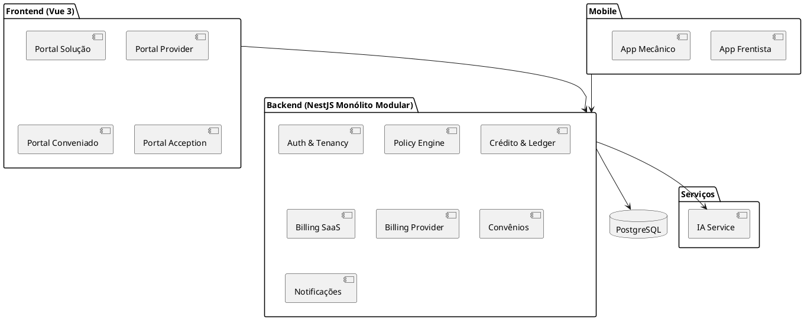

# 📘 Documento Consolidado

# Definição do Produto, Arquitetura, Requisitos, Fases e Roadmap

---

# 1️⃣ Definição do Produto

## 1.1 Nome conceitual

**Plataforma SaaS Provider-First para Gestão de Crédito (Fiado), Antifraude e Controle de Frota**

---

## 1.2 Problema que resolve

Postos de combustível e oficinas de pequeno/médio porte:

* Desejam conceder **crédito (fiado)** para empresas
* Precisam controlar risco e inadimplência
* Precisam reduzir fraude operacional
* Não são foco das grandes soluções de cartão-frota
* Precisam manter relacionamento direto com seus clientes

Empresas com frota:

* Desejam previsibilidade de caixa
* Precisam controlar consumo por veículo/motorista/centro de custo
* Querem governança e transparência

---

## 1.3 Proposta de Valor

A solução oferece:

* Crédito próprio do provider (modelo provider-first)
* Controle de limite e política personalizada
* Antifraude determinístico (F1) + IA (F2+)
* Ledger auditável
* White-label
* SaaS modular escalável
* Preparado para oficinas e parcerias futuras

---

## 1.4 Público-Alvo

### Primário

* Postos de combustível SMB
* Oficinas (Fase 3)

### Secundário

* Empresas com frota pequena e média
* Redes regionais

---

# 2️⃣ Modelo de Negócio

## 2.1 SaaS (Acception → Provider)

* Planos: Starter, Growth, Pro
* Trial configurável por plano
* White-label a partir de Growth
* Suspensão configurável:

  * FULL_BLOCK
  * BLOCK_AUTH_ONLY
* Add-ons:

  * Gateway Provider
  * IA avançada (F2+)

---

## 2.2 Provider → Conveniado

* Provider cria planos de convênio
* 1 plano ativo por convênio
* Geração de contrato automático baseado em template personalizável
* Cobrança manual ou via gateway (add-on)
* Sem renegociação parcelada inicialmente

---

# 3️⃣ Princípios Arquiteturais

* Clean Architecture
* Monolítico modular
* Multitenancy por `provider_id`
* Empresa como escopo (`conveniado_id`)
* Ledger append-only
* IA separada (Python/FastAPI)
* Desenvolvimento orientado a Spec Driven Development
* Documentação como contexto para IA e humanos
* Diagramas em PlantUML ou Mermaid

---

# 4️⃣ Arquitetura do Sistema

## 4.1 Componentes

* Backend: NestJS + Prisma + PostgreSQL
* Frontend: Vue 3 + Vuetify
* Mobile: Flutter
* IA: Python/FastAPI
* Storage: S3/MinIO
* Gateway: Asaas/Pagar.me

---

## 4.2 Diagrama Geral



---


# 5️⃣ Estrutura de Projeto (Monorepo)

```
/docs
  /Features
  /Architecture
  /Prompts
  /Overview

/backend
  server-api
/frontend
  portal-solution
  portal-provider
  portal-conveniado
  portal-acception
/mobile
  app-frentista
  app-mecanico
/services
  ia-service
/packages
  shared-types
  ui-components
  utils
```

---

# 5️⃣ Multitenancy

## Decisão adotada

* Provider = Tenant real (SaaS)
* Empresa = subdomínio dentro do provider

Isolamento DB: 
  * `provider_id` obrigatório
  * `conveniado_id` quando aplicável
  
Sem RLS inicialmente

Isolamento via:

* RBAC
* Scoping obrigatório
* Guardas no backend
---

# 6️⃣ Módulos Internos NestJS

## Core

* auth
* tenancy
* rbac
* audit
* i18n

## Domínio Provider

* providers
* conveniados
* plans-provider
* fleet
* catalog
* credit
* ledger
* policy-engine
* refuel
* billing-provider
* notifications
* evidence

## SaaS

* billing-saas
* admin-acception
* portal-solution

## Integrações

* payment-gateway
* ai-client
* storage
* observability

---

# 8️⃣ Requisitos Funcionais

## Autorização

* ALLOW/REVIEW/DENY
* Reserva de crédito
* Step-up
* Idempotência por externalTxId

## Crédito

* Limite global
* Limite por veículo
* Limite por período
* Aging
* Bloqueio automático

## Billing SaaS

* Planos
* Trial configurável
* Suspensão configurável
* Webhooks idempotentes

## Billing Provider

* Geração de faturas
* Cobrança manual
* Gateway opcional
* Lock por inadimplência

## White-label

* Subdomínio (Growth+)
* Domínio próprio (Pro+)

---

# 9️⃣ Requisitos Não Funcionais

## Segurança

* JWT + RBAC
* Escopo obrigatório
* Auditoria imutável

## Performance

* Autorização ≤ 300ms
* Read models

## Escalabilidade

* Monólito modular
* Serviços desacopláveis

## Auditabilidade

* Ledger append-only
* Persistência de decisões

## LGPD

* Minimização de dados
* Retenção configurável

---

# 🔟 Fases do Projeto

## Fase 1 — Postos

* Multitenancy
* Registro + Onboarding
* Planos SaaS
* Billing SaaS
* Convênios
* Crédito
* Ledger
* Antifraude determinístico
* App Frentista
* Billing Provider básico

---

## Fase 2 — IA Postos

* Score crédito (assíncrono)
* Fraude abastecimento (síncrono leve)
* Limite dinâmico

---

## Fase 3 — Oficinas

* OS integrada ao crédito
* App Mecânico
* Fraude OS/IA para OS
* Diagnóstico IA


---

## Fase 4 — Parcerias

* Limite compartilhado
* Liquidação inter-provider
* IA risco agregado

---

# 1️⃣1️⃣ Arquitetura de IA

## Fase 1

* Apenas regras determinísticas no backend

## Fase 2+

IA Service (Python/FastAPI):

* Score crédito (assíncrono)
* Fraude abastecimento (síncrono leve)
* Limite dinâmico
* Explicabilidade

### Redução de riscos do serviço separado:

* IA stateless
* Backend envia features
* Timeout curto
* Fallback determinístico
* Persistência de model_version e reason_codes

---

# 1️⃣2️⃣ Roadmap de Implementação

## Etapa 1 — Fundacional (Infra + Core)

* Monorepo
* Estrutura Clean Architecture
* Multitenancy + RBAC
* Audit

## Etapa 2 — SaaS Básico

* Registro Provider
* Planos SaaS
* Trial
* Billing SaaS

## Etapa 3 — Crédito e Ledger

* Conta crédito
* Ledger append-only
* Reserva
* Geração de faturas provider

## Etapa 4 — Policy Engine

* Regras determinísticas
* Step-up
* Refuel authorization endpoints

## Etapa 5 — App Frentista

* Autorização online
* Evidência
* Sincronização

## Etapa 6 — IA Service (Fase 2)

* Implementação FastAPI
* Score crédito
* Fraude leve
* Integração backend

## Etapa 7 — Oficina (Fase 3)

## Etapa 8 — Parcerias (Fase 4)

---

# 1️⃣3️⃣ Workflow de Desenvolvimento

## 1. Research

* IA + Humano
* Geração de SPEC

## 2. Planning

* Breakdown de tarefas
* Roadmap por fase

## 3. Implementação

* AI coding
* Baseado em SPEC

## 4. Code Review

* IA review

## 5. Teste e Validação

* Humano valida
* Correções IA+Humano

---

# 1️⃣4️⃣ Especificação Orientada a IA (Spec Driven Development)

Cada feature deve ter:

* Contexto
* Objetivo
* Casos de uso
* Regras de negócio
* Modelos de dados
* APIs
* Diagramas (PlantUML)
* Critérios de aceite
* Dependências

Documentos localizados em:

```
/docs/Features
/docs/Architecture
/docs/Overview
```
# 1️⃣5️⃣ Decisões Tomadas (Resumo Executivo)

* Provider-first
* Multitenancy: Provider tenant + Empresa escopo
* Sem RLS inicial
* White-label Growth+
* Trial configurável por plano
* Suspensão configurável
* Gateway Provider como add-on
* Sem renegociação parcelada inicial
* Ledger append-only
* IA separada (Python)
* Antifraude determinístico primeiro
* App frentista online obrigatório
* Estrutura monorepo
* Clean Architecture
* Monolito modular

---

# 1️⃣6️⃣ Riscos Identificados e Mitigações

| Risco                              | Mitigação                        |
| ---------------------------------- | -------------------------------- |
| Concessão irresponsável de crédito | Políticas + IA + dashboards      |
| Fraude operacional                 | Regras determinísticas + step-up |
| Inadimplência SaaS                 | Suspensão configurável           |
| Inadimplência convênio             | Lock automático                  |
| Vazamento entre tenants            | Scoping obrigatório              |
| Complexidade excessiva             | Fases progressivas               |

---
# 1️⃣5️⃣ Estratégia de Evolução

* Fase 1 sólida em determinismo e governança
* Fase 2 adiciona inteligência
* Fase 3 expande domínio (OS)
* Fase 4 aumenta complexidade multi-provider

---

# 1️⃣6️⃣ Diferenciais Competitivos

* Provider-first
* Crédito próprio
* IA adaptativa
* White-label
* Ledger auditável
* SMB oriented
* Modularidade para evolução

---

# 1️⃣7️⃣ Conclusão

A solução:

* É coerente com o público SMB
* Permite evolução controlada
* Garante governança financeira
* Mantém risco sob controle
* É tecnicamente escalável
* Está estruturada para desenvolvimento assistido por IA
